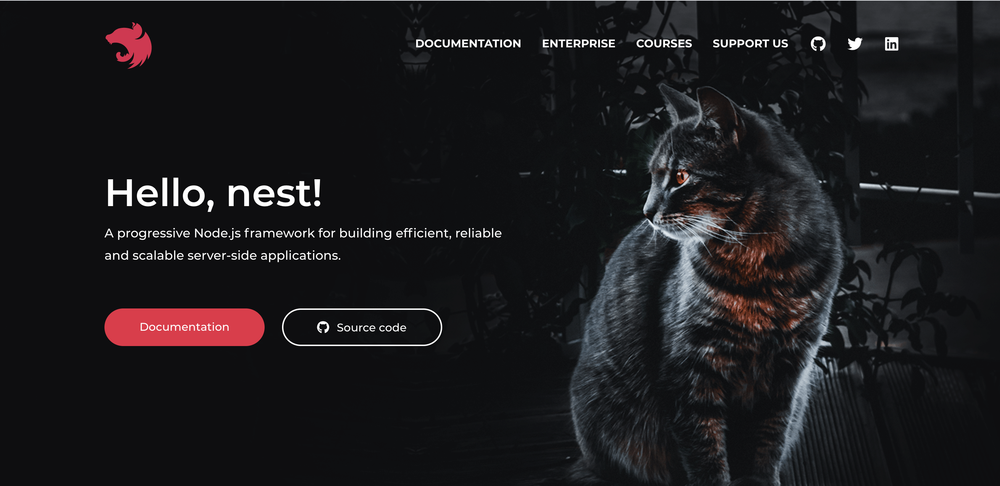
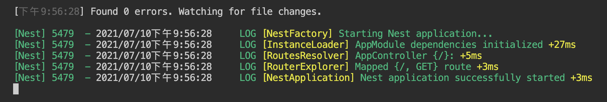
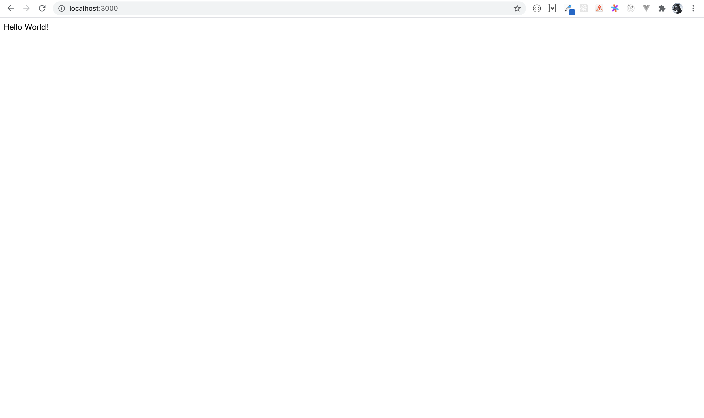

# 基础介绍



::: tip 环境及版本介绍

Node：v14.17.0

Npm: 7.15.0

Yarn: 1.22.10

Nest: 8.0.2

:::

## 思考

> 在学习之前我也对自己提出了一些学习nestjs的问题：
>
> - 什么是nestjs？
> - nestjs的优势是什么？
> - 适合怎样的场景下使用？
> - 为什么要用nestjs？官方有哪些现成的解决方案？
>
> 下面我们就带着问题一一去寻找答案吧！

## 问题

### 是什么

nestjs是用于构建高效、可靠、渐进式的服务器端应用程序。

### 优势

- 基于Node.js，对前端开发者们有着莫名的熟悉感。
- 高内聚低耦合，有一套成熟的开发规范。
- TypeScript加持，使其程序健壮性有一定的保障。
- 生态活跃，有成熟的解决方案开箱即用； 比如：鉴权、日志、安全等等。

### 应用场景

- 大型项目中台构建
- 微服务
- ......

## 基础环境搭建

### node环境

> 如果没有安装的话，可以访问：[官网](https://nodejs.org/en/) 推荐使用长期支持版

```shell
$ node -v
// v14.17.0

$ npm -v
// 7.15.0
```

### 安装CLI工具

[官网地址](https://docs.nestjs.com/) 如果是Mac电脑的话，前面需要加上`sodu`，加上后回车会让你输入笔记本的密码，输入时在控制台是看不到你自己输入的密码，输完后回车，就可以全局安装了，前提是密码没有输错；不加的话全局安装不了。

```shell
$ npm i -g @nestjs/cli
```

安装完成后，使用如下命令检查cli版本

```shell
$ nest -v
// 8.0.2
```

### 初始化项目

> 初始化项目有两种方式，一种拉取官方提供的模版，另一种就是使用cli工具创建（**建议**）。

#### 拉取模版

```shell
// 拉取项目
$ git clone https://github.com/nestjs/typescript-starter.git project

// 进入项目目录
$ cd project

// 安装依赖
$ npm install

// 运行项目
$ npm run start
```

项目启动成功后运行在3000端口，在浏览器中访问：`http://localhost:3000`

#### 脚手架创建

```shell
$ nest new [project-name] // 比如：nest new learn
```

创建成功后，可以查看项目目录和`package.json`

#### 项目目录及配置文件

```tree
learn                             
├─ dist                           // 构建后的代码目录
│  ├─ app.controller.d.ts         
│  ├─ app.controller.js           
│  ├─ app.controller.js.map       
│  ├─ app.module.d.ts             
│  ├─ app.module.js               
│  ├─ app.module.js.map           
│  ├─ app.service.d.ts            
│  ├─ app.service.js              
│  ├─ app.service.js.map          
│  ├─ main.d.ts                   
│  ├─ main.js                     
│  ├─ main.js.map                 
│  └─ tsconfig.build.tsbuildinfo  
├─ src                            // 项目源码目录
│  ├─ app.controller.spec.ts      
│  ├─ app.controller.ts           
│  ├─ app.module.ts               
│  ├─ app.service.ts              
│  └─ main.ts                     
├─ test                          // 单元测试配置文件及项目业务测试文件 
│  ├─ app.e2e-spec.ts             
│  └─ jest-e2e.json               
├─ .eslintrc.js 				 // eslint
├─ .gitignore 					 // 配置git版本控制时的忽略文件
├─ .prettierrc 					 // prettier
├─ nest-cli.json  				 // cli配置文件
├─ package.json                  // 项目配置文件
├─ README.md                     
├─ tsconfig.build.json           // ts构建配置 
├─ tsconfig.json                 // ts配置
└─ yarn.lock                      
```

`package.json`中的`scripts`对象中的所有命令：

```json
//......
"scripts": {
    "prebuild": "rimraf dist",                                      // 重新构建命令
    "build": "nest build",                                          // 项目打包命令
    "format": "prettier --write \"src/**/*.ts\" \"test/**/*.ts\"",  // 格式化处理命令
    "start": "nest start",                                          // 默认启动脚本命令
    "start:dev": "nest start --watch",                              // 开发时代码变化监视的启动命令
    "start:debug": "nest start --debug --watch",                    // 调试的启动命令
    "start:prod": "node dist/main",                                 // 生产环境启动命令
    "lint": "eslint \"{src,apps,libs,test}/**/*.ts\" --fix",        // eslint检查修复命令
    "test": "jest",                                                 // 运行单元测试
    "test:watch": "jest --watch",                                   // 监听单元测试文件变化
    "test:cov": "jest --coverage",
    "test:debug": "node --inspect-brk -r tsconfig-paths/register -r ts-node/register node_modules/.bin/jest --runInBand",
    "test:e2e": "jest --config ./test/jest-e2e.json"
  },
//......
```

执行命令，启动项目：

```shell
$ yarn start
or
$ npm run start
```

服务启动成功后；程序运行在3000端口（当然也可以在src/main.ts文件中的app.listen()方法中传入自定义的端口）；然后在浏览器中请求：`http://localhost:3000`



