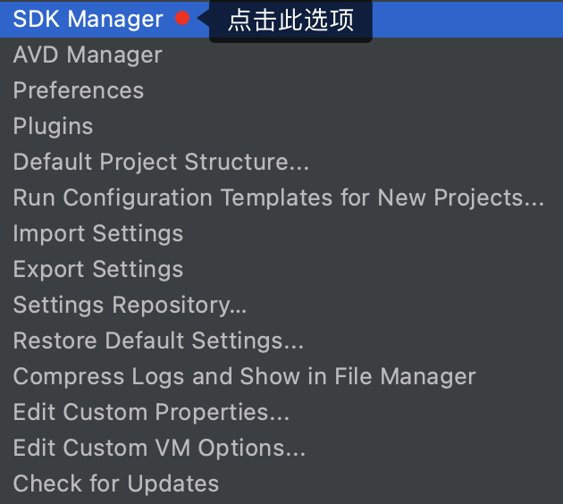
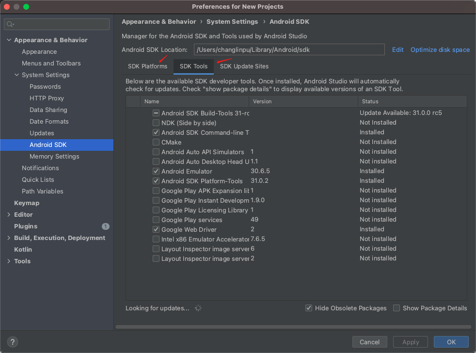
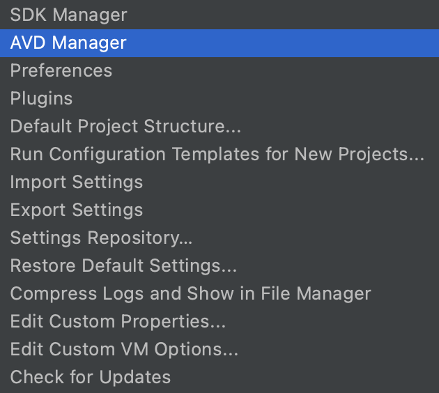
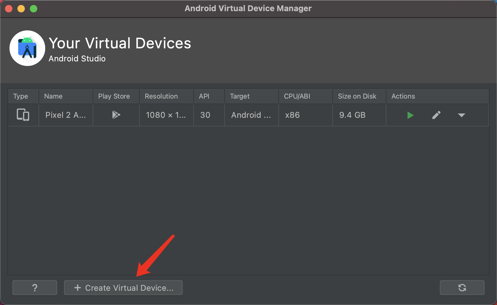

# 环境搭建

开发当然少不了开发环境的支持，`React Native`官方提供了两种环境搭建方式：完整原声环境、简易沙河环境。

::: tip 系统环境

- 搭建方式：完整原声环境

- 系统：macOS 11.2.3  

- 配置：4核16G

  安装过程一言难尽，由于一些网络原因，***安装前尽可能找一些代理软件或者找一些国内可用的镜像源***

:::

## 安装支持IOS平台的环境

> 必须安装的依赖有：Node、Watchman、Xcode 和 CocoaPods。

### 安装Node & Watchman

```shell
// 安装node
$ brew install node

// 安装Watchman
$ brew install watchman
```

> - 安装完 Node 后建议设置 npm 镜像（淘宝源）以加速后面的过程（或使用科学上网工具）。
>
> - Watchman是有FaceBook提供的监视文件系统变更的工具（packager 可以快速捕捉文件的变化从而实现实时刷新）

- 包管理工具yarn（可选）

  [Yarn](http://yarnpkg.com/)是 Facebook 提供的替代 npm 的工具，可以加速 node 模块的下载。

  ```shell
  $ npm install -g yarn
  ```

  安装之后查看版本`yarn --versioin`，若安装成功了就会打印出对应的版本号，成功安装`yarn` 之后就可以用 `yarn` 代替 `npm` 了，例如用`yarn`代替`npm install`命令，用`yarn add 某第三方库名`代替`npm install 某第三方库名`。

### 安装Xcode

打开 App Store 或者到[Apple 开发者官网](https://developer.apple.com/xcode/downloads/)上下载，然后打开，拖拽到 Application 中，他就会自动安装IOS模拟器之类的，

- iOS包管理工具---cocoapods

  > [CocoaPods](https://cocoapods.org/)是用 Ruby 编写的包管理器(可以理解为针对 iOS 的 npm)，react native 的 iOS 版本需要使用 CocoaPods 来管理依赖。 

  ```shell
  $ brew install cocoapods
  ```

  安装完成之后可以使用如下命令来查看版本：

  ```shell
  $ pod --version
  // 1.10.1
  ```

  

## 安装支持IOS平台的环境

> 必须安装的依赖有：Node、JDK 和 Android Studio。上面已经安装了Node和Watchman，就不需要重复安装了，接下来只需要安装JDK和Android Studio开发工具

### 安装JDK(Java Development Kit)

```shell
$ brew install adoptopenjdk/openjdk/adoptopenjdk8
```

安装完成之后，可以输入如下命令查看版本：

```shell
$ javac -version
// javac 1.8.0_292
```

### 安装 Android Studio

> 在 App Store中无法搜索到该工具，所以只能在官网去下载，国内由于一些网络原因可能无法打开官方链接，不过可以访问[download](https://developer.android.google.cn/studio/)下载

安装界面中选择“Custom”，确保选中了以下几项：

- `Android SDK`
- `Android SDK Platform`
- `Android Virtual Device`

然后点击"Next"来安装选中的组件。

如果没有安装上面的选项安装或者无法选择的话，也可以先下一步，然后在 Android Studio 的启动页面的右下角，选择configure选项，然后选择 SDK Manager去安装；或者在Android Studio 的"Preferences"菜单中找到。具体路径是**Appearance & Behavior** → **System Settings** → **Android SDK**。





安装`Android Virtual Device`没在SDK Manger中，也在启动界面的右下角选择 configure，就会出现一个下拉框，选择 AVD Manager后就会进入到一个新的界面，然后就可以去安装对应的SDK啦。



进去之后就可以点击左下角的 Create Virtual Device...



- 配置环境变量

  React Native 需要通过环境变量来了解你的 Android SDK 装在什么路径，从而正常进行编译。

  具体的做法是把下面的命令加入到 shell 的配置文件中。如果你的 shell 是 zsh，则配置文件为`~/.zshrc`，如果是 bash 则为`~/.bash_profile`（可以使用`echo $0`命令查看你所使用的 shell。）：

  ```shell
  # 如果你不是通过Android Studio安装的sdk，则其路径可能不同，请自行确定清楚
  export ANDROID_HOME=$HOME/Library/Android/sdk
  export PATH=$PATH:$ANDROID_HOME/emulator
  export PATH=$PATH:$ANDROID_HOME/tools
  export PATH=$PATH:$ANDROID_HOME/tools/bin
  export PATH=$PATH:$ANDROID_HOME/platform-tools
  ```

  :::  tip

  可以在 Android Studio 的"Preferences"菜单中查看 SDK 的真实路径，具体是**Appearance & Behavior** → **System Settings** → **Android SDK**。

  说明：~表示用户目录，即`/Users/你的用户名/`，而小数点开头的文件在 Finder 中是隐藏的，并且这个文件有可能并不存在。可在终端下使用`vi ~/.zshrc`命令创建或编辑。

  :::

  使用`source $HOME/.zshrc`命令来使环境变量设置立即生效（否则重启后才生效）。可以使用`echo $ANDROID_HOME`检查此变量是否已正确设置。

## 创建项目

### 全局安装

可以通过`npm i react-native-cli -g ` 全局安装  [react-native-cli](https://github.com/facebook/react-native)命令行工具，然后创建项目；我个人比较喜欢使用`npx`来创建项目（建议使用`npx`的方式创建项目）;

### npx创建普通项目

```shell
$ npx react-native init [projectName]
```

### npx创建指定版本的项目

```shell
$ npx react-native init [projectName] --version x.xx.x
```

### npx创建指定模版的项目

> 创建一个TypeScript项目

```shell
$ npx react-native init [projectName] --template react-native-template-typescript
```

