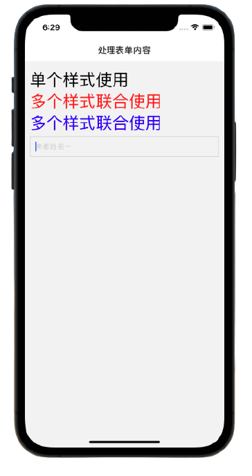

# React Native 的基本认识

::: tip

React Native 是一个使用[React](https://zh-hans.reactjs.org/)和应用平台的原生功能来构建 Android 和 iOS 应用的开源框架。通过 React Native，您可以使用 JavaScript 来访问移动平台的 API，以及使用 React 组件来描述 UI 的外观和行为：一系列可重用、可嵌套的代码（摘抄自[react-native 中文网](https://reactnative.cn/docs/intro-react-native-components)）。

:::

## 它和 H5 或者混合开发应用的区别

> -   真实的原生应用
> -   性能比 H5 或者混合应用好
> -   它不是运行在浏览器环境下的 web 页面

## React Native 中的常用组件

### 基础组件

| 组件       | 说明                                                    |
| ---------- | ------------------------------------------------------- |
| Button     | 按钮组件。                                              |
| Image      | 图片组件。                                              |
| View       | 视图组件。                                              |
| Text       | 文本组件。                                              |
| TextInput  | 文本输入框。                                            |
| ScrollView | 滚动视图组件，设置`flex: 1`自动填充父级容器的空余空间。 |
| FlatList   | 列表组件，类似于 HTML 中的`ul li`标签。                 |
| Switch     | 跨平台通用的“开关”组件。                                |

### 高级组件

| 组件                 | 说明                                                       |
| -------------------- | ---------------------------------------------------------- |
| ActivityIndicator    | 显示一个圆形的 loading 提示符组件。                        |
| ImageBackground      | 背景图组件。                                               |
| KeyboardAvoidingView | 解决键盘挡住视图内容的组件。                               |
| Modal                | 一种简单的覆盖在其他视图之上显示内容的方式。               |
| RefreshControl       | 通常使用在`ScrollView`或`FlatList`内部来实现下拉刷新功能。 |

### props

-   图片样式

    | 属性               | 配置项                                                                                               |
    | ------------------ | ---------------------------------------------------------------------------------------------------- |
    | resizeMode         | `cover`、`contain`、`stretch`、`repeat`、`center`。                                                  |
    | border             | `borderWidth`、`borderColor`。                                                                       |
    | borderReaius       | `borderTopRightRadius`、`borderBottomRightRadius`、`borderBottomLeftRadius`、`borderTopLeftRadius`。 |
    | Tint               | `tintColor` 为所有非透明的像素指定一个颜色。                                                         |
    | opacity            | 透明度；取值在 0 ～ 1 之间。                                                                         |
    | backgroundColor    | 背景色。                                                                                             |
    | backfaceVisibility | 该属性定义旋转后的图像的背面是否可见；可选值：`visible`、`hidden`；默认`visible`。                   |
    | overlayColor       | 当图片有圆角的时候，指定一个颜色用于填充圆角处的空白。                                               |

-   布局

    > 和 CSS 中 flexbox 的相关属性没什么区别，只不过属性名都是小驼峰格式的

-   阴影样式

    | 属性          | 配置项                                     |
    | ------------- | ------------------------------------------ |
    | shadowColor   | 设置阴影色。                               |
    | shadowOffset  | 设置阴影偏移量。                           |
    | shadowOpacity | 设置阴影不透明度 (乘以颜色的 alpha 分量)。 |
    | shadowRadius  | 设置阴影模糊半径。                         |

-   Text 样式

    | 属性                | 配置项                                                                                                                                               |
    | ------------------- | ---------------------------------------------------------------------------------------------------------------------------------------------------- |
    | textShadowOffset    | 文本阴影偏移量；`width`、`height`。                                                                                                                  |
    | color               | 文本颜色                                                                                                                                             |
    | fontSize            | 文本大小。                                                                                                                                           |
    | fontFamily          | 文本字体。                                                                                                                                           |
    | fontWeight          | 字体重量，可选值：`normal`、`bold`、`100~900`之间。                                                                                                  |
    | lineHeight          | 行高。                                                                                                                                               |
    | textAlign           | 文本对齐方式，可选值：`auto`、`left`、`right`、`center`、`justify`。                                                                                 |
    | textDecorationLine  | 用于设置文本的修饰线外观的(下划线、上划线、贯穿线/删除线 或 闪烁)；可选值：`none` `underline`、 `line-through` 、`underline line-through。`          |
    | textDecorationColor | 用于设置文本的修饰线的颜色。                                                                                                                         |
    | textDecorationStyle | 用于设置由`textDecorationLine`设定的线的样式；可选值：`solid`、`double`、`dotted`、`dashed`。                                                        |
    | fontStyle           | 允许你选择 `fontFamily` 字体下的 `italic` 或 `normal` 样式。                                                                                         |
    | textShadowColor     | 文本阴影颜色。                                                                                                                                       |
    | textShadowRadius    | 文本阴影效果的半径。                                                                                                                                 |
    | textAlignVertical   | 文本垂直对齐的方式；可选值：`auto`、`top`、`bottom`、`center`                                                                                        |
    | textTransform       | 指定如何将元素的文本大写。它可以用于使文本显示为全大写或全小写，也可单独对每一个单词进行操作。可选值：`none`、`uppercase`、`lowercase`、`capitalize` |
    | fontVariant         | 将小写字母转换为大写字母。                                                                                                                           |
    | letterSpacing       | 设置字符与字符之间的间距。                                                                                                                           |
    | writingDirection    | 文本书写方向；可选值为：`auto`、`ltr`、`rtl`                                                                                                         |

-   View 样式

    > 基本上的属性都和`CSS`中的没啥区别，只不过都是以小驼峰的格式书写

### 内部对象类型

-   布局对象

    示例：

    ```javascript
    {
        layout: {
            width: 520,          // 组件宽度
            height: 70.5,        // 组件高度
            x: 0,                // 在父组件中的横坐标
            y: 42.5              // 在父组件中的纵坐标
        },
        target: 1127             // 接收PressEvent的元素的节点id。
    }
    ```

-   点击事件对象

    ```js
    {
        changedTouches: [PressEvent],	// 自上次事件以来改变的所有PressEvents的数组。
        identifier: 1,					// 分配给事件的唯一数字标识符。
        locationX: 8,					// 触摸原点X坐标在可触摸区域内(相对于元素)。
        locationY: 4.5,					// 可触摸区域内的触摸原点Y坐标(相对于元素)。
        pageX: 24,						// 触摸屏幕上的原点X坐标(相对于根视图)。
        pageY: 49.5,					// 触摸屏幕上的原点Y坐标(相对于根视图)。
        target: 1127,					// 接收PressEvent的元素的节点id。
        timestamp: 85131876.58868201,	// PressEvent发生时的时间戳值。值以毫秒为单位。
        touches: []						// 屏幕上所有当前PressEvents的数组。
    }
    ```

-   React 节点对象

    React 节点对象有以下这些类型：

    -   Boolean (实际渲染会被忽略)
    -   `null` or `undefined` (实际渲染会被忽略)
    -   Number
    -   String
    -   React 元素 (JSX 语句的返回值)
    -   由以上类型数据组成的数组（还可以嵌套）

-   矩阵区域对象

-   ViewToken 对象

## React Native 中的样式

::: tip

在 React Native 中定义样式基本上是遵循 web 上的`CSS`的命名，只是语法的格式是采用小驼峰命名法；`style`可以是一个普通的`javascript`对象；官方建议使用`StyleSheet.create()`来创建定义组件的样式。

:::

示例：

```javascript
//...
import { TextInput, Text, StyleSheet } from "react-native";

// 定义当前组件的样式
const styles = StyleSheet.create({
    input: {
        height: 40,
        width: '100%',
        borderWidth: 1,
        borderColor: '#cdcdcd',
        color: 'red',
        paddingLeft: 10,
        paddingRight: 10
    },

    desc: {
        color: 'red',
        fontSize: 32,
    }
})


// ...

//视图内容
<Text style={styles.desc}>单个样式使用</Text>
<Text style={[styles.desc, styles.red]}>多个样式联合使用</Text>
<Text style={[styles.desc, styles.blue]}>多个样式联合使用</Text>
<TextInput
    style={[styles.input, { marginTop: 10 }]}
    placeholder="来者姓名～"
    onChangeText={(e) => this.handleOnChangeText(e)}
    placeholderTextColor='#ccc'
/>

// ...
```

效果图：



::: tip 注意：

所有的核心组件都接受名为`style`的属性。

-   单个样式：将`style`定义为一个对象。

    ```js
    <Text style={styles.desc}>单个样式使用</Text>
    ```

-   多个样式联合使用

    ```js
    <Text style={[styles.desc, styles.red]}>多个样式联合使用</Text>
    ```

-   混合使用

    ```js
    <TextInput
        style={[styles.input, { marginTop: 10 }]}
        placeholder="Please enter the contents of the title"
        onChangeText={e => this.handleOnChangeText(e)}
        placeholderTextColor="#ccc"
    />
    ```

**后定义的样式的优先级比先定义的样式的优先级高**

:::

## React Native 中的图片

> React Native 提供了一个统一的方式来管理 iOS 和 Android 应用中的图片。

### 静态图片资源

图片文件的查找会和 JS 模块的查找方式一样。如果不同平台使用了不同的图片文件，可以以对应的端侧命名；比如：`avatar.ios.png`、`avatar.android.png`；`Packager `就会根据平台而选择不同的文件。

还可以使用`@2x`，`@3x`这样的文件名后缀，来为不同的屏幕精度提供图片。比如下面这样的代码结构：

```
.
├── button.js
└── img
    ├── check.png
    ├── check@2x.png
    └── check@3x.png
```

并且`button.js`里有这样的代码：

```js
<Image source={require('./img/check.png')} />
```

Packager 会打包所有的图片并且依据屏幕精度提供对应的资源。

::: tip 注意：

如果你添加图片的时候 packager 正在运行，可能需要重启 packager 以便能正确引入新添加的图片。

:::

这样会带来如下的一些好处:

1. iOS 和 Android 一致的文件系统。
2. 图片和 JS 代码处在相同的文件夹，这样组件就可以包含自己所用的图片而不用单独去设置。
3. 不需要全局命名。你不用再担心图片名字的冲突问题了。
4. 只有实际被用到（即被 require）的图片才会被打包到你的 app。
5. 现在在开发期间，增加和修改图片不需要重新编译了，只要和修改 js 代码一样刷新你的模拟器就可以了。
6. 与访问网络图片相比，Packager 可以得知图片大小了，不需要在代码里再声明一遍尺寸。
7. 现在通过 npm 来分发组件或库可以包含图片了。

::: tip 注意：

为了使新的图片资源机制正常工作，require 中的图片名字必须是一个静态字符串（不能使用变量！因为 require 是在编译时期执行，而非运行时期执行！）。

:::

### 静态的非图片资源

`require`语法可以用来静态的加载项目中的音视频或者文档文件；所支持的文件类型有：`.mp3`, `.wav`, `.mp4`, `.mov`, `.htm` 和 `.pdf`等(完整列表请看 [packager defaults](https://github.com/facebook/metro/blob/master/packages/metro-config/src/defaults/defaults.js#L14-L44))

你也可以在[metro(即 packager)配置文件](https://facebook.github.io/metro/docs/en/configuration)中添加[`assetExts`配置项](https://facebook.github.io/metro/docs/en/configuration#resolver-options)来支持其他类型的文件。

**_需要注意的是视频必须指定尺寸而不能使用`flex`样式_**，因为目前还不能从非图片资源中获取到尺寸信息。对于直接链接到 Xcode 或者 Android 资源文件夹的视频，则不会有这个限制。

### 使用混合 App 的图片资源

如果你在编写一个混合 App（一部分 UI 使用 React Native，而另一部分使用平台原生代码），也可以使用已经打包到 App 中的图片资源（以拖拽的方式放置在 Xcode 的 asset 类目中，或是放置在 Android 的 drawable 目录里）。注意此时只使用文件名，不带路径也不带后缀：

```js
<Image source={{ uri: 'app_icon' }} style={{ width: 40, height: 40 }} />
```

对于放置在 Android 的 assets 目录中的图片，还可以使用`asset:/` 前缀来引用：

```js
<Image
    source={{ uri: 'asset:/app_icon.png' }}
    style={{ width: 40, height: 40 }}
/>
```

::: warning 注意：

这些做法并没有任何安全检查。需确保引用文件在应用中真实存在，而且还需要指定尺寸。

:::

### 网络图片

> 以满足 iOS [App Transport Security](https://segmentfault.com/a/1190000002933776) 的要求网络图片的传输协议尽可能是 https。

```js
// 正确
<Image source={{uri: 'https://facebook.github.io/react/logo-og.png'}} style={{width: 400, height: 400}} />

// 错误
<Image source={{uri: 'https://facebook.github.io/react/logo-og.png'}} />
```

-   网络图片的请求参数

    可以在 Image 组件的 source 属性中指定一些请求参数

    ```js
    <Image
        source={{
            uri: 'https://facebook.github.io/react/logo-og.png',
            method: 'POST',
            headers: {
                Pragma: 'no-cache'
            },
            body: 'Your Body goes here'
        }}
        style={{ width: 400, height: 400 }}
    />
    ```

-   Uri 数据图片

    有时候你可能拿到的是图片的 base64 数据，此时可以使用`'data:'`格式来显示图片。

    ::: tip 注意：

    需要手动指定图片的尺寸。建议仅对非常小的图片使用 base64 数据，比如一些小图标。

    :::

    ```js
    <Image
        style={{
            width: 51,
            height: 51,
            resizeMode: 'contain'
        }}
        source={{
            uri: 'data:image/png;base64,iVBORw0KGgoAAAANSUhEUgAAADMAAAAzCAYAAAA6oTAqAAAAEXRFWHRTb2Z0d2FyZQBwbmdjcnVzaEB1SfMAAABQSURBVGje7dSxCQBACARB+2/ab8BEeQNhFi6WSYzYLYudDQYGBgYGBgYGBgYGBgYGBgZmcvDqYGBgmhivGQYGBgYGBgYGBgYGBgYGBgbmQw+P/eMrC5UTVAAAAABJRU5ErkJggg=='
        }}
    />
    ```

### iOS 边框圆角的注意事项

::: tip 注意

下列边框圆角样式目前在 iOS 的图片组件上还不支持：

-   `borderTopLeftRadius`
-   `borderTopRightRadius`
-   `borderBottomLeftRadius`
-   `borderBottomRightRadius`

:::

## React Native 中的颜色

-   支持 `rgb()` 和 `rgba()` 两种十六进制与函数方法：

    -   `'#f0f'` (#rgb)
    -   `'#ff00ff'` (#rrggbb)
    -   `'rgb(255, 0, 255)'`
    -   `'rgba(255, 255, 255, 1.0)'`

-   支持 `hsl()` 和 `hsla()` 函数方法：

    -   `'hsl(360, 100%, 100%)'`
    -   `'hsla(360, 100%, 100%, 1.0)'`

-   全透明颜色值`rgba(0,0,0,0)` 有个单独的写法，和[CSS3](https://www.w3.org/TR/css-color-3/#transparent)一致：

    -   `transparent`

-   颜色名称

    可以使用颜色名称来作为颜色值；React Native 遵循[CSS3 规范](http://www.w3.org/TR/css3-color/#svg-color)：

    -   aqua (`#00ffff`)
    -   blue (`#0000ff`)
    -   ......
