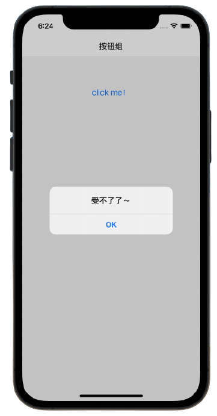
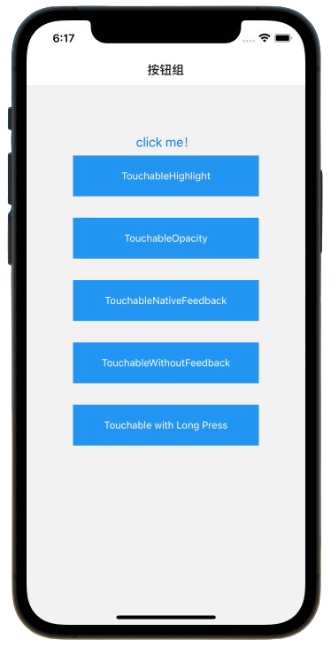
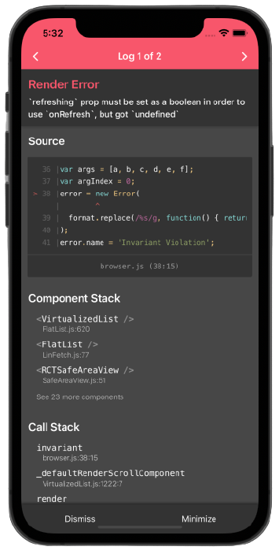
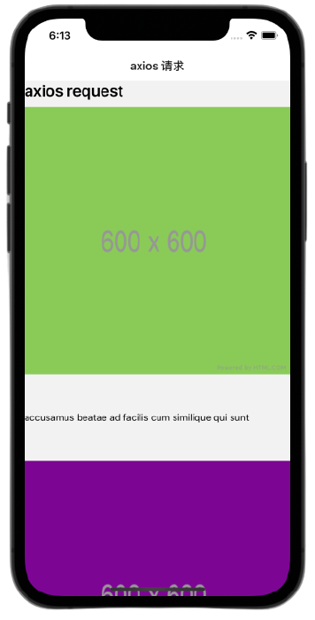

# 开发必备

## 触摸事件

> 移动应用上的用户交互基本靠“摸”。当然，“摸”也是有各种姿势的：在一个按钮上点击，在一个列表上滑动，或是在一个地图上缩放。

### onPress

```js
import { Button, Alert } from "react-native"

//...
<Button onPress={()=>{Alert.alert('受不了了～')}>click me</Button>
```

效果图：



> 点击click me就弹出弹框，按钮还可以添加`color`属性来修改按钮的颜色

### Touchable 系列组件

::: tip

这个组件的样式是固定的。如果要自定义就需要配合`TouchableOpacity`和`TouchableNativeFeedback`来定制。

使用场景：

- 可以使用`TouchableHighlight`来制作按钮或者链接。注意此组件的背景会在用户手指按下时变暗。
- 在 Android 上还可以使用`TouchableNativeFeedback`，它会在用户手指按下时形成类似墨水涟漪的视觉效果。
- `TouchableOpacity`会在用户手指按下时降低按钮的透明度，而不会改变背景的颜色。
- 如果你想在处理点击事件的同时不显示任何视觉反馈，则需要使用`TouchableWithoutFeedback*`。

:::

```js
import React, { Component } from 'react';
import { Button, Alert, Platform, StyleSheet, Text, TouchableHighlight, TouchableOpacity, TouchableNativeFeedback, TouchableWithoutFeedback, View } from 'react-native';

export default class Touchables extends Component {
    _onPressButton() {
      Alert.alert('You tapped the button!')
    }

    _onLongPressButton() {
      Alert.alert('You long-pressed the button!')
    }


    render() {
        return (
            <View style={styles.container}>
                <Button
                    onPress={() => {
                      Alert.alert('受不了了～');
                    }}
                    title="click me！"
                />
                <TouchableHighlight onPress={this._onPressButton} underlayColor="white">
                    <View style={styles.button}>
                      <Text style={styles.buttonText}>TouchableHighlight</Text>
                    </View>
                </TouchableHighlight>
                <TouchableOpacity onPress={this._onPressButton}>
                    <View style={styles.button}>
                      <Text style={styles.buttonText}>TouchableOpacity</Text>
                    </View>
                </TouchableOpacity>
                <TouchableNativeFeedback
                    onPress={this._onPressButton}
                    background={Platform.OS === 'android' ? TouchableNativeFeedback.SelectableBackground() : ''}>
                    <View style={styles.button}>
                        <Text style={styles.buttonText}>TouchableNativeFeedback</Text>
                    </View>
                </TouchableNativeFeedback>
                <TouchableWithoutFeedback
                    onPress={this._onPressButton}
                >
                    <View style={styles.button}>
                        <Text style={styles.buttonText}>TouchableWithoutFeedback</Text>
                    </View>
                </TouchableWithoutFeedback>
                <TouchableHighlight onPress={this._onPressButton} onLongPress={this._onLongPressButton} underlayColor="white">
                    <View style={styles.button}>
                        <Text style={styles.buttonText}>Touchable with Long Press</Text>
                    </View>
                </TouchableHighlight>
            </View>
        );
    }
}

const styles = StyleSheet.create({
    container: {
        paddingTop: 60,
        alignItems: 'center'
    },
    button: {
        marginBottom: 30,
        width: 260,
        alignItems: 'center',
        backgroundColor: '#2196F3'
    },
    buttonText: {
        textAlign: 'center',
        padding: 20,
        color: 'white'
    }
})

```

效果图：



## 定时器

> 定时器是一个应用中非常重要的部分。React Native 实现了和浏览器一致的定时器。

### API

- setTimeout, clearTimeout
- setInterval, clearInterval
- setImmediate, clearImmediate
- requestAnimationFrame, cancelAnimationFrame

::: tip

`requestAnimationFrame(fn)`和`setTimeout(fn, 0)`不同，前者会在每帧刷新之后执行一次，而后者则会尽可能快的执行（在 iPhone5S 上有可能每秒 1000 次以上）。

`setImmediate`则会在当前 JavaScript 执行块结束的时候执行，就在将要发送批量响应数据到原生之前。注意如果你在`setImmediate`的回调函数中又执行了`setImmediate`，它会紧接着立刻执行，而不会在调用之前等待原生代码。

`Promise`的实现就使用了`setImmediate`来执行异步调用。

:::

### InteractionManager

> 可以将一些耗时较长的工作安排到所有互动或动画完成之后再进行。这样可以保证`JavaScript `动画的流畅运行。

与定时器方法对比：

- `requestAnimationFrame()`: 用来执行在一段时间内控制视图动画的代码
- `setImmediate/setTimeout/setInterval()`: 在稍后执行代码。注意这有可能会延迟当前正在进行的动画。
- `runAfterInteractions()`: 在稍后执行代码，不会延迟当前进行的动画。

触摸处理系统会把一个或多个进行中的触摸操作认定为'交互'，并且会将`runAfterInteractions()`的回调函数延迟执行，直到所有的触摸操作都结束或取消了。

`InteractionManager` 还允许应用注册动画，在动画开始时创建一个交互“句柄”，然后在结束的时候清除它。

```js
const handle = InteractionManager.createInteractionHandle();
// 执行动画... (`runAfterInteractions`中的任务现在开始排队等候)
// 在动画完成之后
InteractionManager.clearInteractionHandle(handle);
// 在所有句柄都清除之后，现在开始依序执行队列中的任务
```

::: tip 注意

在组件卸载之后清除定时器可以规避一些致命性的错误；比如：闪退、长时间无响应。
:::


## 手势响应系统

### TouchableHighlight 与 Touchable 系列组件

响应系统用起来可能比较复杂。所以我们提供了一个抽象的`Touchable`实现，用来做“可触控”的组件。这一实现利用了响应系统，使得你可以简单地以声明的方式来配置触控处理。如果要做一个按钮或者网页链接，那么使用`TouchableHighlight`就可以。

### 响应者的生命周期

一个 View 只要实现了正确的协商方法，就可以成为触摸事件的响应者。我们通过两个方法去“询问”一个 View 是否愿意成为响应者：

- `View.props.onStartShouldSetResponder: (evt) => true,` - 在用户开始触摸的时候（手指刚刚接触屏幕的瞬间），是否愿意成为响应者？
- `View.props.onMoveShouldSetResponder: (evt) => true,` - 如果 View 不是响应者，那么在每一个触摸点开始移动（没有停下也没有离开屏幕）时再询问一次：是否愿意响应触摸交互呢？

如果 View 返回 true，并开始尝试成为响应者，那么会触发下列事件之一:

- `View.props.onResponderGrant: (evt) => {}` - View 现在要开始响应触摸事件了。这也是需要做高亮的时候，使用户知道他到底点到了哪里。
- `View.props.onResponderReject: (evt) => {}` - 响应者现在“另有其人”而且暂时不会“放权”，请另作安排。

如果 View 已经开始响应触摸事件了，那么下列这些处理函数会被一一调用：

- `View.props.onResponderMove: (evt) => {}` - 用户正在屏幕上移动手指时（没有停下也没有离开屏幕）。
- `View.props.onResponderRelease: (evt) => {}` - 触摸操作结束时触发，比如"touchUp"（手指抬起离开屏幕）。
- `View.props.onResponderTerminationRequest: (evt) => true` - 有其他组件请求接替响应者，当前的 View 是否“放权”？返回 true 的话则释放响应者权力。
- `View.props.onResponderTerminate: (evt) => {}` - 响应者权力已经交出。这可能是由于其他 View 通过`onResponderTerminationRequest`请求的，也可能是由操作系统强制夺权（比如 iOS 上的控制中心或是通知中心）。

`evt`是一个合成事件，它包含以下结构：

- `nativeEvent`
  - `changedTouches` - 在上一次事件之后，所有发生变化的触摸事件的数组集合（即上一次事件后，所有移动过的触摸点）
  - `identifier` - 触摸点的 ID
  - `locationX` - 触摸点相对于当前元素的横坐标
  - `locationY` - 触摸点相对于当前元素的纵坐标
  - `pageX` - 触摸点相对于根元素的横坐标
  - `pageY` - 触摸点相对于根元素的纵坐标
  - `target` - 触摸点所在的元素 ID
  - `timestamp` - 触摸事件的时间戳，可用于移动速度的计算
  - `touches` - 当前屏幕上的所有触摸点的集合

### 捕获 ShouldSet 事件处理

`onStartShouldSetResponder`与`onMoveShouldSetResponder`是以冒泡的形式调用的，即嵌套最深的节点最先调用。这意味着当多个 View 同时在`*ShouldSetResponder`中返回 true 时，最底层的 View 将优先“夺权”。在多数情况下这并没有什么问题，因为这样可以确保所有控件和按钮是可用的。

但是有些时候，某个父 View 会希望能先成为响应者。我们可以利用“捕获期”来解决这一需求。响应系统在从最底层的组件开始冒泡之前，会首先执行一个“捕获期”，在此期间会触发`on*ShouldSetResponderCapture`系列事件。因此，如果某个父 View 想要在触摸操作开始时阻止子组件成为响应者，那就应该处理`onStartShouldSetResponderCapture`事件并返回 true 值。

- `View.props.onStartShouldSetResponderCapture: (evt) => true,`
- `View.props.onMoveShouldSetResponderCapture: (evt) => true,`

## 网络连接

React Native 提供了和 web 标准一致的[Fetch API](https://developer.mozilla.org/en-US/docs/Web/API/Fetch_API)，用于满足开发者访问网络的需求。当然也可以使用第三方库(axios之类的)

### Fetch

> 如果对Fetch不熟悉的话，可以先看看[MDN文档](https://developer.mozilla.org/zh-CN/docs/Web/API/Fetch_API)

使用Fetch来实现一个网络请求；要求：点击一个按钮发送请求，获取到数据后展示在页面上；

::: tip

学习环节可以先用一些免费的在线API做测试，当然也可以自己搭建；推荐使用[JSONPlacehodler](https://jsonplaceholder.typicode.com/)，在线的、免费的、拿来即用的RESTful风格的接口。

:::

代码如下：

```js
import React, { Component } from 'react'
import {
    View,
    Text,
    Button,
    StyleSheet,
    FlatList,
    SafeAreaView,
    ActivityIndicator,
} from 'react-native'
import Loading from '../../components/loading/Loading'

// 创建样式
const style = StyleSheet.create({
    text: {
        fontSize: 24,
        color: 'skyblue',
    },
    button: {
        width: '40%',
        height: 30,
        borderWidth: 1,
        borderColor: 'red',
    },
    item: {
        fontSize: 26,
        fontWeight: `500`,
        color: '#333',
        marginTop: 10,
    },
    flatList: {
        borderColor: 'red',
        borderWidth: 1,
        width: '95%',
        height: '100%',
        marginLeft: 'auto',
        marginRight: 'auto',
    },
})

export default class LinFetch extends Component {

    state = {
        loading: false,
        count: 0,
        data: [],
    }

    // 获取数据
    async handleFetch() {
        const result = await fetch(`https://jsonplaceholder.typicode.com/todos`)
        const data = await result.json()
        this.setState({ data, loading: false })
    }

    // 下拉加载
    handleOnRefresh() {
        this.setState({ loading: true })
        this.handleFetch()
    }

    // 上拉加载
    handleOnEndReached() {
        const { loading } = this.state
        this.setState({ loading: !loading })
    }

    render() {
        const { data, loading } = this.state
        return (
            <View style={{ flex: 1, width: '100%', height: '100%' }}>
                <Text style={style.text}>fetch request</Text>
                <Button
                    style={style.button}
                    onPress={() => this.handleFetch()}
                    title="request"
                />
                <SafeAreaView
                    style={{ flex: 1, width: '100%', height: '100%' }}>
                    <FlatList
                        style={style.flatList}
                        data={data}
                        refreshing={loading}
                        onRefresh={() => this.handleOnRefresh()}
                        onEndReached={() => this.handleOnEndReached()}
                        keyExtractor={(item) => item.id}
                        renderItem={({ item }) => (
                            <Text style={style.item}>{item.title}</Text>
                        )}
                        ListFooterComponent={loading && <Loading />}
                    />
                </SafeAreaView>
            </View>
        )
    }
}

```

::: tip

在配置下拉刷新时，必须设置`refreshing`属性，否则将报如下图所示错误



:::

最后效果图如下：


### Axios

> 其实这些使用方法和开发web端应用时的方法如出一辙，如果还不熟悉axios可以去[axios官网](https://axios-http.com/)熟悉熟悉。

- 安装

  ```shell
  $ npm i axios
  or
  $ yarn add axios
  ```

- 请求JSONPlaceholder 中的图片

  ```jsx
  state = {
      albumId: 1,
      data: [],
      isLoading: false,
  }
  
  async componentDidMount() {
      await this.handleGetData()
  }
  
  async handleGetData() {
      const { albumId, data } = this.state
      const result = await axios.get(
      		`https://jsonplaceholder.typicode.com/albums/${albumId}/photos`,
      )
      this.setState({ 
          data: [data, ...result.data], 
          isLoading: false 
      })
  }
  ```

- 视图展示

  ```jsx
  <FlatList
      data={data}
      renderItem={({ item }) => (
          <>
              <Image
                  style={styles.stretch}
                  source={{ uri: item.url }}
                  resizeMode="contain"
              />
              <Text>{item.title}</Text>
          </>
      )}
      keyExtractor={(item) => item.id}
      onEndReached={() => this.handleOnEndReached()}
  />
  ```

  

​	完整代码如下：

```jsx
import React, { Component } from 'react'
import axios from 'axios'
import { View, Text, Image, StyleSheet, FlatList } from 'react-native'

const styles = StyleSheet.create({
    text: {
        fontSize: 24,
        fontWeight: '600',
    },
    stretch: {
        width: '100%',
        height: 500,
        resizeMode: 'stretch',
    },
})

class LinAxios extends Component {
    state = {
        albumId: 1,
        data: [],
        isLoading: false,
    }

    componentDidMount() {
        this.handleGetData()
    }

		// 获取数据
    async handleGetData() {
        const { albumId, data } = this.state
        const result = await axios.get(
            `https://jsonplaceholder.typicode.com/albums/${albumId}/photos`,
        )
        console.log('albmId:', albumId)
        this.setState({ data: [data, ...result.data], isLoading: false })
    }

    // 上拉加载
    async handleOnEndReached() {
        if (this.state.isLoading) return
        await this.setState({
            albumId: this.state.albumId + 1,
            isLoading: true,
        })
        this.handleGetData()
    }

    render() {
        const { data } = this.state

        return (
            <View>
                <Text style={styles.text}>axios request</Text>
                <FlatList
                    data={data}
                    renderItem={({ item }) => (
                        <>
                            <Image
                                style={styles.stretch}
                                source={{ uri: item.url }}
                                resizeMode="contain"
                            />
                            <Text>{item.title}</Text>
                        </>
                    )}
                    keyExtractor={(item) => item.id}
                    onEndReached={() => this.handleOnEndReached()}
                />
            </View>
        )
    }
}

export default LinAxios
```


## WebSocket

待完善……

