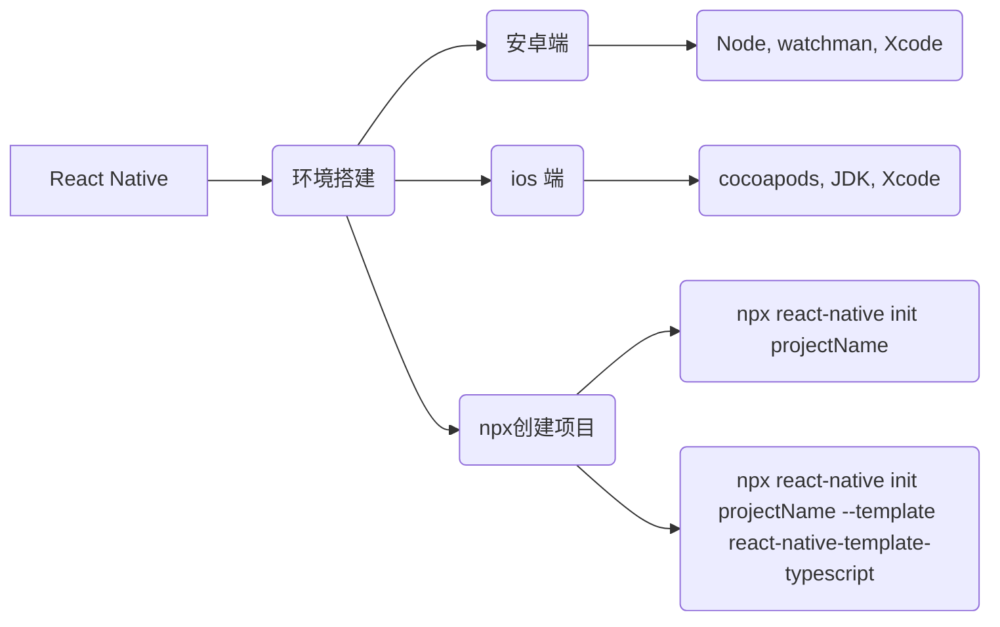

```mermaid
graph LR
A[React Native] -->B(环境搭建)
    B --> C(安卓端)
    C -->D(Node, watchman, Xcode)
    B -->E(ios 端)
    E -->F(cocoapods, JDK, Xcode)
    B -->G(npx创建项目)--> G1(npx react-native init projectName)
    		 G -->G2(npx react-native init projectName --template react-native-template-typescript)
```
