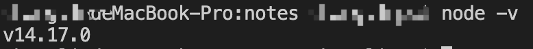
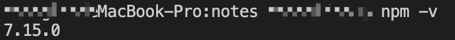
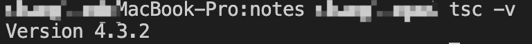
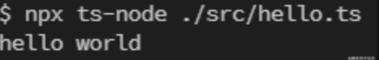

## 开发准备

### 环境搭建

`TypeScript`是不能直接运行在浏览器环境的，是需要借助[Node.js](https://nodejs.org/en/)的支持，如果没有安装Node.js的话就要先安装，Node.js自带了`npm`和`npx`。

- 查看Node.js是否安装成功，可以使用如下命令：

```shell
$ node -v
```

结果如下图：



- 查看npm的版本

```shell
$ npm -v
```

结果如下：



### 开发工具

> 常言道“工欲善其事，必先利其器”；作为一个开发人员选择一款合适的开发工具不亦是明智之举，可以根据自己的喜好和习惯选择；比如：Subline Text、Atom、Vim、WebStorm、VSCode，我比较喜欢VSCode，所以后代码演示都在VSCode中；
>
> - 在传统语法高亮、自动补全功能的基础上拓展了基于变量类型、函数定义，以及引入模块的智能补全；
> - 支持在编辑器上直接运行和调试应用；
> - 内置了 Git Comands，能大幅提升使用 Git 及其他 SCM 管理工具的协同开发效率；
> - 基于 Electron 开发，具备超强的扩展性和定制性。

### 安装 TypeScript

因为 VS Code 只集成了 TypeScript 语言服务，不包含转译器，所以我们还需要单独安装 TypeScript。为了方便快速完成一个入门小示例，这里我们推荐通过命令行工具使用 npm 全局安装 TypeScript。

具体操作：打开 VS Code 内置命令行工具(当然也可以使用其他终端工具)，然后输入如下所示代码：

```shell
$ npm i -g typescript
```

安装完成之后，就可以使用如下命令查看本版本：

```shell
$ tsc -v
```

结果如下：



环境准备差不多了，下面就来写一个入门程序；

- 先初始化`tslint`配置；

```shell
$ tsc --init // 注意两个短横线与init之间没有空格
```

- 新建一个`hello.ts`的文件编写一个`hello world`的程序

```shell
// hello.ts
console.log('hello world');
```

- 运行程序

```shell
// 先将ts代码编译成js代码
$ tsc hello.ts

// 执行js代码
$ node hello.js 
```

上面两行代码执行后，终端中就会打印出`hello world`

> 由于我们在开发过程中会不断修改文件和添加内容，所以重复这么执行命令也不是办法（哈哈哈哈，不会偷懒的程序员不是好程序员）；所以我们得进一步来优化我们得项目工程，让它可以时时监听文件得变化而启动，这样就不会让我们每次都手动重启编译运行这种重复的事情了，这也算是解放生产力吧！

## 搭建项目

- 初始化项目

> 选择一个项目目录，然后新建项目工程文件夹（文件名不能与一些依赖名同名，比如不能取名为typescript、ts-node等等，否则会导致依赖安装不成功），如下命令初始化`npm`环境，执行成功后就会项目的根目录生成一个`package.json`文件。

```shell
$ npm init -y
```

- 安装依赖，打开终端指向当前项目目录，执行如下命令。

```shell
$ npm i -D typescript tslint @types/node ts-node
```

- 初始化`tsconfig.json`配置`TypeScript`的行为规则，其作用是在该文件中定义要编译那些文件、把那些文件编译到那个目录中以及使用那个版本的`JavaScript`运行；命令运行成功后，就会在项目的根目录生成一个`tsconfig.json`的文件。

```shell
$ tsc --init
```

> tsconfig.json文件的配置项部分说明：
>
> | 选项    | 说明                                                        |
> | ------- | ----------------------------------------------------------- |
> | include | TSC在那个文件夹中寻找TypeScript文件                         |
> | lib     | TSC假定运行代码的环境中有那些API                            |
> | module  | TSC把代码编译成哪个模块系统（CommonJs、ES2015等等）         |
> | outDir  | TSC把生成的`JavaScript`代码放在那个文件夹中                 |
> | strict  | 检查无效代码时尽量严格，该选项强制所有代码都正确声明了类型  |
> | target  | TSC把代码编译成哪个版本的`JavaScript`(ES3、ES5、ES2015等等) |

## 配置项目规范

### 配置tslint

> 为代码指定风格上的约定（如使用制表符还是空格缩进之类的）

```shell
$ npx tslint --init
```

命令执行成功后，就会在项目的更目录生成`tslint.json`的文件，内容如下所示：

```json
{
    "defaultSeverity": "error",
    "extends": ["tslint:recommended"],
    "jsRules": {},
    "rules": {},
    "rulesDirectory": []
}
```

### 集成 EditorConfig 配置

> **[EditorConfig](https://editorconfig.org/)** 有助于为不同 IDE 编辑器上处理同一项目的多个开发人员维护一致的编码风格。

在项目根目录下增加 .editorconfig 文件， 并配置以下内容：

```yaml
# Editor configuration, see http://editorconfig.org

# 表示是最顶层的 EditorConfig 配置文件
root = true

# 表示所有文件适用
[*]

# 设置文件字符集为 utf-8
charset = utf-8

# 缩进风格（tab | space）
indent_style = space

# 缩进大小
indent_size = 4

# 控制换行类型(lf | cr | crlf)
end_of_line = lf

# 去除行首的任意空白字符
trim_trailing_whitespace = true

# 始终在文件末尾插入一个新行
insert_final_newline = true

# md 文件适用以下规则
[*.md]
max_line_length = off
trim_trailing_whitespace = false
```

VSCode 使用 EditorConfig 需要去插件市场下载插件 `EditorConfig for VS Code` 。WebStorm 则不需要安装，直接使用 EditorConfig 配置即可。


### 集成 Prettier 配置

> **[Prettier](https://prettier.io/)** 是一款强大的代码格式化工具，支持 `JavaScript、TypeScript、CSS、SCSS、Less、JSX、Angular、Vue、GraphQL、JSON、Markdown` 等语言，基本上前端能用到的文件格式它都可以搞定，是当下最流行的代码格式化工具。

- 安装 Prettier

```shell
$ npm i prettier -D
```

- 创建 Prettier 配置文件 Prettier 支持多种格式的配置文件，比如 .json、.yml、.yaml、.js 等。 在本项目根目录下创建 .prettierrc 文件。
- 配置 .prettierrc 在本项目中，我们进行如下简单配置，关于更多配置项信息，请前往官网查看 [Prettier-Options](https://prettier.io/docs/en/options.html) 。

```json
{
    "useTabs": false,
    "tabWidth": 4,
    "printWidth": 100,
    "singleQuote": true,
    "trailingComma": "none",
    "bracketSpacing": true,
    "semi": false
}
```

Prettier 安装且配置好之后，就能使用命令来格式化代码

- 格式化所有文件（. 表示所有文件）

```shell
$ npx prettier --write .
```

VSCode 编辑器使用 `Prettier` 配置需要下载插件 `Prettier - Code formatter`； WebStorm 则不需要安装，直接使用 EditorConfig 配置即可。


> 配置完成后的项目目录如下图所示：

```
typescript-basic
├─ src
│  └─ hello.ts
├─ .editorconfig
├─ .gitignore
├─ .prettierrc
├─ package-lock.json
├─ package.json
├─ README.md
├─ tsconfig.json
└─ tslint.json
```

- 配置启动命令：

> 在package.json的`scripts`中添加配置

```json
//...
"scripts": {
    // ...
    "dev": "npx ts-node ./src/index.ts"
},
// ...
```

就拿刚刚的`hello.ts`为例，`npx ts-node ./src/hello.ts`



以上就是环境搭建和相应的规范配置，后续就可以在上面直接“添砖加瓦”了。

[源码传送门](https://github.com/big-front-end/typescript-basic)

