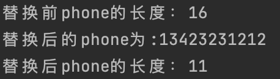

# 基础

> 可爱的 Golang 吉祥物，出自 Golang 设计者之一 Rob Pike 之妻 Renee French


由 Google 于 2007 年开发，并于 2009 年开源的 Golang 语言，至今已经走过了将近 10 多个年头。自 2012 年 Golang 1.0 稳定版本发布以来，凭借其独特的魅力在全球范围内吸引了众多的开发者和发展了数量庞大的活跃社区。

Golang 在多核并发上拥有原生的设计优势，充分利用现代硬件性能又兼顾开发效率，设计的目标是为了发挥类似 Python 等动态语言开发速度，并在此基础上提供 C/C++ 等编译型语言的性能和安全。

Golang 具备很强的语言表达能力，支持静态类型安全，能够快速编译大型项目；同时也能够让开发人员访问底层操作系统，极力挖掘计算机 CPU 资源，还提供了强大的网络编程和并发编程支持。

Golang 具备以下特性：

- 从底层支持并发，无需第三方库支持，对开发者的编程技巧和开发经验要求低；
- 支持自动垃圾回收，避免内存泄露
- 支持函数多返回值
- 支持匿名函数和闭包
- 支持反射
- 更好的性能
- 提供强大的标准库支持
- 快速、静态类型的编辑型语言，同时提供动态语言特性

Golang 简单、高效、并发的特性吸引了众多开发人员加入到 Golang 开发的大家庭中，目前已经涌现大量通过 Golang 原生开发的大型开源项目， 并在软件行业中发挥重要作用，其中包括 Docker、Kubernetes等。

## 源代码与程序

- 以`.go`为文件后缀，所有`go`文件存放在包中，一个包由一个或者多个go文件组成
- 使用`package`关键字声明当前go文件属于那个包
- 使用`import`关键字引入外部包
- main是一个特殊的包，它定义了一个独立的可执行程序；在`main`包中，`main`函数又是一个特殊的函数

## 注释

注释是一项很有用的功能，当程序越来越大的时候，功能越来越复杂的时候，添加注释对其模块说明是很有必要，即使过了很久再次打开项目的时候，也能快速知道当前代码块或者模块的意图

### 单行注释

在程序中使用双斜线表示单行注释：`//`；例如：

```go
func main() {
  // conversion()
  // join()
  // replace()
  // number()
  // error()
}
```

::: warning

如果在代码前面添加单行注释，则解析器不会解析被注释的代码！

:::

### 多行注释

在程序中使用`/* */`符号表示多行注释；例如：

```go
/*
func error()  {}
*/
```

在上面代码中，`error()`这个函数就会被忽略到，不会执行

## 变量

> 变量是对一块内存的命名，程序可以通过定义变量来申请一块内存，通过引用变量来使用这块内存

### Go语言中的25个关键字

```go
// 包相关 
import、package

// 声明相关
var、const、type、struct、interface、func、chan、map、go

// 循环相关
for、range

// 条件判断相关
if、else、switch、select、case

// 中断或返回
return、goto、fallthrough、break、default、continue

// 延迟执行
defer
```

### 内置的预声明的常量、类型和函数

```go
// 常量
true、false、iota、nil

// 整型
int、int8、int16、int32、int64

// 无符号整型
uint、uint8、uint16、uint32、uint64、uintptr

// 浮点型
float32、float64、complex64、complex128

// 其他
bool、byte、rune、string、error

// 函数
make、len、cap、new、append、copy、close、delete、complex、real、imag、panic、recover
```

### 变量的作用域

- 变量以大写开头字母的表示可导出，对包外是可见、可访问的；以小写字母开头则只能在当前包内使用
- 使用var关键字来创建某种类型的变量并设置初始值；类型和初始值可以省略一个，但是不能同时都省略；当省略初始值时，变量的值默认为当前类型的零值；比如：`int`类型就是0、`boolean`类型就是false、字符串就是" "、接口和应用类型的零值为`nil`、数组和结构体的零值就是所有成员的零值。

### 短变量

- 使用 `:=` 声明变量及赋值；比如:

```go
name := "Forest"
```

- 这种方式声明的变量只能在函数内部使用

### 声明周期

- 声明周期就是程序运行时被程序其他部分所引用的起止时间
- 变量的声明周期是指在程序执行过程中变量存在的时间段

  - 全局变量：包级别变量的声明周期是整个程序的执行时间
  - 局部变量：局部变量的声明周期是动态的，函数的参数和返回值都是局部变量；即函数被调用时被创建，结束后被销毁

- 当创建的变量内存不确定时，会分配给堆；如：切片(slice)、字典(map)、通道(channel)等。如果分配的内存超过栈(stack)的大小，则会分配到堆中

  - 堆：用来存放进程执行中被动态分配的内存段的，他的大小不固定，可动态伸缩
  - 栈：用来存放程序暂时创建的局部变量的，即在函数内部定义的变量或调用函数传入的参数

### 作用域

- 作用域是声明在程序中出现的位置及有效范围

  - 程序编译时，将从当前使用范围开始往最外层查找，如果没有找到报错；如果在内层和外层都存在这个变量，则内层的被优先使用

- 访问权限

  - 包级私有
  - 模块级私有
  - 公开级

## 类型

### 字符串

字符串就是我们平时书写的文字，是一种数据类型，是一连串的字符，在编程语言中，通常用写在引号内。比如：`"hello future"`

#### 修改字符串大小写

对于字符串可执行最简单的操作就是修改大小写。使用`strings`包下的`ToUpper()`方法将其字符串进行大写转换；使用`strings`包下的`ToLower()`方法将其字符串转换为小写。

```go
hi := "hello future"
nickname := "FOREST"

// 转换为大写
upper := strings.ToUpper(hi)
fmt.Println(upper) // HELLO FUTURE

// 转换为小写
lower := strings.ToLower(nickname)
fmt.Println(lower) // forest
```

#### 合并(拼接)字符串

将两个或者多个字符串连成一个字符串的方法称为拼接(合并)。

- 加号拼接

  ```go
  str := "hello" + "future"
  fmt.Printf("加号拼接：%s \n", str) // 加号拼接：hellofuture 
  ```

- strings.Join()拼接

  ```go
  str1 := strings.Join([]string{"hello", "future"}, "")
  fmt.Printf("join拼接：%s \n", str1) // join拼接：hellofuture 
  ```

- fmt.Sprintf()拼接

  ```go
  user := fmt.Sprintf("%s: %s \n", "nickname", "Forest")
  fmt.Printf("fmt.Sprintf 拼接：%s", user) // fmt.Sprintf 拼接：nickname: Forest 
  ```

- bytes.Buffer()拼接

  ```go
  skill:= bytes.Buffer{}
  skill.WriteString("JavaScript、")
  skill.WriteString("Node、")
  skill.WriteString("TypeScript、")
  skill.WriteString("Vue、")
  skill.WriteString("React")
  fmt.Printf("bytes.Buffer拼接：%s \n", skill.String()) // bytes.Buffer拼接：JavaScript、Node、TypeScript、Vue、React 
  ```

#### 删除或者替换

我们经常需要对比两个字符串是否相同，如果因为有了多余的空格肯定是对比不通过的。在Go语言中使用`strings.Trim()`方法可以处理删除或者替换，此方法可以传入两个参数，第一个参数是处理对象，第二个是想替换成的字符

```go
phone := " 13423231212    "
fmt.Printf("替换前phone的长度：%d \n", len(phone)) // 16
fmt.Printf("替换后的phone为:%s \n", strings.Trim(phone, " ")) // 替换后的phone为:13423231212
fmt.Printf("替换后phone的长度：%d \n", len(strings.Trim(phone, " "))) // 11
```



### 数字

数字可以帮助我们记录或者表示很多可视化数据、存储Web应用信息等

#### 整数

在Go语言中可以对整数进行加、减、乘、除等运算

```go
num1, num2 := 10, 20

// 加
fmt.Println(num1 + num2) // 30
// 减
fmt.Println(num2 - num1) // 10
// 乘
fmt.Println(num1 * num2) // 200
// 除
fmt.Println(num2 / num1) // 2
// 取模
fmt.Println(num2 % num1) // 0
// 优先级运算
fmt.Println((num1 + num2) / num1) // 3
```

#### 浮点数

Go语言中提供了两种浮点数：float32、float64；float32可以提供小数点后6位的精度，float64可以提供小数点后15位的精度

::: warning

通常情况下，应优先选择float64，因为它比float32的精度要高，而且float32能精确表达的最小正整数并不大，因为浮点数和整数的底层解释方式完全不同

:::

#### 避免类型错误

在程序中，经常需要在消息体中使用变量的值，但常常有因为类型不兼容而导致程序运行报错。例如下面代码：

```go
age := 22
fmt.Println("age:" + age) // Invalid operation: "age:" + age (mismatched types string and int)
```

在运行程序时就报错了，这是一个编译错误，解析器无法识别使用的信息；在上面的代码中，解析器发现使用一个值整数的变量，但它不知道该如何解读这个值，所以解决这个问题的关键就是要做类型转换。

```go
age := 22
fmt.Println("age:" + strconv.Itoa(age)) // age:22
```

## 指针

- 指针就是变量的地址。指针可指向变量值的地址，不是所有的值都有地址，但是所有的变量都有地址。以 ‘&变量名’ 的形式访问变量的地址，比如：&name 表示获取name的内存地址，使用指针时不需要知道变量名就可以读取或更新变量值；通过 *变量名 的形式来获取内存地址的值

```go
var name string = "Forest"

// 获取那么的指针
nickname := &name

// 通过指针获取变量的值
n := *nickname
```

- 内置函数New
  - new(T)可以创建一个未命名的T类型的变量，初始化T类型的零值，并返回 *T

:::tip
使用内置函数`new`创建的变量和使用其他方式定义的变量没有什么区别，但是`new(T)`可以直接在表达式中使用，无须提前声明；因此内置函数`new`在语法上更加便利，但它并不是一个基础语法，`new`也不是一个关键字
:::

## 包和文件

- 一个包可以保存一个或者多个以.go结尾的文件，每个包都给包声明了一个独立的命名空间
- 包初始化

  - 包初始化从初始化包级别的变量开始，这些变量是按照声明顺序初始化的，在依赖已经解析完毕就根据依赖的顺序初始化；程序的执行顺序是从上往下执行的；通常使用init(){} 来做包的初始化，这个init函数不能被调用，他是自执行的
  - 我们可以在多个.go文件中使用多个init函数，包的初始化是按照包倒入的顺序
  