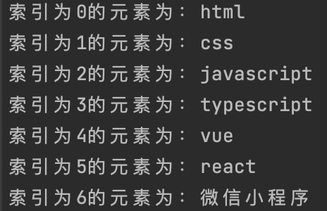
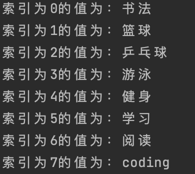

# 数组与切片

## 数组

### 简介

数组就是具有固定长度且拥有0个或者多个相同数据类型元素的集合；简单来说数组就是将同一类东西放到一起，然后派上序号

### 初始化数组

- 声明一个长度、类型固定且没有赋初始值的数组

  ```go
  // 声明一个长度为5的字符串数组
  var list [5]string
  ```
  
- 声明一个长度、类型固定且有初始值的数组

  ```go
  language := [3]string{"java", "python", "go"}
  ```

- 声明一个长度不固定、类型固定且有初始值的数组

  > 如果在数组初始化时，不能确定有多少个元素，那么就可以在[]中用`···`代替数字，这时数组的长度就由初始化数组的元素的个数来决定

  ```go
  skill := [...]string{"mysql", "mongoDB", "redis"}
  ```

### 访问数组元素

数组是有序集合，可以通过数组的索引来访问数组的元素，数组的索引是从0开始的

```go
language := [3]string{"java", "python", "go"}
fmt.Println(language[2]) // go
```

### 循环

循环就是自动完成一系列重复的功能块；可以通过`for`、`for range`

```go
front := [...]string{"html", "css", "javascript", "typescript", "vue", "react", "微信小程序"}

// index为索引 item为数组中的元素
for index, item := range front {
  fmt.Printf("索引为%d的元素为：%s\n", index, item)
}
```

结果如下：



### 修改数组中的元素

修改数组中的元素的语法与访问数组中的元素的语法类似；想要修改数组中的元素，需要先指定数组名和要修改的元素的索引，在指定该元素的新值

```go
front := [...]string{"html", "css", "javascript", "typescript", "vue", "react", "微信小程序"}
front[2] = "js"
fmt.Println(front) // [html css js typescript vue react 微信小程序]
```

## 切片

### 简介

切片是相同类型元素的可变长度，通常表示为[]types，看上去很像数组，但是没长度

每个切片都有三部分组成：

- 指向底层数组中某个元素的指针：指向数组的第一个从切片访问的元素，这个元素并不一定是数组的第一个元素；一个底层数组可以对一个多个切片，这些切片可以引用数组的任何位置，并且彼此之间的元素可以重叠

- 长度(length/len)：切片中的元素个数
- 容量(capacity/cap)：为切片分配的存储空间

切片在没有明确赋值初始值的时候，默认初始值为`nil`，没有对应的底层数组，并且长度和容量都为0；所以切片只能和`nil`比较；如果想检查切片是否为空，则可以使用`len(slice)==0`

### 创建切片

- 直接创建

  ```go
  var hobby = []string{"书法", "篮球", "乒乓球", "游泳", "健身", "学习", "阅读", "coding"}
  fmt.Println(hobby) // [书法 篮球 乒乓球 游泳 健身 学习 阅读 coding]
  ```

- 基于数组创建

  ```go
  front := [...]string{"html", "css", "javascript", "typescript", "vue", "react", "微信小程序"}
  // 以 “切片名[start:end]” 的方式基于数组生成一个切片
  frontEnd := front[:]
  fmt.Println(frontEnd) // [html css javascript typescript vue react 微信小程序]
  ```

  ::: tip 注意

  Go语言的切片原则：***左含右不含，传入的数字是元素的索引***；

  - 只传开始不传结束时，表示从传入的元素索引开始到数组(切片)的最后一个元素结束

    ```go
    front := [...]string{"html", "css", "javascript", "typescript", "vue", "react", "微信小程序"}
    
    start := front[2:]
    fmt.Println(start) // [javascript typescript vue react 微信小程序]
    ```

  - 只传入结束不传入开始时，表示从数组(切片)第一个元素的索引开始到传入的结束索引减1为止

    ```go
    front := [...]string{"html", "css", "javascript", "typescript", "vue", "react", "微信小程序"}
    
    end := front[:3]
    fmt.Println(end) 
    ``` 

  - 既不传开始索引，也不传结束索引时，将整个数组(切片)的所有元素都包含其中

    ```go
    front := [...]string{"html", "css", "javascript", "typescript", "vue", "react", "微信小程序"}
    
    frontEnd := front[:] // 以 “切片名[start:end]” 的方式基于数组生成一个切片
    fmt.Println(frontEnd) // [html css javascript typescript vue react 微信小程序]
    ```

  :::

- 使用make函数创建

  ```go
  create := make([]string, 4) // 长度和容量都为4
  create1 := make([]string, 4, 6) // 长度为4，容量为6
  ```

  >  当长度和容量相等时可以省略容量

可以把切片看作是对数组的简单封装，因为在每个切片的底层数据结构中，一定能回包含一个数组，所以数组也被称为切片的底层数组。切片可以看作是对数组连续片段的引用，既可以是部分数组，也可以是全部数组。*使用`len()`可以获取切片的长度，使用`cap()`可以获取容量的大小*

### 切片的基本操作

Go语言中可以通过内置函数`append()`，对切片实现新增、删除、替换、复制等功能

#### 新增

新增使用`append()`方法来添加元素，返回一个新的切片，然后赋值给原来声明的切片

```go
create := make([]string, 4) // 默认长度和容量都为4
create = append(create, "篮球")
create = append(create, "书法")
create = append(create, "游泳")
create = append(create, "健身")
create = append(create, "阅读")
fmt.Println(create) // [ 篮球 书法 游泳 健身 阅读]
fmt.Printf("create的长度为：%d\n", len(create)) // 9
fmt.Printf("create的容量为： %d\n", cap(create)) // 16
```

切片的扩容不是改变原切片的底层数组，而是生成一个容量更大的底层数组，然后把原切片中的元素和新元素一起复制到新切片中；一般来说，可以简单认为新切片的容量是就切片的2倍；如果原切片的长度大于1024，则新切片的容量是旧切片的1.25倍；如果新长度超过原切片的容量，那么使用`append()`函数对其追加元素时就不会引起扩容

#### 删除

```go
var hobby = []string{"书法", "篮球", "乒乓球", "游泳", "健身", "学习", "阅读", "coding"}	
var favorite = append(hobby[:2], hobby[3:]...) // 这样就把“乒乓球”一项删除了
fmt.Println("favorite:", favorite) // favorite: [书法 篮球 游泳 健身 学习 阅读 coding]
```

::: tip

注意这里使用三个点(...)，因为在使用`append()`方法时，需要添加具体的每个单独的元素，而hobby是一个切片，所以Go语言用三个点(...)把一个切片打散成单独的元素，这样就可以使用`append()`方法了

:::

#### 替换/更新

```go
var hobby = []string{"书法", "篮球", "乒乓球", "游泳", "健身", "学习", "阅读", "coding"}
hobby[0] = "硬笔书法"
fmt.Println(hobby) // [硬笔书法 篮球 乒乓球 游泳 健身 学习 阅读 coding]
```

#### 复制

在实际工作中，经常需要根据基友的切片创建全新的切片；复制切片必须创建一个包含整个列表的切片；方法是同事省略起始位置的索引([:])，这时Go语言创建一个从第一个元素开始，到最后一个元素的切片元素结束的切片，即复制整个切片

- 使用省略起始位置的方式复制

  > 其实这种方式和基于数组的方式创建切片一样

  ```go
  front := [...]string{"html", "css", "javascript", "typescript", "vue", "react", "微信小程序"}
  frontEnd := front[:]
  ```

- 使用内置函数的方式复制

  Go语言的内置函数copy，可以把内容从一个数组切片复制到另一个数组切片；如果加入的两个数组切片大小不同，则按较小的安个数组切片来复制

#### 遍历

```go
var hobby = []string{"书法", "篮球", "乒乓球", "游泳", "健身", "学习", "阅读", "coding"}

for index, item := range hobby {
  fmt.Printf("索引为%d的值为：%s \n", index, item)
}
```



在Go语言中的`for rnage`循环中，始终使用值拷贝的方式代替被遍历的元素本身，也就是`for range`循环中的value是一个值拷贝，而不是元素本身
