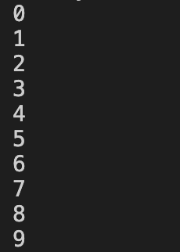
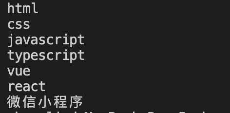
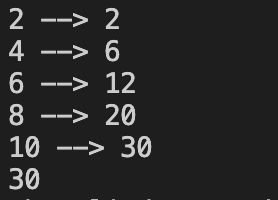
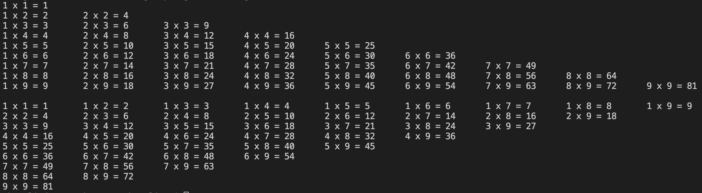

# 流程控制与循环

在编程过程中，经常会根据一系列条件做出不同的操作；这个过程就叫流程控制

## if

```go
var list []string = []string{"future", "Go"}
if len(list) > 2 {
  fmt.Println("list的长度大于2")
}
```

每条`if`语句的核心都是一个值为`true`或`false`的表达式，这种表达式被称为条件测试

- 检查是否相等

  ```go
  num1 := 1
  num2 := 2
  if num1 == num2 {
    fmt.Println("它们相等")
  }
  ```

  

- 数字比较

  int、int8、int16、int32、int64是不同的类型，不能拿来统一比较

- 多条件检查

  - 或（||）
  - 与（&&）
  - 非（!）

- 布尔表达式

  ```go
  canEat := false
  canGo := true
  ```

- if-else结构

  当需要检查的条件超过两个时，则可以使用Go语言提供的`if-else`解构；在编程语言中，只需执行`if-else`解构中的一个代码块，它即可依次检查每个条件测试，直到通过条件测试为止；在通过测试后，将执行紧随其后的逻辑代码，并跳过其他测试

  ```go
  var list []string = []string{"future", "Go"}
  if len(list) > 2 {
    fmt.Println("list的长度大于2")
  } else {
    fmt.Println("list的长度不大于2")
  }
  ```

  ## switch

当有个条件时，可能些`if-else`对于后期而言比较难以阅读和维护，在Go语言中，`switch`也可以控制流程

```go
var nums = []int{1, 2, 3, 4, 5, 6, 7}
for _, num := range nums {
  switch num {
    case 1:
    fmt.Println("Monday")
    case 2:
    fmt.Println("Tuesday")
    case 3:
    fmt.Println("Wednesday")
    case 4:
    fmt.Println("Thursday")
    case 5:
    fmt.Println("Friday")
    case 6:
    fmt.Println("Saturday")
    case 7:
    fmt.Println("Sunday")
  }
}
```

::: tip 

- 左花括号`{`必须与`switch`关键字处于同一行
- 在Go语言中不需要用`break`来明确推出一个`case`子句
- 只有在`case`子句中明确添加`fallthrough`关键字时，才会继续执行紧跟的下一个`case`子句

:::

## 循环语句

上面的`switch`案例就用到了循环的一种，在Go语言中，一共有两种循环方式：`for`、`for range`

下面分别使用这两种方式来做一个小demo：

```go
// 遍历从一到十
for i := 0; i < 10; i++ {
  fmt.Println(i)
} 

```

打印结果如下图所示：



```go

// 遍历front数组中的元素并打印
front := [...]string{"html", "css", "javascript", "typescript", "vue", "react", "微信小程序"}
for _, v := range front {
  fmt.Println(v)
}
```

遍历结果如下：



### break

`break`的作用就是中段往后执行，跳出当前作用域

```go
var (
  sum int
  i   = 1
)

for {
  if i > 5 {
    break
  }

  sum += i

  fmt.Println(i, "-->", sum)

  i++
}

fmt.Println(sum)
```

::: tip

使用`for`时，如果后不跟条件则会一直循环。

:::

上面事例中，初始值`i`为1，在循环体中，每执行一次，`i`就会加一，并打印当前`i`和累加结果；如果`i`大于5则跳出当前循环体

### continue

```go
var (
  sum int
  i   = 1
)

for {
  if i > 10 {
    break
  }

  if i%2 != 0 {
    // this continue creates an endless loop
    // since the code never increases the i
    continue
  }

  sum += i

  fmt.Println(i, "-->", sum)

  i++
}

fmt.Println(sum)
```

如果你是初学者，拿到这段代码去运行，你很可能会懵，为什么没有打印出来呢？其实吧！就是`continue`在捣鬼；我们先从从上往下解读这段代码，首先声明了两个变量：`sum`和`i`,`i`赋了初始值为1，`sum`为int类型的变量；紧接着就是循环，进入循环后，判断`i`是否大于10，如果大于10，就退出当前循环体(也就是再也不执行for循环内的逻辑了)，如果小于10才能往后继续执行；然后就改变`sum`的值(`sum += i`等同于`sum = sum + i`)，下一步就是打印`i`和`sum`，然后就是改变`i`的值(`i++`就是在`i`原来的基础加1)，现在来分析一波为什么没有打印结果的原因，`i`的值为1，故而不会进第一个判断，然后又来了第二波判断，判断`i`取模2是否等于0，如果不等于0就`continue`，又从`for`循环的第一行开始执行，有判断是否大于10、取模2是否等于0，这样就陷入了死循环了；因为`i`的值一直都是1，所以第一个判断是永远不会生效的，第二个判断也一直会执行，周而复始；如何打破上面代码的僵局呢？其思路就是在`continue`之前改变`i`的初始值，这样就会不陷入死循环了，修改后的代码为下：

```go
var (
  sum int
  i   = 1
)

for {
  if i > 10 {
    break
  }

  if i%2 != 0 {
    // this continue creates an endless loop
    // since the code never increases the i
    i++ // 在continue之前改变i的值
    continue
  }

  sum += i

  fmt.Println(i, "-->", sum)

  i++
}

fmt.Println(sum)
```

打印结果如下：



写个99乘法表：

```go
// 决定处理第几行
for i := 1; i < 10; i++ {
  // 决定这一行有多少列
  for j := 1; j <= i; j++ {
    fmt.Printf("%d x %d = %d \t", j, i, i*j)
  }
  // 手动生成回车
  fmt.Println("")
}


// 决定处理第几行
for row := 1; row < 10; row++ {
  // 决定处理第几列
  for col := row; col < 10; col++ {
    fmt.Printf("%d x %d = %d \t", row, col, row * col)
  }
  fmt.Println("")
}
```

结果如下:



### goto

在Go语言中，可以通过`goto`语句跳转到标签，进行代码间的无条件跳转；另外，`goto`语句在快速跳出循环、避免重复退出方面也有一定的帮助。使用`goto`语句能简化一些代码的实现过程。

```go
func learnGoto() {
	var i int
loop:
	if i < 3 {
		fmt.Println("looping")
		i++
		goto loop
	}
	fmt.Println("done")
}
```

