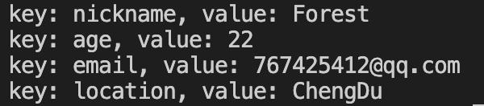

# map

数组和切片属于单一元素的容器，他们使用连续存储的方式存储元素，每个元素的类型都是相同的。map(字典)与它们不同，它存储的不是单一元素，而是键值对(包含一个key和value)；在map中，所有键的类型都是相同的，所有值的类型也是相同的，但键和值的类型可以不同，键的类型必须通过`==`来进行比较数据类型

在Go语言中，字典是使用哈希表实现的；键和值互为映射。我们可以对键值对进行增加、删除、修改和查询等操作。

```go
package main

import "fmt"

func main() {
	var m map[string]int = map[string]int{
		"typescript编程":        88,
		"Go极简一本通":             99,
		"Go Web编程实战派":         128,
		"javascript高级程序设计":    129,
		"javascript语言精髓与编程实践": 144,
	}

	price, ok := m["Go Web编程实战派"]
	if !ok {
		fmt.Println("can not find")
		return
	}

  fmt.Println("price:", price) // price: 128

}
```

上面这段代码就是在哈希表中查找与某一个键对应的值，所以需要先把键作为参数传递给哈希表，哈希表再用哈希函数把键转为哈希值。哈希值通常是一个无符号的整数；在一个哈希表中通常有一定数量的桶(bucket)，叫作哈希桶；这些哈希桶会均匀的存储其所属哈希表收纳的键值对。键值对总是在一起存储，只要找到了键，就一定能找到与之对应的值；然后哈希表把相应的值作为结果返回。

在Go语言中，每一个键都是由它的哈希值代表的map不会单独存储任何键，但会单独存储他们的哈希值。在Go语言规范中，键的类型不能是函数、map(字典)、切片。如果键的类型是接口类型，那么实际类型也不能是上面上种，否则在程序运行时会引发`panic`

## 创建map

在Go语言中，map就是一系列键值对，我们可以通过键访问与之对应的值；与键相关的值可以是数字、字符串、切片，甚至是map；事实上，任何Go语言对象都可以称为map中的值。

### 字面量方式创建

```go
// 字面量方式创建
var m map[string]string = map[string]string{"nickname": "Forest", "age": "22", "email": "767425412@qq.com"}
fmt.Println("访问nickname为：", m["nickname"]) // 访问nickname为： Forest
```

### 使用内置函数make创建

```go
// make
user := make(map[string]string)
user["nickname"] = "Forest"
user["age"] = "22"
user["gmail"] = "767425412lin@gmail.com"
user["location"] = "ChengDu"
fmt.Println(user) // map[age:22 gmail:767425412lin@gmail.com location:ChengDu nickname:Forest]
```

::: tip

可以使用`make()`函数来构造`map`，但不能使用`new()`函数来构造`map`。如果错误的使用`new()`函数分配了一个引用对戏那个，则会获得一个空指针，相当于声明了一个为初始化的变量并取得了它的地址。

:::

## map的基本操作

在Go语言中map用放在花括号({})中的一系列键值对表示，如使用字面量方式创建的形式；键值对相互关联，在访问键时将返回与之相关联的值。键与值之间用猫好分开，键值对之间用逗号隔开，这样就可以保存任意数量的键值对；最简单的map是只有一个键值对的字典，如下：

```go
var m map[string]string = map[string]string{"nickname": "Forest"}
```

### 访问map中的值

要想获取与键相关的值，则需要一次指定map名和方括号内的键：

```go
var m map[string]string = map[string]string{"nickname": "Forest", "age": "22", "email": "767425412@qq.com"}
fmt.Println("访问nickname为：", m["nickname"])
```

上面声明了一个名为m的map，并初始化了值，使用中括号访问键为`nickname`的值，若存在就会打印出来，若不存在Go语言也会明确的告诉我们，如下:

```go
var m map[string]string = map[string]string{"nickname": "Forest", "age": "22", "email": "767425412@qq.com"}
location, ok := m["location"]
if !ok {
  fmt.Println("没有找到对应的值！")
  return
}
fmt.Println("location:", location)
```

上面代码中显然不会执行最后一行的打印，因为打m中没有`location`的键值对存在，所以会走进`if`判断里

### 添加键值对

map是一种动态的数据结构，可以随时在其中添加键值对，并且可依次指定字典名、用方括号的方式使其与之关联。就拿上面的例子来说吧！添加一个`location`的键值对：

```go
var m map[string]string = map[string]string{"nickname": "Forest", "age": "22", "email": "767425412@qq.com"}
m["location"] = "ChengDu"
location, ok := m["location"]
if !ok {
  fmt.Println("没有找到对应的值！")
  return
}
fmt.Println("location:", location) // location: ChengDu
```

上面代码中也就是`m[location]="ChengDu"`在原来的map添加了一对数据，所以后面的访问就不会走进`if`判断里了，最后一行的打印也说明了我们的添加是成功了的

::: tip

键值对的排列顺序与添加顺序不同，Go语言不关心键值对的添加顺序，它只关心键值对之间的关联关系

:::

### 修改map中的值

其实修改方法与上面一样，同样也是使用方括号的方式进行修改

```go
	var m map[string]string = map[string]string{"nickname": "Forest", "age": "22", "email": "767425412@qq.com"}
	m["age"] = "18"
	fmt.Println("修改后的age：", m["age"]) // 修改后的age： 18
```

上面代码中，就是将age初始化声明的22改为18，最后一行的打印结果可以测试出修改后的结果。这种方式就是，如果运来声明的map中没有要修改的值则直接添加，如果有，则直接修改

### 删除键值对

对于字典中不需要的信息，可以使用`delete`方法将相应的键值对进行删除；**使用`delete`方法时，必须指定字典名称和要删除的键**。即使删除的键不存在，这个删除也是安全的；map会使用给定的键来查找值，如果对应的值不存在，则返回该类型的零值

> `delete()`方法有两个参数，第一个参数是map名，第二个参数是要删除数据的键

```go
var m map[string]string = map[string]string{"nickname": "Forest", "age": "22", "email": "767425412@qq.com"}
m["age"] = "18"
// 删除email数据
delete(m, "email")
fmt.Println("m:", m) // m: map[age:18 nickname:Forest]
```


### 遍历map

一个map既可以包含几个键值对，也可以包含数百万个键值对。也就是说在一个map中可能包含大量的数据，因此需要通过遍历的方式来读取map中的数据。常用的遍历map的方式有三种：

- 遍历map中所有的键值对
- 遍历map中的键
- 遍历map中的值

在map中，值的迭代顺序是不固定的，即迭代的顺序是随机，从一个值开始到最后一个值结束。

```go
var forest map[string]string = map[string]string{"nickname": "Forest", "age": "22", "email": "767425412@qq.com", "location": "ChengDu"}
for key, value := range forest {
  fmt.Printf("key: %s, value: %s \n", key, value)
}
```

结果如下：



### 在map中嵌入切片

在实际的开发环境，可能会有比较复杂的应用场景，比如一个购物商城，男装系列、女装系列、图书系列、文具系列的等等都可能会用到嵌套结构

```go
func nested() {
	var sports map[string][]string = map[string][]string{
		"ball":  {"basketball", "pingpong", "soccer", "badminton"},
		"other": {"martial arts", "swimming", "long run", "high jump"},
	}
	fmt.Println("sports:", sports)
}
```

上面代码中，首先创建一个`sports`的`map`，键为字符串类型，值为字符串的切片

### 在map中嵌入map

特别是一些商城类的产品中，经常可能会看到某一系列下的商品的商品名称、描述、价格、规格等等；这种场景就很可能会用到map嵌套map。下面来写个案例：

```go
var books map[string]map[string]int = map[string]map[string]int{
  "四书": map[string]int{"论语": 80, "大学": 66, "中庸": 60, "孟子": 70},
  "五经": map[string]int{"周易": 90, "诗书": 80, "礼记": 88, "尚书": 78, "春秋": 99},
  "书法": map[string]int{"兰亭集序": 66, "九成宫碑": 68, "多宝塔": 56},
}
```

