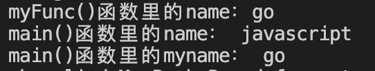

# 函数

## 定义函数

函数是带有名字的代码块，通过它可以更方便的完成重复性的工作。当程序在多次执行同一向任务时，无须反复编写该任务的代码，只需调用执行该任务的函数。

在Go语言中，完整的函数形式如下：

```go
func 函数名 (参数列表) (返回列表) {函数体}

// 示例
func handleCalcSum(x, y string) int {}
```

> - func： 声明函数的关键字
> - handleCalcSum：函数名称
> - x, y：参数列表；一组参数和参数类型，简称形参列表，具体值有调用者提供的实际参数传递进来
> - int：返回参数类型；可以是一个类型或者返回值
> - 函数体：函数定义的代码集合

当函数返回未命名的返回值或没有返回值时，括号可以省略。当函数有返回值时，则必须显示的以`return`语句结束

- 无返回值

  ```go
  func handleCalcSum(x, y int) {
    // 函数体
  }
  ```

- 返回值类型

  ```go
  func handleCalcSum(x, y int) int {
    // 函数体
  }
  ```

- 返回具体值

  ```go
  func handleCalcSum(x, y int) (result int) {
    result := x * y
    return result
  }
  ```

  上面代码中声明了具体的返回值，所以在返回的时候也可以不用写返回变量，代码如下：

  ```go
  func handleCalcSum(x, y int) (result int) {
    result := x * y
    return
  }
  ```

函数类型是函数签名，当有两个相同的参数列表和返回列表时，这两个函数的类型和签名是相同的；需要注意的是，即使参数和返回值的名称不同，也不会硬系那个函数类型。

### 传递参数

上面代码中函数计算和，我们来具体实现下呢

```go
package main

import "fmt"

func main() {
	sum := handleCalcSum(10, 5)
	fmt.Println("和为：", sum) // 和为： 15
}

func handleCalcSum(x, y int) int {
	return x + y
}
```

上面代码中，干了写什么呢，下面来一一探究；声明了一个处理计算和的函数(`handleCalcSum()`)，要求调用时需要传入两个`int`类型的参数，返回这俩参数和；在`main`函数中调用了这个计算函数，传入了两值，分别是：10和5；声明了一个sum的变量接受这个计算函数返回的结果

### 实际参数与形式参数

实际参数就是在调用函数时，传给形参的实际的数据被称为实际参数，简称实参

形式参数就是在声明函数时，用于接受外部传入的数据被称为形式参数，简称形参；形式参数时函数的局部变量，初始值有调用者提供的实际参数传递进来的。函数的形参和命名返回值都是函数最外层的作用域变量。实参时安置传递的，所以函数接受到的是实参的副本，修改函数的形参不会改变调用者提供的实参，但是，如果提供的实参是引用类型，如切片、map、函数、指针、通道等，那么当函数使用形参时就可以改变实参的值。

### 位置参数

在调用函数时，Go语言必须将函数调用的每个参数都关联到传递函数定义的一个形参上，而最简单的关联方式就是基于实参的顺序进行关联，这种关联方式被称为位置实参

```go
func Desc(nickname, motto string) {
	fmt.Printf("%s的座右铭是：%s\n", nickname, motto)
}

Desc("Forest", "雪花不飘我不飘···") // Forest的座右铭是：雪花不飘我不飘···
```

上面代码中，定一个函数`Desc`，它需要两个`string`类型的形参，调用时需要按顺序传递参数；调用时`Desc()`方法时，第一个参数关联到形参`nickname`上，将第二个实参关联到`motto`上；最后输出`Forest的座右铭是：雪花不飘我不飘···`

这种方式很好的证明了调用函数是一种效率极高的工作方式；我们只需要在函数中编写业务逻辑代码，设计好参数列表，当需要调用这个函数是，向它提供实参信息就完事，并且函数是可以重复使用的

### 传递数组

数组是按值传递，当调用一个函数时，每个传入的参数都会先创建一个副本，在赋值给对应的函数变量，所以函数接受的事一个副本，而不是原始参数；这种传递参数的方式，在传递大数组的时变得极为低效，而且在函数对数组的任何修改都只是副本上进行的，并不影响原数组

```go
package main

func main() {
	beer := [3]string{"雪花", "燕京", "勇闯"}
	diet(beer) // 雪花 不飘我不飘
}

func diet(liquor [3]string){
	fmt.Printf("%s 不飘我不飘\n", liquor[0])
}

```

我们可以使用数组指针来修改，代码如下：

```go
package main

import "fmt"

func main() {
	beer := [3]string{"雪花", "燕京", "勇闯"}

	modify(&beer) // 修改后的值为： &[乌苏 燕京 勇闯]
	fmt.Println("berr:", beer) // berr: [乌苏 燕京 勇闯]
}

func modify(liquor *[3]string) {
	liquor[0] = "乌苏"
	fmt.Println("修改后的值为：", liquor)
}
```

以上代码最终执行后可以看出，原数组中的值已经被改了；使用数组指针是高效的，它允许被调用函数修改调用方数组中的元素

::: tip

在使用指针修改的时候，应注意数组本身的特性；由于数组长度是固定的，因此数组本身并不可变，即不能添加或删除元素

:::


### 传递切片

在一些复杂的场景中，很有可能会传递切片；因为切片可以包含一个或者多个复杂的数据，比如map等等

```go
package main

func main() {
	var books map[string]map[string]int = map[string]map[string]int{
		"四书": map[string]int{"论语": 80, "大学": 66, "中庸": 60, "孟子": 70},
		"五经": map[string]int{"周易": 90, "诗书": 80, "礼记": 88, "尚书": 78, "春秋": 99},
		"书法": map[string]int{"兰亭集序": 66, "九成宫碑": 68, "多宝塔": 56},
	}
	getBookPrice(books) // 80
	fmt.Println("修改前的books：", books) // 修改前的books： map[书法:map[九成宫碑:68 兰亭集序:66 多宝塔:56] 五经:map[周易:90 尚书:78 春秋:99 礼记:88 诗书:80] 四书:map[中庸:60 大学:66 孟子:70 论语:80]]
	modifyBookPrice(books) // book: map[书法:map[九成宫碑:68 兰亭集序:66 多宝塔:56] 五经:map[周易:90 尚书:78 春秋:99 礼记:88 诗书:80] 四书:map[中庸:60 大学:66 孟子:70 论语:88]]
	fmt.Println("修改后的books:", books) // 修改后的books: map[书法:map[九成宫碑:68 兰亭集序:66 多宝塔:56] 五经:map[周易:90 尚书:78 春秋:99 礼记:88 诗书:80] 四书:map[中庸:60 大学:66 孟子:70 论语:88]]
}

func getBookPrice(book map[string]map[string]int) {
	fmt.Println("book:", book["四书"]["论语"])
}

func modifyBookPrice(book map[string]map[string]int) {
	book["四书"]["论语"] = 88
	fmt.Println("book:", book)
}
```

上面打印结果可以看出，修改前(论语：80)和修改后(论语：88)的数据；至于为什么可以改变传入切片的数据呢？形参是函数的局部变量，初始值又调用方提供的实参传递；函数形参和返回值属于函数最外层作用域的局部变量。实参是按值传递的，函数接收的是每个实参的副本，所以修改函数的形参并不会影响调用提供的实参；如果调用方传入的是引用类型，那么当函数使用形参是就有可能间接的修改实参

### 避免实参错误

在调用函数时，必须要以声明函数所需的参数进行个数及类型的一一匹配；当提供的参数个数或者类型不匹配时，就会出现变异错误而导致程序运行失败

## 返回值

函数并非总是直接显示输出的，相反，我们经常使用函数处理一些数据，并返回一个或多个值；函数返回的值被称为返回值。在函数中，可以使用`return`关键字将值返回到调用函数的代码中

### 返回简单值

```go
package main

import (
	"fmt"
)

func main() {
	beer := [3]string{"雪花", "燕京", "勇闯"}
	result := diet(beer)
	fmt.Println("result:", result) // result: 雪花不飘我不飘
}

func diet(liquor [3]string) string {
	fmt.Printf("%s 不飘我不飘\n", liquor[0])
	return liquor[0] + "不飘我不飘"
}
```

上面代码中声明了一个`diet`函数，需要传入一个数组，在`main()`中调用返回一个字符串

### 返回map

函数可以返回任何类型的值，包括切片和字典等复杂的数据结构

```go
package main

import (
	"fmt"
)

func main() {
	var books map[string]map[string]int = map[string]map[string]int{
		"四书": map[string]int{"论语": 80, "大学": 66, "中庸": 60, "孟子": 70},
		"五经": map[string]int{"周易": 90, "诗书": 80, "礼记": 88, "尚书": 78, "春秋": 99},
		"书法": map[string]int{"兰亭集序": 66, "九成宫碑": 68, "多宝塔": 56},
	}
  
	res := getBook(books)
	fmt.Println("res:", res) // res: map[中庸:60 大学:66 孟子:70 论语:88]
}

// 获取书籍
func getBook(book map[string]map[string]int) map[string]int {
	return book["四书"]
}
```

上面代码中，声明了一个函数`getBook()`，调用时需要传入一个map，然后返回一个map；在`main()`中调用了`getBook()`，传入一个为`books`的map，`books`是一个嵌套map，`getBook()`将“四书”的数据获取后返回

## 返回多个值

Go语言中可以让一个函数返回不止一个结果；大多数函数的返回值是两个，一个是返回数据，另一个返回的是数据存在与否的布尔值

在很多场景下多会用到返回多个值的情景，比如获取切片、数组、map中的某个字段进行处理时，就会返回两个值；一个是数据源，另一个就是存在与否的布尔值，如下：

```go
package main

import (
	"fmt"
)

func main() {
	var sports map[string][]string = map[string][]string{
		"ball":  {"basketball", "pingpong", "soccer", "badminton"},
		"other": {"Martial arts", "swimming", "long run", "high jump"},
	}
  
	value, exists := sports["ball"]
	if exists {
		fmt.Println("value:", value)
	} else {
		fmt.Println("没有你要获取的值！")
	}
}
```

上面实力代码中，首先给一个要获取的捡，最终返回两个值(`value`，`exist`)，`exist`就是判断这个值是否存在要查找的键，它是一个布尔值；如果存在则进入第一个判断，打印`value`；否则就打印“没有你要获取的值”

在日常开发中，我们可以给返回值命名，与函数的形参一样；在返回键被命名后，他们的值在函数开始初始化时就会被初始化为当前类型的零值；在函数执行过程中，如果返回的语句不怠任何参数，那么会返回对应的返回值变量

::: tip

在Go语言中，不要求强制命名返回值

如果调用了一个有多个返回值的函数或者方法，但是不需要某个返回值时，可以使用“_”来忽略这个返回值；比如：

```go
books, _ = http.GET("localhost:9090/api/v1/books")
```

:::

## 函数变量

与其他值一样，函数变量也有类型，既可以把函数变量赋值给变量，也可以传递函数变量，或者从其他函数返回函数变量。我们可以像使用普通变量一样使用函数变量，还可以把函数变量当作参数进行传递

函数变量类型的零值是`nil`，如果调用了值为`nil`的函数，则会导致宕机。通常使用`nil`和函数变量来做判空比较

## 匿名函数

所谓匿名函数就是没有名字的函数，也被称为闭包。在Go语言中，匿名函数有一个没有函数名的函数声明和函数体组成。函数可以作为一种被赋值给函数类型的变量；匿名函数往往以变量的方式被传递；匿名函数与函数一样，可以像普通变量那样被传递或使用。匿名函数同样可以获取和更新外层函数的局部变量

### 匿名函数的定义

匿名函数可以被理解为没有名字的普通函数，其定义方式如下：

```go
func (参数列表) (返回值列表) {
  // 函数体
}
```

匿名函数是一个“内联”语句或表达式，匿名函数的优越性在于：可以直接使用函数内的变量，不必声明

```go
type Hi func(num string) string

func sayHello(num string, hi Hi) {
	result := hi(num)
	fmt.Println("result:", result)
}

func main() {
  sayHello("10", func(num string) string {
		return num + "人打招呼"
	})
}
```

上面代码中，`sayHello`的第二个参数就是个匿名函数，类型是`func(num string)string`；当调用`sayHello()`方法时，第二个匿名函数的执行结果会返回给`result`这个成员变量，然后将这个成员变量打印出来

匿名函数在Go语言中较为常见，这种方式定义的函数能够获取整个语法环境，里面的函数可以使用外层函数中的变量

### 匿名函数的调用

#### 在定义时定义匿名函数

匿名函数可以在声明后直接调用，也可以直接声明并调用

```go
package main

import "fmt"

func main() {
	// 定义匿名函数并赋值给成员变量
	f := func(nickname string) {
		fmt.Printf("hi~ %s", nickname) 
	}
	f("Forest") // hi~ Forest

	// 直接声明并调用
	func(email string) {
		fmt.Printf("我的邮箱是： %s", email) // 我的邮箱是： 767425412@qq.com
	}("767425412@qq.com")
}
```

匿名函数的用途非常广泛；匿名函数本省是一种值，可以方便地保存在各种容器中实现毁掉函数和操作封装

#### 用匿名函数作为回调函数

回调函数简称“回调”(Callback即Call then back，被主函数调用运算后会返回主函数)，是指通过函数参数传递到其他代码的某一块可执行代码的引用

匿名函数作为回调函数来使用，在Go语言的系统包中是很常见的。在`strings`包中就有这种实现：

```go
func TrimFunc(s string, f func(rune) bool) string {
  return TrimRightFunc(TrimLeftFunc(s, f), f)
}
```

可以使用匿名函数体作为参数，来实现对切片中的元素的遍历操作。代码如下：

```go
package main

import "fmt"

func visitPrint(list []int, f func(int)) {
	for _, value := range list {
		f(value)
	}
}

func main() {
	sli := []int{1, 2, 3, 4, 5}

	visitPrint(sli, func(i int) {
		fmt.Println(i)
	})
}

// 最后的打印结果：
// 1
// 2
// 3
// 4
// 5
```

### 剩余参数

剩余参数是指参数的个数是不确定的；在参数列表的类型名称之前使用省略号“...rest”作为一个剩余参数的容器。在调用这个函数时，可以传递改类型人意数目的参数；其实“...rest”就是个语法糖，可以把它看作rest类型的数组切片，即rest[]

```go
package main

import "fmt"

func main() {
	sli := []int{1, 2, 3, 4, 5}

	visitPrint(sli, func(i int) {
		fmt.Println(i)
	})
	res := Total(2, 3, 4, 5, 6, 7)
	fmt.Println("res:", res) // 27
}

func Total(prices ...int) int {
	result := 0

	for _, price := range prices {
		result += price
	}
	return result
}
```

下面是Go语言内置的Printf函数的定义：

```go
func Printf(format string, a ...interface{}) (n int, err error) {
  return Fprintf(os.Stdout, format, a...)
}
```

用`interface{}`可以传递任意类型的数据，并且`interface{}`是类型安全的，因而使用`Printf()`函数时，可以传入任意类型、个数不等的参数

### 延迟函数调用（defer）

#### 什么是defer

在程序中，经常需要创建资源（比如：数据库连接、文件句柄、锁等等）；为了在函数执行完毕后及时地释放资源，Go的设计者提供`defer`延迟语句

`defer`语句主要用在函数中，用来在函数结束(return或者panic异常导致结束)之前执行某个动作，是一个函数结束前最后执行的工作

在Go语言一个函数中，`defer`语句的执行逻辑如下：

- 当程序执行到一个`defer`时，不会立即执行`defer`后的语句，而是将`defer`的语句压入一个存储`defer`语句的栈中，然后继续执行函数下一个语句
- 当函数执行完毕后，再从`defer`栈中一次从顶取出执行（注意：先进去的最后执行，最后进去的先执行）
- 在`defer`将语句放入栈时，也会将相关的值赋值进入栈中

```go
package main

import "fmt"

func main() {
	deferCall()
}

func deferCall() {
	defer funcA()
	defer funcB()
	defer funcC()
}

func funcA() {
	fmt.Println("A")
}

func funcB() {
	fmt.Println("B")
}

func funcC() {
	fmt.Println("C")
}

// 最后打印结果：
// C
// B
// A
```

#### defer与return的执行顺序

在一个函数体中，`defer`和`return`的调用顺序是怎样的？通过下面例子来观察下吧

```go
package main

import "fmt"

var name string = "go"

func myFunc() string {
	defer func() {
		name = "javascript"
	}()

	fmt.Printf("myFunc()函数里的name：%s\n", name)

	return name
}

func main() {
	myName := myFunc()
	fmt.Printf("main()函数里的name： %s\n", name) 
	fmt.Println("main()函数里的myname：", myName) 
}
```

运行结果如下：



看到上图结果后，还是来详细看看示例代码吧

- 首先声明了一个全局变量`name`并赋了初始值“go”
- 声明了一个函数`myFunc()`返回一个字符串，其中里面是一个延迟执行的匿名回调函数，这个延迟函数的主要作用就是改变`name`的值，然后返回`name`
- 在`main`函数中调用了声明的`myFunc()`函数

看到结果后为什么最后一行打印还是输入的“go”呢？解释只有一个——`defer`执行是在`return`之后才调用的匿名回调函数，所以在执行`defer`前，`myFunc()`已经被赋值成“go”

#### defer常用应用场景

- 关闭资源

  在创建资源（比如连接数据库、文件句柄、锁等等）后，需要释放掉资源内存，避免占用内存、系统资源。可以在打开资源的语句的下一行，直接使用`defer`语句提前把关闭资源的操作注册了，这样会减少程序员忘写关闭资源的情况

- 和recover()函数一起使用

  当程序出现宕机或者遇到`panic`错误时，`recover()`函数可以恢复执行；而且不会报告宕机错误。之前说过，`defer`不但可以在`return`返回前调用，也可以在程序宕机显示`panic`错误时，在程序出现宕机之前被执行，一次来恢复程序

### panic

我们日常编写代码时是不会遇到`panic`的，只有程序运行时才会遇到

当程序引发`panic`时，`panic`的相关信息会被创建出来，并且该程序的控制权会立即从此行代码转交到调用其所属函数的那行代码上，即调用栈的上一级。方法的执行过程其实就是一个出栈的过程，在此行代码终止后，它会转移至上一级的调用代码处。如此反复，最终到达栈顶，也就是函数，对于主`goroutine`来说就是`main`函数。控制权被Go语言运行时系统回收，最终，程序崩溃并终止运行

当程序发生意外时，甚至宕机时，会输出一条日志。这条日志包括宕机时的错误信息和函数调用的栈的调用信息，我们可以借助这些信息诊断问题的原因。`panic`不会终止`defer`语句的执行，逐层向上执行`panic`，直到所属`goroutine`中所有正在执行的函数都被终止为止

### recover

**recover**(恢复)可处理程序运行时错误，种植错误处理流程。`recover()`通常在一个使用`defer`语句的函数中执行。如果没有在发生异常的`goroutine`中明确调用`recover`，可能会导致该`goroutine`所属的进程打印异常信息后直接退出

如果在`defer`语句中调用了`recover`并且定义该`defer`语句的函数发生了`panic`，那么`recover`会是程序从`panic`中恢复，并返回`panic`信息，导致`panic`异常的函数不会继续运行，但能正常返回；若在未发生`panic`时调用`recover`，则`recover`会返回`nil`。如果发生`panic`，但没有`recover`那么久会终止运行
