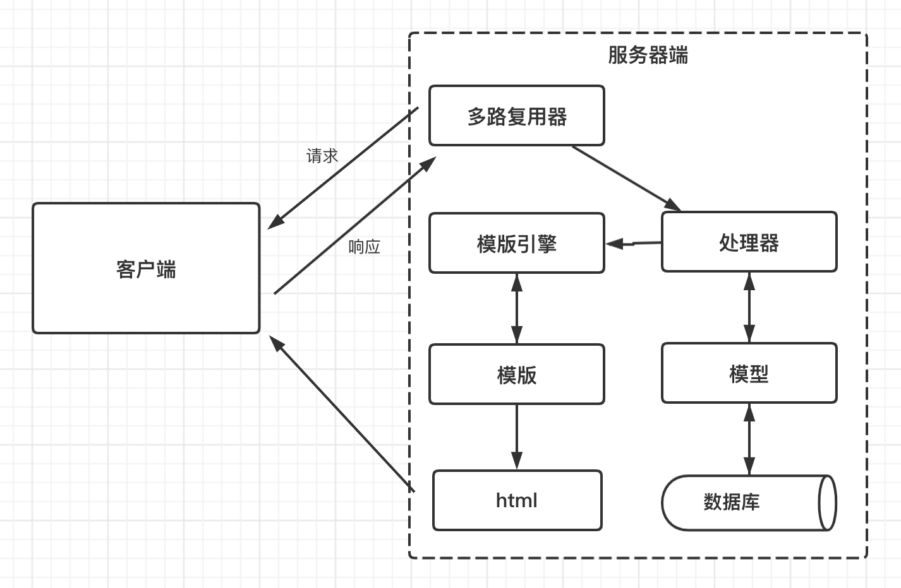
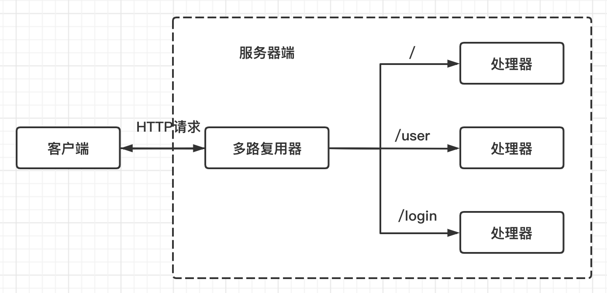

# 接受和处理Go Web请求



Go Web服务器请求和响应的流程:

- 客户端发送请求
- 服务端的多路复用器收到请求
- 多路复用器根据请求的URL找到注册的处理器,将请求交由处理器处理
- 处理器执行逻辑,如果必要,则与数据库进行交互,得到处理结果
- 处理器调用模版引擎将指定的模版和上一步得到的结果渲染成客户端可识别的数据格式(通常HTML)
- 服务端将数据通过HTTP响应返回客户端
- 客户端拿到数据,执行对应的操作

## ServeMux和DefaultServeMux



### serveMux

**serveMux**是一个结构体, 其中包含一个映射, 这个映射会讲URL映射至相应的处理器; 它会在映射中找出与请求URL最为匹配的URL,然后调用与之相对应的ServeHTTP()方法来处理请求

**DefaultServeMux**是`net/http`包中默认提供的一个多路复用器, 其实质是`ServeMux`的一个实例;  多路复用器的任务是——根据请求的URL将请求重定向到不同的处理器;  如果用户灭有位Server对象指定处理器, 则服务器默认使用DefaultServeMux作为ServeMux结构体的实例

其实ServerMux也是一个处理器, 可以在需要时对其实例实施处理串联; 

声明语句如下:

```go
var DefaultServeMux = &defaultServeMux
var defaultServeMux ServeMux
```

