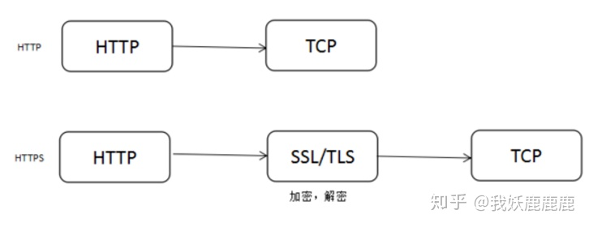
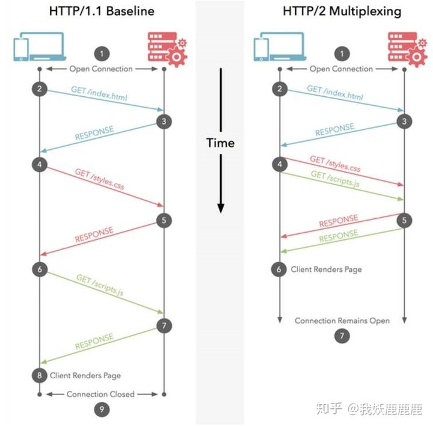
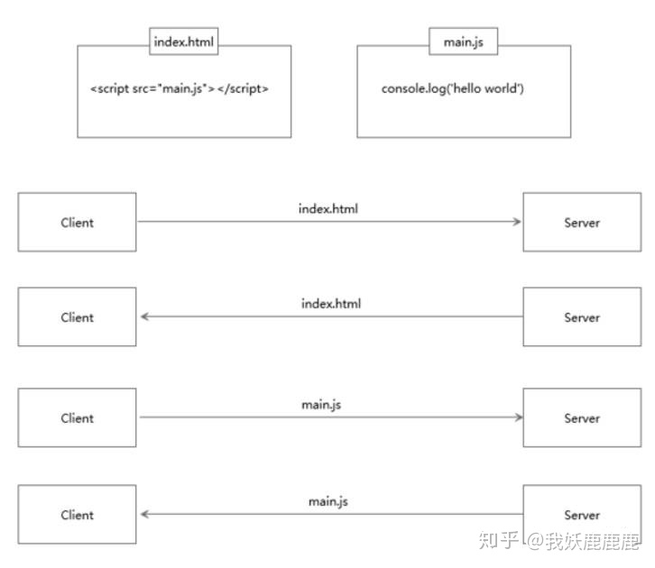
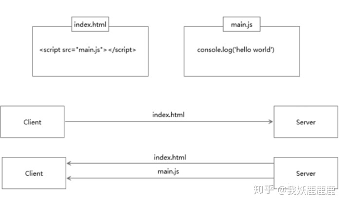
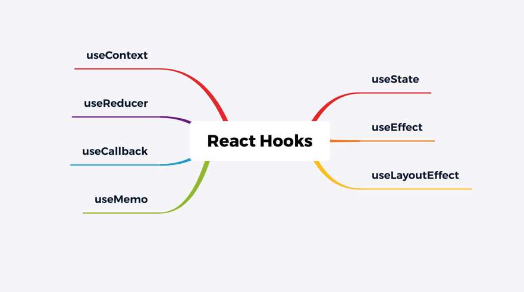
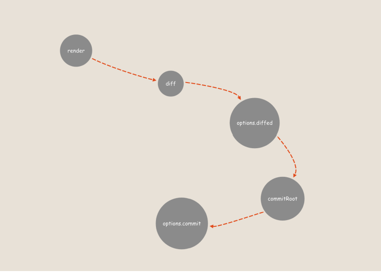

## keep-alive  组件有什么作用？

> 主要用于保留组件状态或避免重新渲染。 包裹动态组件时，会缓存不活动的组件实例，而不是销毁它们。

## 说下 vue 生命周期钩子函数?

> -Vue 实例创建阶段的生命周期函数
>
> -   初始化事件及生命周期函数
>     -   brforeCreate() ---------- data 和 methods 中的数据都还没有初始化
>     -   创建中，正在初始化 data 和 methods
>     -   Created() -------------- 如果需要操作 data 中的数据或操作方法，可以放在这个函数里
> -   开始编译模板
>     -   beforeMount() --------- 模板编译好了，但是还没有放到页面中去 - 把编译好的模板放到浏览器中去进行渲染
>     -   mounted() ------------- 页面渲染完成，Vue 实例初始化完毕
> -   Vue 实例运行阶段的生命周期函数
>     -   如果数据发生改变
>         -   beforeUpdate() -------- 页面数据还没有更新，但是 data 中的数据已经更新完毕，页面与数据不同步
>     -   Diff, 这一步执行，是先根据 data 中的最新数据，在内存中重新计算出一份 dom 树，对比新老两个 dom 树之间的差异...
>         -   update() ---------------- 这时候，数据和页面已经完成更新
> -   Vue 实例销毁阶段的生命周期函数
>     -   beforeDestroy() -------- 销毁执行之前，实例身上所有的数据和事件，指令等等都可以用，此刻还没有真正执行销毁
>     -   destroyed() ------------- 执行这个函数的时候，组件中的数据，方法，指令，过滤器等等完全销毁

## Vue 中 computed 和 watch 区别?

> -   computed  是计算属性，依赖其他属性计算值，并且 computed  的值有缓存，只有当计算值变化才会返回内容。
> -   watch  监听到值的变化就会执行回调，在回调中可以进行一些逻辑操作。

## React 的组件间通信都有哪些形式？

> -   父传子：在 React 中，父组件调用子组件时可以将要传递给子组件的数据添加在子组件的属性中，在子组件中通过 props 属性进行接收。这个就是父组件向子组件通信。
> -   子传父：React 是单向数据流，数据永远只能自上向下进行传递。当子组件中有些数据需要向父级进行通信时，需要在父级中定义好回调，将回调传递给子组件，子组件调用父级传递过来的回调方法进行通信。
> -   跨组件通信 - context。使用 context API，可以在组件中向其子孙级组件进行信息传递。

## React 中如何实现路由懒加载？

在 React 16 中，新增了 lazy 方法，通过 lazy 方法可以轻松实现组件懒加载，当然要实现路由懒加载的话，其实也只需要把路由组件结合 lazy 使用即可。   参考代码如下：

```javascript
import { Route } from 'react-router-dom'
import React, { Suspense } from 'react'
const HomeView = React.lazy(() => import('./home'))
function App() {
    return (
        <div>
            <h1>路由懒加载</h1>              
            <Route
                path="/"
                exact
                render={() => {
                    return (
                        <Suspense
                            fallback={<div>组件Loading进来之前的占位内容</div>}
                        >
                                          
                            <HomeView />
                                  
                        </Suspense>
                    )
                }}
            />
                       
        </div>
    )
}
export default App
```

在上述代码中使用 lazy 引入了一个动态组件，然后将该组件放入了根路由中。这样的话只有用户访问网站首页时，才会动态加载这个组件。注意在 React 规范中，lazy 和 Suspense 必须配合使用，lazy 引入的动态组件必须要放入 Suspense 中，Suspense 的 fallback 属性是 lazy 的组件没有加载进来之前的占位内容。

## React 的生命周期函数都有哪些，分别有什么作用？

React 的生命周期已经经历了 3 次改动，最新的版本可以看下图：

> -   挂载阶段：
>
>     -   constructor: 初始化组件，初始化组件的 state 等。
>     -   static getDerivedStateFromProps()：该函数用于将 props 中的信息映射到 state 中。
>     -   render: 生成虚拟 DOM
>     -   componentDidMount：组件挂载完成，通过在该函数中去处理副作用 更新阶段：
>     -   static getDerivedStateFromProps()
>     -   shouldComponentUpdate()：该生命周期函数用于判断是否要进行组件更新。
>     -   render()：生成虚拟 DOM
>     -   getSnapshotBeforeUpdate()：组件已经完成 diff，即将更新真实 DOM，用户获取上一次的 DOM 快照。该函数必须搭配 componentDidUpdate 一块使用，返回值会变成 componentDidUpdate 第三个参数。
>     -   componentDidUpdate()： 组件更新完成，通常在该函数中进行副作用处理。
>
> -   即将卸载：
>     -   componentWillUnmount：组件即将卸载，用于删除组件添加到全局的数据或事件。

## 说一下 React Hooks 在平时开发中需要注意的问题和原因?

-   不要在循环，条件或嵌套函数中调用 Hook，必须始终在 React 函数的顶层使用 Hook

这是因为 React 需要利用调用顺序来正确更新相应的状态，以及调用相应的钩子函数。一旦在循环或条件分支语句中调用 Hook，就容易导致调用顺序的不一致性，从而产生难以预料到的后果。

-   使用 useState 时候，使用 push，pop，splice 等直接更改数组对象的坑

使用 push 直接更改数组无法获取到新值，应该采用析构方式，但是在 class 里面不会有这个问题

代码示例

```javascript
function Indicatorfilter() {
    let [num, setNums] = useState([0, 1, 2, 3])
    const test = () => {
        // 这里坑是直接采用 push 去更新 num
        // setNums(num)是无法更新 num 的
        // 必须使用 num = [...num ,1]
        num.push(1)
        // num = [...num ,1]
        setNums(num)
    }
    return (
        <div className="filter">
            <div onClick={test}>测试</div>
            <div>
                {num.map((item, index) => (
                    <div key={index}>{item}</div>
                ))}
            </div>
        </div>
    )
}

class Indicatorfilter extends React.Component<any, any> {
    constructor(props: any) {
        super(props)
        this.state = {
            nums: [1, 2, 3]
        }
        this.test = this.test.bind(this)
    }

    test() {
        // class 采用同样的方式是没有问题的
        this.state.nums.push(1)
        this.setState({
            nums: this.state.nums
        })
    }

    render() {
        let { nums } = this.state
        return (
            <div>
                <div onClick={this.test}>测试</div>
                <div>
                    {nums.map((item: any, index: number) => (
                        <div key={index}>{item}</div>
                    ))}
                </div>
            </div>
        )
    }
}
```

-   useState 设置状态的时候，只有第一次生效，后期需要更新状态，必须通过 useEffect

看下面的例子

TableDeail 是一个公共组件，在调用它的父组件里面，我们通过 set 改变 columns 的值，以为传递给 TableDeail 的 columns 是最新的值，所以 tabColumn 每次也是最新的值，但是实际 tabColumn 是最开始的值，不会随着 columns 的更新而更新

```javascript
const TableDeail = ({ columns }: TableData) => {
    const [tabColumn, setTabColumn] = useState(columns)
}

// 正确的做法是通过useEffect改变这个值
const TableDeail = ({ columns }: TableData) => {
    const [tabColumn, setTabColumn] = useState(columns)
    useEffect(() => {
        setTabColumn(columns)
    }, [columns])
}
```

-   善用 useCallback

父组件传递给子组件事件句柄时，如果我们没有任何参数变动可能会选用 useMemo。但是每一次父组件渲染子组件即使没变化也会跟着渲染一次。

-   不要滥用 useContext

可以使用基于 useContext 封装的状态管理工具。

## Token 一般是存放在哪里? Token 放在 cookie 和放在 localStorage、sessionStorage 中有什么不同?

> -   Token 其实就是访问资源的凭证。
> -   一般是用户通过用户名和密码登录成功之后，服务器将登陆凭证做数字签名，加密之后得到的字符串作为 token。
> -   它在用户登录成功之后会返回给客户端，客户端主要有这么几种存储方式：存储在 localStorage 中，每次调用接口的时候都把它当成一个字段传给后台存储在 cookie 中，让它自动发送，不过缺点就是不能跨域拿到之后存储在 localStorage 中，每次调用接口的时候放在 HTTP 请求头的 Authorization 字段里
> -   所以 token 在客户端一般存放于 localStorage，cookie，或 sessionStorage 中。将 token 存放在 webStroage 中，可以通过同域的 js 来访问 。这样会导致很容易受到 xss 攻击，特别是项目中引入很多 第三方 js 类库的情况下。如果 js 脚本被盗用，攻击者就 可以轻易访问你的网站，webStroage 作为一种储存机制，在传输过程中不会执行任何安全标准。
> -   XSS 攻击：cross-site Scripting（跨站脚本攻击）是一种注入代码攻击 。恶意攻击者在目标网站上注入 script 代码，当访问者浏览网站的时候通过执行注入的 script 代码达到窃取用户信息，盗用用户身份等。
> -   将 token 存放在 cookie 中可以指定 httponly，来防止被 Javascript 读取，也可以指定 secure，来保证 token 只在 HTTPS 下传输。缺点是不符合 Restful 最佳实践，容易受到 CSRF 攻击。
> -   CSRF 跨站点请求伪造(Cross—Site Request Forgery)，跟 XSS 攻击一样，存在巨大的危害性。简单来说就是恶意攻击者盗用已经认证过的用户信息，以用户信息名义进行一些操作（如发邮件、转账、购买商品等等）。由于身份已经认证过，所以目标网站会认为操作都是真正的用户操作的 。CSRF 并不能拿到用户信息，它只是盗用的用户凭证去进行操作。

## WebSocket 是怎么实现点对点通信和广播通信的？

> webSocket 是一种全双工通信协议。websocket 让服务端和客户端通信变得简单。最大的特点是可以通过服务端主动推送消息到客户端。前端基于 nodejs 和 WebSocket 实现点对点及广播通信。
>
> -   广播通信顾名思义是类似广播一样给多个人进行广播消息。
> -   点对点通信顾名思义就是一对一的通信，例如多人实时聊天，可以指定用户来发送消息。点对点通信中需要注意服务端需要记录每个 socket 客户端的连接 ，需要将客户端及服务端 socket 对象关联起来。广播数据的时候，广播指定对象就可以了
> -   WebSocket 区分广播通信及点对点通信核心在于区分每一个连接的 socket 对象。广播通信需要对于非自身的所有连接的 socket 对象进行通信。而点对点通信，通过关联用户及 socket 对象，且保存每一个 socket 连接，查找指定的 socket 对象，来达到发送指定 socket 连接的目的。

## 客户端缓存有几种方式?浏览器出现 from disk、from memory 的 策略是啥?

1.强缓存

-   服务器通知浏览器一个缓存时间，在缓存时间内，下次请求，直接用缓存，不在时间内，执行比较缓存策略。
-   `Cache-control` （相对值）、 `Expries`（绝对值）
-   Expries 是 http1.0 的标准

```javascript
let nowTime = new Date()
nowTime.setTime(new Date().getTime() + 3600 * 1000)
ctx.set('Expires', nowTime.toUTCString())
```

到了`HTTP/1.1`，`Expire`已经被`Cache-Control`替代`ctx.set("Cache-control","max-age=3600") // 设置缓存时间 3600s`

-   public：所有内容都将被缓存（客户端和代理服务器都可缓存） - private：所有内容只有客户端可以缓存，`Cache-Control`的默认取值 - no-cache：客户端缓存内容，但是是否使用缓存则需要经过协商缓存来验证决定 - no-store：所有内容都不会被缓存，即不使用强制缓存，也不使用协商缓存 - max-age=xxx ：缓存内容将在 xxx 秒后失效`Cache-Control`优先级比`Expires`高`from memory cache`代表使用内存中的缓存，`from disk cache`则代表使用的是硬盘中的缓存，浏览器读取缓存的顺序为`memory –> disk`。

-   协商缓存让客户端与服务器之间能实现缓存文件是否更新的验证、提升缓存的复用率，将缓存信息中的`Etag`和`Last-Modified`通过请求发送给服务器，由服务器校验，返回 304 状态码时，浏览器直接使用缓存。出现` from disk`、`from memory` 的策略是强缓存。
    -   `Last-Modify/if-Modify-Since
    -   ETag/if-None-Macth`
    -   协商缓存的标识也是在响应报文的 HTTP 头中和请求结果一起返回给浏览器的，控制协商缓存的字段分别有：`Last-Modified / If-Modified-Since`和`Etag / If-None-Match`，其中`Etag / If-None-Match`的优先级比`Last-Modified / If-Modified-Since`高。
    -   缓存关系强缓存优于协商缓存，强缓存中 `Cache-control` 优于 `Expries`，协商缓存中`ETag/ If-None-Match` 优先级高于 `Last-Modified / If-Modified-Since`。

## 说一下 CORS 的简单请求和复杂请求的区别?

-   `CORS(Cross-origin resource sharing)`，跨域资源共享，是一份浏览器技术的规范，用来避开浏览器的同源策略。相关头部设置如下：
    -   `Access-Control-Allow-Origin` 指示请求的资源能共享给哪些域。 `Access-Control-Allow-Credentials` 指示当请求的凭证标记为 `true` 时，是否响应该请求。 `Access-Control-Allow-Headers` 用在对预请求的响应中，指示实际的请求中可以使用哪些 `HTTP` 头。 `Access-Control-Allow-Methods` 指定对预请求的响应中，哪些 `HTTP` 方法允许访问请求的资源。 `Access-Control-Expose-Headers` 指示哪些 `HTTP` 头的名称能在响应中列出。 `Access-Control-Max-Age` 指示预请求的结果能被缓存多久。 `Access-Control-Request-Headers` 用于发起一个预请求，告知服务器正式请求会使用那些 `HTTP` 头。 `Access-Control-Request-Method` 用于发起一个预请求，告知服务器正式请求会使用哪一种 `HTTP` 请求方法。 `Origin` 指示获取资源的请求是从什么域发起的。
    -   `CORS`可以分成两种简单请求和复杂请求。简单请求是满足以下下条件的请求
    -   HTTP 方法是下列之一
        -   HEAD
        -   GET
        -   POST
    -   HTTP 头信息不超出以下几种字段
        -   Accept
        -   Accept-Language
        -   Content-Language
        -   Last-Event-ID
        -   Content-Type，但仅能是下列之一
        -   application/x-www-form-urlencoded
        -   multipart/form-datatext/plain`
    -   反之就是复杂请求，复杂请求表面上看起来和简单请求使用上差不多，但实际上浏览器发送了不止一个请求。其中最先发送的是一种"预请求"，此时作为服务端，也需要返回"预回应"作为响应。预请求实际上是对服务端的一种权限请求，只有当预请求成功返回，实际请求才开始执行。

## 节流和防抖分别是什么？在什么场景下使用？请分别实现一个节流函数和一个防抖函数

## 怎么禁止让 js 读取 cookie？怎么让 cookie 只在 HTTPS 下传输？

> 由于 cookie 会存放在客户端，一般情况下会保存一些凭证及状态信息，为了防止 cookie 泄露造成安全问题。可以这只 cookie 的 HttpOnly 属性，那么通过程序(JS 脚本、Applet 等)将无法读取到 Cookie 信息，这样能有效的防止 XSS 攻击。cookie 中有个属性 secure，当该属性设置为 true 时，表示创建的 Cookie 会被以安全的形式向服务器传输，也就是只能在 HTTPS 连接中被浏览器传递到服务器端进行会话验证，如果是 HTTP 连接则不会传递该 cookie 信息，所以不会被窃取到 Cookie 的具体内容。就是只允许在加密的情况下将 cookie 加在数据包请求头部，防止 cookie 被带出来。secure 属性是防止信息在传递的过程中被监听捕获后信息泄漏。但是这两个属性并不能解决 cookie 在本机出现的信息泄漏的问题。

## v-if 和 v-for 为什么不能连用？

> v-for 比 v-if 优先，如果每一次都需要遍历整个数组，将会影响速度，尤其是当之需要渲染很小一部分的时候 。可以采取多层包裹来解决性能损耗问题。例如外层给标签绑定指令 v-if 或者是内层标签绑定 v-if

## 单页面应用和多页面应用区别及优缺点?

-   单页应用：
    -   优点：
        -   用户体验好，快，内容的改变不需要重新加载整个页面，基于这一点 SPA 对服务器压力较小
        -   前后端分离
        -   页面切换体验好
    -   缺点：
        -   不利于 SEO
        -   导航不可用，需要自己实现导航
        -   初次加载好事长
        -   页面复杂度提高
-   多页应用
    -   优点：
        -   对于 SEO 友好
        -   容易扩展
        -   更易的数据分析
    -   缺点：
        -   程序开发成本高
        -   增加服务端压力，多页面会不停的加载
        -   用户体验相对较差

## v-model  该如何实现？

> v-model 本质上是 v-on 和 v-bind 的语法糖。
> v-model 在内部为不同元素抛出不同的事件，如：text 和 textarea 元素使用 value 属性和 input 事件；checkbox 和 radio 使用 checked 属性和 change 事件；select 字段将 value 作为 prop 并将 change 作为事件。

-   v-model 作用在普通表单上

```javascript
<input v-model="myvalue" />
//  等同于
<input v-bind:value="myvalue" v-on:input="myvalue=$event.target.value">
```

v-model 作用在组件上 父组件 v-model 语法糖本质上可以修改为 `<child :value="message" @input="function(e){message = e}"></child>`在组件的实现中，我们是可以通过 v-model 属性 来配置子组件接收的 prop 名称，以及派发的事件名称。例如：

```javascript
// 父组件
//html
<mycom v-model="myvalue" />
//等同于
<mycom
    :value="myvalue"
    @input="(e)=>{myvalue = e}"
/>

//js
new Vue({
    el: "#app",
    components:{
        mycom
    },
    data: {
        myvalue: "123"
    }
})

// 子组件
let mycom = {
    props:['value'],
    template:`<div><input :value="value"  @input="fn" /></div>`,
    methods:{
        fn(e){
            this.$emit('input',e.target.value)
        }
    }
}

```

## vue2 中为什么检测不到数组的变化，如何解决?

由于由 JavaScript 的限制，Vue 不能检测数组变动。解决方案是通过全局 Vue.set 或者用实例方法 vm.$set 来修改。同样也可以通过变异方法 splice 来修改数组触发数据响应式

## 在 React 项目中，想要进行逻辑复用,有哪些方案？

### 组件逻辑复用、组件视图复用

#### 逻辑复用：HOC（高阶组件）

> HOC（高阶组件）类似于高阶函数，在使用高阶组件时，传入一个组件，会返回一个组件。 举个我们使用频率比较多的例子 - withRouter

```javascript
function Acmp(props) {
    const { history, localtion, match } = props
    return <div>view</div>
}

const Bcmp = withRouter(Acmp)
```

`Acmp`组件本身不具备路由相关信息；但是`Acmp`中想要使用路由相关的信息，这是就可以使用`withRouter()`使`Acmp`拥有路由信息

`withRouter()`这个高阶组件的作用就是复用传递给视图组件路由信息的逻辑；调用`withRouter()`将`Acmp`组件传递进去，`withRouter()`返回一个`Bcmp`；调用`Bcmp`组件时，会调用`Acmp`组件，并将路由信息传递给`Acmp`

原理如下：

```javascript
const withRouter = (Cmp) => {
    return () => <Route component={Cmp}>
}
```

#### hooks

> `hooks`的出现，主要目的就是解决逻辑复用的问题，相比高阶组件，`hooks` 的使用更加灵活，更自由。以`Router`的`hooks`对比`withRouter`；使用`withRouter`时，会一次性将路由所有相关数据导入组件，而 `hooks` 我们按照需求汁倒入`location`和`history`等；另外一个组件中，用`redux`相关数据，有需要路由信息时，结果如下

```javascript
function Acmp(props) {
    const { history, location, match } = props
    return <div>view</div>
}

const Bcmp = withRouter(Acmp)
const Ccmp = connect(state => state)(Bcmp)
```

复用一个逻辑就需要在外面包一层，使用起来极不方便；使用 `hooks` 就比这方便得多且灵活

#### render props

render props 同样是 react 中，复用逻辑的小技巧，并不是标准定义的 API。 简单来说，就是组件具有一个 `render` 属性，该属性接收的是一个函数，该组件中要渲染的视图是 `render` 属性的返回值。 举一个我们使用最多的常见，`Route` 组件的 `render` 属性。

```javascript
<Route path="/home" render={() => <Home />} />
```

`Route` 组件中得这个 `render` 属性就是一个关于 render props 得实际应用；将组件内要渲染得视图放在 `render` 属性得返回值中，而组件本身是一个路由逻辑得公用。这样就做到了功能复用而视图自定义。

Route 简易原理如下：

```javascript
function Route(props) {
    const { path, render } = props
    if (matchPath(path)) {
        return (
            <RouterContext.Consumer>
                {context => render(context)}
            </ROuterContext.Consumer>
        )
    }
    return null
}
```

> 高阶组件或 hook，通常用在单一的逻辑复用，比如实时获取当前滚动条位置，或定义 `state`，副作用处理等，都是单一的逻辑。 而 render props 通常是一个完整的功能复用，只是该功能中视图或部分视图需要由使用者定义，比如，弹窗功能，路由功能 等，项目中使用到这些功能的地方有很多，但是使用时，视图可能有差异

## 在 React 中，针对类组件 和 函数组件，分别怎么去进行性能优化？

React 中，如果组件更新了，会携带它的子孙级组件一起进行更新，虽然组件更新时，会有 diff 约束 DOM 更新。 但组件更新时的 diff，也会消耗很多性能。 如何避免项目中不必要的组件更新就是我们必须要面对的问题。 如果是类组件我们可以使用 `shouldComponentUpdate` 或者`PureComponent` , 函数组件则可以使用 hooks `useMemo()`
::: tip 注意
不管你使用的是哪种优化手段，`state` 一定是一个不可变值，否则拿不到组件更新前的数据， 也就没有办法进行对比，优化也就无从谈起。<br />
官网手册：[React.memo](https://reactjs.org/docs/react-api.html#reactmemo)、[React.PureComponent](https://reactjs.org/docs/react-api.html#reactpurecomponent)
:::

## Vue3 中 Teleport 的作用是什么

> 他的作用就是将一个嵌套在组件内部的某些内容可以渲染到当前组件外部。
> 假设我们有一个 modal 组件，该组件分为触发 modal 打开的 button 以及模态框本体

```HTML
<div style="position: relative;">
    <button @click="modalOpen = true">    Open full screen modal!  </button>
    <telepot to="body">
        <div v-if="modalOpen" class="modal">
            I'm a modal!
            <button @click="modalOpen = false">Close</button>
        <div>
    </telepot>
</div>
```

::: tip

### teleport 可以包含 vue 组件使用么？

可以，当 teleport 包含的是 vue 组件时，只是将该组件渲染到对应的标签当中，他的 props 等依然是从该组件的父组件进行注入。

### 可以使用多个 teleport 指向同一标签么？

可以的，就比如有一个复用的 modal 组件，他在多个地方被使用时会被指向相同标签比如 body。这时将会按照顺序进行追加，后挂载的元素会在较早挂载元素之后的位置。
:::

## 说一下 vue3 的 composition api?

> composition api 意为组合式 api，其主要是代码组织结构上的变动。vue2 版本的 options api，通过一个配置集合将代码划分为多个部分，使得代码组织结构比较清晰，比如父组件直接传入的数据存放于`props`，方法存放于`methods`等，但是其代码逻辑复用方面一直表现得不是很友好。composition api 就是用于解决该问题，在 vue3 当中新增加了一个生命周期函数为`setup`。`setup`将在创建组件之前被执行，一旦`props`被解析时，`setup`将服务于 composition api 充当入口点。从使用角度来讲 composition api 主要有以下几点与 options api 不同响应式数据声明改变，通过`ref/reactive`两个方法均可以声明响应式数据，但是两者使用方式略有不同。`ref`所声明的响应式变量将会返回一个包含有 value 属性的对象，value 的值就是该响应式变量所对应的值。所以在不论在获取还是改变 ref 声明的响应式变量时都需要通过.value 进行操作。`reactive`返回的则是通过`Proxy`处理后的对象。使用生命周期函数时，变为从 vue 中引入对应生命周期函数例如`onMounted`，生命周期函数接受一个函数作为参数，该函数将会在对应生命周期阶段被执行。`watch`使用方式改变，`watch`作为函数接受至少两个参数，第一个参数为被`watch`的响应式数据，第二个参数为回调函数。当`watch`接受的响应式数据不同会有不同的使用方式，当`watch`的数据为通过`ref`声明的响应式变量时，`watch`直接接受`ref`响应式变量如`watch(refValue)`。当`watch`数据为通过`reactive`声明时，需要传入一个函数，该函数返回 reactive 变量如`watch(() => reactiveValue.value)`。同时新增 watchEffect，他会收集内部依赖，当内部依赖发生改变时就会被执行。`props`现在作为`setup`的第一个参数进行接收，使用`props`时可以通过 vue 暴露的`toRefs`方法将`props`上的属性转为独立的`ref`响应式变量，从而进行使用。在`setup`当中代码将可以根据功能进行组织并提取，这极大程度的解决了以往代码可读性较低以及逻辑服用难的缺点。
>
> ### composition api 是强制使用的么？我还可以在 vue3 中使用 options api 的方式进行开发么？
>
> composition api 并不被强制使用，他只是在大型项目中对于代码复用以及逻辑提取上有很大的有点，并且他极大的提高了代码可读性。vue3 是向下兼容的，在 vue3 当中依然可以通过 options api 进行开发。同时尤大本人曾在 Vue Mastery 上表示过，对于新手来讲，options api 的学习可能对于上手 vue 来说更加快速。
>
> ### 我还可以在 setup 中通过 this 来使用实例上的属性么？
>
> 不可以，因为`setup`执行是在组件创建之前，这时还并没有组件实例，所以在 setup 中并没有 this，如果希望使用一些实例上的方法，可以通过`getCurrentInstance`方法先获取实例在进行操作。

## vue3 中 v-model 的变化?

> vue3 取消了.sync 修饰符的使用，直接使用 v-model 进行替换即可。对于自定义组件使用 v-model 时，prop 与事件的默认名称变更，从 vue2 版本的 value/@input 变更为 modelValue/@update:modelValue。修改 model 的名称从原来的 model 选项进行修改，变更为传递参数给 model，写法为 v-model:argument。使用 v-model 参数后会改变 prop 和事件名为 argument/@update:argument。现在一个组件可以同时使用多个 v-model 进行绑定。并且在 vue3 中 v-model 支持自定义修饰符，他将会通过 props 中的 modelModifiers 属性接收。

### 是否还可以使用 vue2 版本的方式配置 model 名称？

> 不可以，v-model 参数是一个不向下兼容的改动，在 vue3 中修改 model 的名称就是通过 v-model 参数进行修改。

### 在同一个组件上绑定多个 v-model 时需不需要单独进行配置？

> 绑定多个 v-model 的时候只要传参对 model 名称进行变更，每个 v-model 将会同步到不同的 prop 属性当中，所以并不需要在组件中添加额外的选项进行配置。

## 说一下 Vue3 与 Vue2 的对比？

首先从性能层面讲，vue3 不论是渲染速度或是打包速度均快于 vue2，这里有以下几个原因数据劫持方式改变，原有通过 Object.defineProperty 进行的数据劫持改变为 Proxy 进行数据代理。由于 Proxy 可以动态判断该数据是否为深层嵌套数据，而 Object.defineProperty 为遍历全部深层嵌套数据，导致两者仅在数据劫持上就产生了极大的时间差距。vue3 打包策略，vue3 支持了 tree-shaking，即排除任何未实际使用的代码，打包体积极大缩小。同时由于打包后体积缩小文件数量减少，页面加载文件所需时间也极大缩短。diff 优化，vue3 中会对静态节点进行提升，所有静态节点(及不包含任何响应式数据及事件等)在进行比对时不会被遍历。这促使 vue3 在进行节点比对时所需的比对时间大幅减少。性能之后还有生命周期的改变，vue2 中的 beforeCreate 与 created 被 setup 一个生命周期所替代，同时 beforeDestroy 与 destroyed 分别改名为 beforeUnmount 与 unmounted。同时 vue3 当中的响应式数据声明也有所改变，但这主要体现与在 setup 中进行响应式数据的声明。vue3 当中暴露了两个方法，分别是 reactive 与 ref 方法。他们均是用来声明响应式数据，只是对于不同情况有各自的有点。由上面一点可以引出 vue3 当中发生的最大改变 - composition api。vue3 的代码组织有以前的 options api 切换到了 composition api，这使得我们在处理大型项目时不会再像以前一样，一个功能的代码将被分割到 data、computed、method 等等当中，我们可以将相同功能代码提出进行封装，这极大提高了代码可读性。除此以外 vue3 中双向绑定也进行了修改。vue3 中取消了 v-bind 的.sync 修饰符，因为这更符合 v-model 的逻辑。v-model 主要有以下两点不同：一个组件可以同时包含多个 v-model，model 名称的更改由之前的 model 选项变更为传递一个参数给 model，传参方式为 v-model:argument 当 v-model 用于自定义组件时，prop 与事件的默认名称由以前的 value/@input 变更为 modelValue/@update:modelValue。如果使用了 v-model 参数改变了 model 名字，比如 v-model:title，则对应 prop 与事件名称为 title/@update:title。最后 vue3 对 ts 的支持程度也是 vue2 所不能达到的，例如 vue3 当中提供了一个 defineComponent，他能为 props 提供完整的类型推断。

## 在组件的通信中 EventBus 非常经典，你能手写实现下 EventBus 么？

```javascript
class EventBusClass{  
    constructor() {    
        this.msgList = {};
    }  

    on(msgName,fn){    
        if(this.msgList.hasOwnProperty(msgName)){      
            if(typeof this.msgList[msgName] === 'function'){        
                this.msgList[msgName] = [this.msgList[msgName],fn]    
            }else {        
                this.msgList[msgName] = [...this.msgList[msgName], fn]    
            }  
        }else{      
            this.msgList[msgName] = fn;  
            }
        }  

        one(msgName,fn){    
            this.msgList[msgName] = fn;
        }  

        emit(msgName,msg){    
            if(!this.msgList.hasOwnProperty(msgName)){      
                return  
            }​    

            if(typeof this.msgList[msgName] === 'function'){      
                this.msgList[msgName](msg);  
            }else{      
                this.msgList[msgName].map((fn)=>{        fn(msg);      })  
            }
        }  

        off(msgName){    
            if(!this.msgList.hasOwnProperty(msgName)){      
                return;  
            }    

            delete this.msgList[msgName];
        }
    }​
}

const eventBus = new EventBusClass();
window.EventBus = eventBus;

```

## 请介绍一下装饰者模式，并实现？

```javascript
class luban {  
    fire(){    
        console.log('这里是基础伤害');
    }
}​

class firstSkill{  
    constructor(luban){    
        this.luban = luban;
    }  

    fire(){    
        this.luban.fire();    
        console.log('发射手雷');
    }
}

​var luban1 = new luban;
luban1 = new firstSkill(luban1);
luban1.fire();
```

## 了解 js 中设计模式吗？动手实现一下单例模式？

```javascript
let CreateSingle = (function(){    
    let instance;    
    return function(name){        
        if(instance){            
            return instance;        
        }        
        return instance = new Single(name);    
    }
})();​

let Single = function(name){    
    this.name = name;
}​

Single.prototype.getName = function(){    
    console.log(this.name);
}​
let lili = new CreateSingle('lili');
let wuyou = new CreateSingle('wuyou');​
wuyou.getName()
```

## 虚拟  DOM  有什么作用，如何构建虚拟 DOM？

```javascript
class Vdom {
    constructor(option) {
        this.tagName = option.tagName
        this.props = option.props || {}
        this.children = option.children || ''
    }
    render() {
        let el = document.createElement(this.tagName)
        for (let propsKay in this.props) {
            el.setAttribute(propsKay, this.props[propsKay])
        }
        if (Array.isArray(this.children)) {
            this.children.forEach(item => {
                el.appendChild(item.render())
            })
        } else {
            el.innerText = this.children
        }
        return el
    }
}
```

## 你对浏览器的理解？

> -   浏览器的主要功能是将用户选择的 Web 资源呈现出来，它需要从服务器请求资源，并将其显示在浏览器窗口中，资源的格式通常是 HTML，也包括 PDF、image 及其他格式。用户用 URI（Uniform Resource Identifier 统一资源标识符）来指定所请求资源的位置。
> -   HTML 和 CSS 规范中规定了浏览器解释 HTML 文档的方式，由 W3C 组织对这些规范进行维护，W3C 是负责制定 Web 标准的组织。
> -   但是浏览器厂商纷纷开发自己的扩展，对规范的遵循并不完善，这为 Web 开发者带来了严重的兼容性问题。
> -   简单来说浏览器可以分为两部分，shell（外壳） 和 内核。其中 shell 的种类相对比较多，内核则比较少。
> -   shell 是指浏览器的外壳：例如菜单，工具栏等。主要是提供给用户界面操作，参数设置等等。它是调用内核来实现各种功能的。
> -   内核才是浏览器的核心。内核是基于标记语言显示内容的程序或模块。也有一些浏览器并不区分外壳和内核。自从 Mozilla 将 Gecko 独立出来后，才有了外壳和内核的明确划分。

## 介绍一下你对浏览器内核的理解？

> -   浏览器内核主要分成两部分：渲染引擎和 JS 引擎。
> -   渲染引擎的职责就是渲染，即在浏览器窗口中显示所请求的内容。默认情况下，渲染引擎可以显示 HTML、XML 文档及图片，它也可以借助插件（一种浏览器扩展）显示其他类型数据，例如使用 PDF 阅读器插件，可以显示 PDF 格式。
> -   JS 引擎：解析和执行 JavaScript 来实现网页的动态效果。
> -   最开始渲染引擎和 JS 引擎并没有区分的很明确，后来 JS 引擎越来越独立，内核就倾向于只指渲染引擎。

## 常见的浏览器内核比较

> -   Trident：这种浏览器内核是 IE 浏览器用的内核，因为在早期 IE 占有大量的市场份额，所以这种内核比较流行，以前有很多网页也是根据这个内核的标准来编写的，但是实际上这个内核对真正的网页标准支持不是很好。但是由于 IE 的高市场占有率，微软也很长时间没有更新 Trident 内核，就导致了 Trident 内核和 W3C 标准脱节。还有就是 Trident 内核的大量 Bug 等安全问题没有得到解决，加上一些专家学者公开自己认为 IE 浏览器不安全的观点，使很多用户开始转向其他浏览器。
> -   Gecko：这是 Firefox 和 Flock 所采用的内核，这个内核的优点就是功能强大、丰富，可以支持很多复杂网页效果和浏览器扩展接口，但是代价是也显而易见就是要消耗很多的资源，比如内存。
> -   Presto：Opera 曾经采用的就是 Presto 内核，Presto 内核被称为公认的浏览网页速度最快的内核，这得益于它在开发时的天生优势，在处理 JS 脚本等脚本语言时，会比其他的内核快 3 倍左右，缺点就是为了达到很快的速度而丢掉了一部分网页兼容性。
> -   Webkit：Webkit 是 Safari 采用的内核，它的优点就是网页浏览速度较快，虽然不及 Presto 但是也胜于 Gecko 和 Trident，缺点是对于网页代码的容错性不高，也就是说对网页代码的兼容性较低，会使一些编写不标准的网页无法正确显示。WebKit 前身是 KDE 小组的 KHTML 引擎，可以说 WebKit 是 KHTML 的一个开源的分支。
> -   Blink：谷歌在 Chromium Blog 上发表博客，称将与苹果的开源浏览器核心 Webkit 分道扬镳，在 Chromium 项目中研发 Blink 渲染引擎（即浏览器核心），内置于 Chrome 浏览器之中。其实 Blink 引擎就是 Webkit 的一个分支，就像 webkit 是 KHTML 的分支一样。Blink 引擎现在是谷歌公司与 Opera Software 共同研发，上面提到过的，Opera 弃用了自己的 Presto 内核，加入 Google 阵营，跟随谷歌一起研发 Blink。

参考

-   [《浏览器内核的解析和对比》](http://www.cnblogs.com/fullhouse/archive/2011/12/19/2293455.html)
-   [《五大主流浏览器内核的源起以及国内各大浏览器内核总结》](https://blog.csdn.net/Summer_15/article/details/71249203)

## extend 能做什么

这个 API 很少用到，作用是扩展组件生成一个构造器，通常会与 `$mount` 一起使用。

```javascript
// 创建组件构造器
let Component = Vue.extend({
    template: '<div>test</div>'
})
// 挂载到 #app 上
new Component().$mount('#app')
// 除了上面的方式，还可以用来扩展已有的组件
let SuperComponent = Vue.extend(Component)
new SuperComponent({
    created() {
        console.log(1)
    }
})
new SuperComponent().$mount('#app')
```

## mixin 和 mixins 区别

> `mixin` 用于全局混入，会影响到每个组件实例，通常插件都是这样做初始化的。

虽然文档不建议我们在应用中直接使用 `mixin`，但是如果不滥用的话也是很有帮助的，比如可以全局混入封装好的 `ajax` 或者一些工具函数等等。

```javascript
Vue.mixin({
    beforeCreate() {
        // ...逻辑
        // 这种方式会影响到每个组件的 beforeCreate 钩子函数
    }
})
```

`mixins` 应该是我们最常使用的扩展组件的方式了。如果多个组件中有相同的业务逻辑，就可以将这些逻辑剥离出来，通过 `mixins` 混入代码，比如上拉下拉加载数据这种逻辑等等。

另外需要注意的是 `mixins` 混入的钩子函数会先于组件内的钩子函数执行，并且在遇到同名选项的时候也会有选择性的进行合并，具体可以阅读文档。

## 响应式原理

Vue 内部使用了 `Object.defineProperty()` 来实现数据响应式，通过这个函数可以监听到 `set` 和 `get` 的事件。

```javascript
var data = { name: 'yck' }
observe(data)
let name = data.name // -> get value
data.name = 'yyy' // -> change value

function observe(obj) {
    // 判断类型
    if (!obj || typeof obj !== 'object') {
        return
    }
    Object.keys(obj).forEach(key => {
        defineReactive(obj, key, obj[key])
    })
}

function defineReactive(obj, key, val) {
    // 递归子属性
    observe(val)
    Object.defineProperty(obj, key, {
        // 可枚举
        enumerable: true,
        // 可配置
        configurable: true,
        // 自定义函数
        get: function reactiveGetter() {
            console.log('get value')
            return val
        },
        set: function reactiveSetter(newVal) {
            console.log('change value')
            val = newVal
        }
    })
}
```

以上代码简单的实现了如何监听数据的 `set` 和 `get` 的事件，但是仅仅如此是不够的，因为自定义的函数一开始是不会执行的。只有先执行了依赖收集，才能在属性更新的时候派发更新，所以接下来我们需要先触发依赖收集。

```html
<div>{{name}}</div>
```

在解析如上模板代码时，遇到双大括号就会进行依赖收集。

接下来我们先来实现一个 `Dep` 类，用于解耦属性的依赖收集和派发更新操作。

```javascript
// 通过 Dep 解耦属性的依赖和更新操作
class Dep {
    constructor() {
        this.subs = []
    }
    // 添加依赖
    addSub(sub) {
        this.subs.push(sub)
    }
    // 更新
    notify() {
        this.subs.forEach(sub => {
            sub.update()
        })
    }
}
// 全局属性，通过该属性配置 Watcher
Dep.target = null
```

以上的代码实现很简单，当需要依赖收集的时候调用 `addSub`，当需要派发更新的时候调用 `notify`。

接下来我们先来简单的了解下 Vue 组件挂载时添加响应式的过程。在组件挂载时，会先对所有需要的属性调用 `Object.defineProperty()`，然后实例化 `Watcher`，传入组件更新的回调。在实例化过程中，会对模板中的属性进行求值，触发依赖收集。

因为这一小节主要目的是学习响应式原理的细节，所以接下来的代码会简略的表达触发依赖收集时的操作。

```javascript
class Watcher {
    constructor(obj, key, cb) {
        // 将 Dep.target 指向自己
        // 然后触发属性的 getter 添加监听
        // 最后将 Dep.target 置空
        Dep.target = this
        this.cb = cb
        this.obj = obj
        this.key = key
        this.value = obj[key]
        Dep.target = null
    }
    update() {
        // 获得新值
        this.value = this.obj[this.key]
        // 调用 update 方法更新 Dom
        this.cb(this.value)
    }
}
```

以上就是 `Watcher` 的简单实现，在执行构造函数的时候将 `Dep.target` 指向自身，从而使得收集到了对应的 Watcher，在派发更新的时候取出对应的 `Watcher` 然后执行 `update` 函数。

接下来，需要对 `defineReactive` 函数进行改造，在自定义函数中添加依赖收集和派发更新相关的代码。

```javascript
function defineReactive(obj, key, val) {
    // 递归子属性
    observe(val)
    let dp = new Dep()
    Object.defineProperty(obj, key, {
        enumerable: true,
        configurable: true,
        get: function reactiveGetter() {
            console.log('get value')
            // 将 Watcher 添加到订阅
            if (Dep.target) {
                dp.addSub(Dep.target)
            }
            return val
        },
        set: function reactiveSetter(newVal) {
            console.log('change value')
            val = newVal
            // 执行 watcher 的 update 方法
            dp.notify()
        }
    })
}
```

以上所有代码实现了一个简易的数据响应式，核心思路就是手动触发一次属性的 `getter` 来实现依赖收集。

现在我们就来测试下代码的效果，只需要把所有的代码复制到浏览器中执行，就会发现页面的内容全部被替换了。

```javascript
var data = { name: 'yck' }
observe(data)
function update(value) {
    document.querySelector('div').innerText = value
}
// 模拟解析到 `{{name}}` 触发的操作
new Watcher(data, 'name', update)
// update Dom innerText
data.name = 'yyy'
```

`Object.defineProperty` 的缺陷
以上已经分析完了 Vue 的响应式原理，接下来说一点 `Object.defineProperty` 中的缺陷。

如果通过下标方式修改数组数据或者给对象新增属性并不会触发组件的重新渲染，因为 `Object.defineProperty` 不能拦截到这些操作，更精确的来说，对于数组而言，大部分操作都是拦截不到的，只是 Vue 内部通过重写函数的方式解决了这个问题。

对于第一个问题，Vue 提供了一个 API 解决

```javascript
export function set(target: Array<any> | Object, key: any, val: any): any {
    // 判断是否为数组且下标是否有效
    if (Array.isArray(target) && isValidArrayIndex(key)) {
        // 调用 splice 函数触发派发更新
        // 该函数已被重写
        target.length = Math.max(target.length, key)
        target.splice(key, 1, val)
        return val
    }
    // 判断 key 是否已经存在
    if (key in target && !(key in Object.prototype)) {
        target[key] = val
        return val
    }
    const ob = (target: any).__ob__
    // 如果对象不是响应式对象，就赋值返回
    if (!ob) {
        target[key] = val
        return val
    }
    // 进行双向绑定
    defineReactive(ob.value, key, val)
    // 手动派发更新
    ob.dep.notify()
    return val
}
```

对于数组而言，Vue 内部重写了以下函数实现派发更新

```javascript
// 获得数组原型
const arrayProto = Array.prototype
export const arrayMethods = Object.create(arrayProto)
// 重写以下函数
const methodsToPatch = [
    'push',
    'pop',
    'shift',
    'unshift',
    'splice',
    'sort',
    'reverse'
]
methodsToPatch.forEach(function (method) {
    // 缓存原生函数
    const original = arrayProto[method]
    // 重写函数
    def(arrayMethods, method, function mutator(...args) {
        // 先调用原生函数获得结果
        const result = original.apply(this, args)
        const ob = this.__ob__
        let inserted
        // 调用以下几个函数时，监听新数据
        switch (method) {
            case 'push':
            case 'unshift':
                inserted = args
                break
            case 'splice':
                inserted = args.slice(2)
                break
        }
        if (inserted) ob.observeArray(inserted)
        // 手动派发更新
        ob.dep.notify()
        return result
    })
})
```

## **二、Vue3 中的数据响应式是怎么实现的？**

**答案:**

```js
observe(data) {
    let _this = this;
    this._data = new Proxy(data, {
        set(target, prop, newValue) {
            let event = new CustomEvent(prop, {
                detail: newValue
            });
            _this.dispatchEvent(event);
            return Reflect.set(...arguments);
        }
    });
}
```

## 请简述 Vue 中 Template 的实现思路？

-   第一步是将 模板字符串 转换成 element ASTs（解析器）(abstract syntax tree,抽象语法树）
-   第二步是对 AST 进行静态节点标记，主要用来做虚拟 DOM 的渲染优化（优化器）
-   第三步是 使用 element ASTs 生成 render 函数代码字符串（代码生成器）

## 如何把真实 dom 转变为虚拟 dom，代码实现一下？

```js
function vDom(node) {
    let nodeType = node.nodeType
    let _vnode = null
    if (nodeType === 1) {
        //元素节点
        let props = node.attributes
        console.log(props)
        let property = {}
        for (let i = 0; i < props.length; i++) {
            property[props[i].name] = props[i].nodeValue
        }
        _vnode = new VNode({
            tagName: node.nodeName,
            props: property,
            type: nodeType
        })
        let children = node.childNodes
        for (let i = 0; i < children.length; i++) {
            if (children[i].nodeType === 1 || children[i].length > 1) {
                _vnode.appendChild(vDom(children[i]))
            }
        }
    } else if (nodeType === 3) {
        _vnode = new VNode({
            type: nodeType,
            value: node.nodeValue.trim()
        })
    }
    return _vnode
}
```

## http 协议是做什么的?

首先 http 协议是一种构建在 TCP 协议之上的应用层协议,主要是用途客户端和服务端的沟通.

经过不断的发展,目前 http1.1 已经大范围使用.

而 15 年提出的 http2.0 更是带来了很多崭新的功能和概念,现在我们来对比介绍一下.

## http1.0 与 http1.1 之间的区别:

1. **缓存策略:**

http1.0 的缓存策略主要是依赖 header 中的 If-Modiified-Since,Expire(到期)

http1.1 的缓存策略要比 http1.0 略多,例如 Entity tag(实体标签), If-Unmodified-Since, If-Match, If-None-Match 等.

**2. 宽带和网络连接优化:**

http1.0 中会存在一些性能浪费,比如我们的只需要对象中的一部分,但是每次请求返回的却是整个对象,这无疑造成了性能的损害

http1.1 则不然,它可以通过在请求头处设置 range 头域,就可以返回请求资源的某一部分,也就是返回码为 206(Partial Content)的时候,这对于性能优化很有必要.

> 这里所谓的请求资源的一部分,也就是大家常说的断点续传

关于断点续传的应用场景,例如用户需要下载一个大文件,最佳的方式是将这个大文件分割成几部分,然后由多个进程同时进行.

这个时候,我们可以在请求头中设置 range 字段,来规定分割的 byte 数范围.

而服务端会给客户端返回一个包含着 content-range 的响应头,来对应相应的分割 byte 数范围

请求头中:

> Range: bytes=0-801 // 一般请求下载整个文件是 bytes=0- 或不用这个头

响应头中:

> Content-Range: bytes 0-800/801 //801:文件总大小

**3. 新增部分错误通知:**

http1.1 版本新增了 24 个错误状态响应码,比如

> 409(Conflict)表示: 请求的资源与当前的状态发生冲突
> 410(Gone)表示服务器上某个资源被永久性的删除了

**4.Host 头处理:**

http1.0 中默认每台服务器都绑定唯一的一个 IP 地址,所以请求消息中 url 并没有传递主机名,也就是 hostname.

http1.1 中请求消息和响应消息都支持 Host 头域,而且,如果我们不传这个字段还会报一个 400(bad request)的状态码

这里也介绍下头域的内容:

**通用头域:**

> **Cache-Control: 缓存头域 => 常见值为 no-cache(不允许缓存), no-store(无论请求还是响应均不允许缓存), max-age(规定可以客户端可以接受多长生命期的数据)** > **Keep-Alive: 使得服务端和客户端的链接长时间有效** > **Date: 信息发送的时间** > **Host: 请求资源的主机 IP 和端口号** > **Range: 请求资源的某一部分** > **User-Agent: 发出请求的用户的信息(鉴权)**

**5. 长连接:**

http1.1 支持长连接和请求的流水线(pipelining),在一个 TCP 链接上可以传送多个 http 请求和响应.这样就不用多次建立和关闭 TCP 连接了.

---

## http 与 https 的区别:

1. https 协议需要 CA 申请证书(换句换说,是要钱的)
2. http 协议运行在 TCP 协议之上,传输的内容都是明文传送,安全性较差,而 https 则是运行在 SSL/TLS 层之上, 而 SSL/TLS 层是运行在 TCP 层之上,https 传输的内容都是经过加密的,安全性较高
3. http 与 https 使用不同的连接方式.其中 http 默认用的是 80 端口,而 https 默认用的是 443 端口(uzi 打 kid 的那个 443)

> SSL/TLS ==> secure socket layer / transport layer security

再整张图来看看,到底啥情况~



---

## http2.0 和 http1.x 的区别:

1. http1 的解析是基于文本协议的各式解析,而 http2.0 的协议解析是二进制格式,更加的强大
2. **多路复用(Mutiplexing) :** 一个连接上可以有多个 request,且可以随机的混在一起,每个不同的 request 都有对应的 id,服务端可以通过 request_id 来辨别,大大加快了传输速率
3. header 压缩: http1.x 中的 header 需要携带大量信息.而且每次都要重复发送.http2.0 使用 encode 来减少传输的 header 大小.而且客户端和服务端可以各自缓存(cache)一份 header filed 表,避免了 header 的重复传输,还可以减少传输的大小.
4. 服务端推送(server push): 可以通过解析 html 中的依赖,只能的返回所需的其他文件(css 或者 js 等),而不用再发起一次请求.

> 多路复用的示意图



> 普通请求示意图:



> 服务端推送示意图:



```js
Object.assign(obj1, obj2)
```

## 常用 hooks



React Hooks 则可以完美解决上面的嵌套问题，它拥有下面这几个特性。

1. 多个状态不会产生嵌套，写法还是平铺的；
2. 允许函数组件使用 state 和部分生命周期；
3. 更容易将组件的 UI 与状态分离。

```js
function useWindowWidth() {
    const [width, setWidth] = useState(window.innerWidth)

    useEffect(() => {
        const handleResize = () => {
            setWidth(window.innerWidth)
        }
        window.addEventListener('resize', handleResize)
        return () => {
            window.removeEventListener('resize', handleResize)
        }
    }, [width])

    return width
}
```

> 上面是一个结合了 useState 和 useEffect 两个 hook 方法的例子，主要是在 resize 事件触发时获取到当前的 `window.innerWidth`。这个 useWindowWidth 方法可以拿来在多个地方使用。

### useState

useState 是 React Hooks 中很基本的一个 API，它的用法主要有这几种：

1. useState 接收一个初始值，返回一个数组，数组里面分别是当前值和修改这个值的方法（类似 state 和 setState）；
2. useState 接收一个函数，返回一个数组；
3. setCount 可以接收新值，也可以接收一个返回新值的函数。

```js
const [ count1, setCount1 ] = useState(0);
const [ count2, setCount2 ] = useState(() => 0);
setCount1(1); // 修改 state
```

### #### useState和 class state 的区别

虽然函数组件也有了 state，但是 function state 和 class state 还是有一些差异：

1. function state 的粒度更细，class state 过于无脑；
2. function state 保存的是快照，class state 保存的是最新值；
3. 引用类型的情况下，class state 不需要传入新的引用，而 function state 必须保证是个新的引用。

## ### useRef

#### **useRef 有下面这几个特点：**

1. `useRef` 是一个只能用于函数组件的方法；
2. `useRef` 是除字符串 `ref`、函数 `ref`、`createRef` 之外的第四种获取 `ref` 的方法；
3. `useRef` 在渲染周期内永远不会变，因此可以用来引用某些数据；
4. 修改 `ref.current` 不会引发组件重新渲染。

#### **useRef vs createRef：**

1. 两者都是获取 ref 的方式，都有一个 current 属性；
2. useRef 只能用于函数组件，createRef 可以用在类组件中；
3. useRef 在每次重新渲染后都保持不变，而 createRef 每次都会发生变化。


### useEffect

`useEffect` 是一个 `Effect Hook`，常用于一些副作用的操作，在一定程度上可以充当 `componentDidMount`、`componentDidUpdate`、`componentWillUnmount` 这三个生命周期。

`useEffect` 是非常重要的一个方法，可以说是 React Hooks 的灵魂，它用法主要有这么几种：

1. `useEffect` 接收两个参数，分别是要执行的回调函数、依赖数组；
2. 如果依赖数组为空数组，那么回调函数会在第一次渲染结束后（`componentDidMount`）执行，返回的函数会在组件卸载时（`componentWillUnmount`）执行；
3. 如果不传依赖数组，那么回调函数会在每一次渲染结束后（`componentDidMount` 和 `componentDidUpdate`）执行；
4. 如果依赖数组不为空数组，那么回调函数会在依赖值每次更新渲染结束后（componentDidUpdate）执行，这个依赖值一般是 state 或者 props。

```js
function App() {
    useEffect(() => {
        // 第一次渲染结束执行
        const handleScroll = () => {}
        window.addEventListener("scoll", handleScroll);
        return () => {
            // 组件卸载之前执行
            window.removeEventListener("scoll", handleScroll);
        }
    }, []);
    
    useEffect(() => {
        console.log("每次渲染结束都会执行")
    })
    
    useEffect(() => {
        console.log("只有在 count 变化后才会执行")
    }, [count])
}
```

useEffect 比较重要，它主要有这几个作用：

1. 代替部分生命周期，如 componentDidMount、componentDidUpdate、componentWillUnmount；
2. 更加 reactive，类似 mobx 的 reaction 和 vue 的 watch；
3. 从命令式变成声明式，不需要再关注应该在哪一步做某些操作，只需要关注依赖数据；
4. 通过 useEffect 和 useState 可以编写一系列自定义的 Hook。

#### useEffect vs useLayoutEffect

useLayoutEffect 也是一个 Hook 方法，从名字上看和 useEffect 差不多，他俩用法也比较像。
在90%的场景下我们都会用 useEffect，然而在某些场景下却不得不用 useLayoutEffect。

useEffect 和 useLayoutEffect 的区别是：

1. useEffect 不会 block 浏览器渲染，而 useLayoutEffect 会；
2. useEffect 会在浏览器渲染结束后执行，useLayoutEffect 则是在 DOM 更新完成后，浏览器绘制之前执行。

这两句话该怎么来理解呢？我们以一个移动的方块为例子：

```react
const moveTo = (dom, delay, options) => {
    dom.style.transform = `translate(${options.x}px)`
    dom.style.transition = `left ${delay}ms`
}
const Animate = () => {
    const ref = useRef();
    useEffect(() => {
        moveTo(ref.current, 500, { x: 600 })
    }, [])
    return (
        <div className="animate">
            <div ref={ref}>方块</div>
        </div>
    )
}
```


在 useEffect 里面会让这个方块往后移动 600px 距离，可以看到这个方块在移动过程中会闪一下。
但如果换成了 useLayoutEffect 呢？会发现方块不会再闪动，而是直接出现在了 600px 的位置。

```react
const Animate = () => {
    const ref = useRef();
    useLayoutEffect(() => {
        moveTo(ref.current, 500, { x: 600 })
    }, [])
    return (
        <div className="animate">
            <div ref={ref}>方块</div>
        </div>
    )
}
```

原因是 useEffect 是在浏览器绘制之后执行的，所以方块一开始就在最左边，于是我们看到了方块移动的动画。
然而 useLayoutEffect 是在绘制之前执行的，会阻塞页面的绘制，所以页面会在 useLayoutEffect 里面的代码执行结束后才去继续绘制，于是方块就直接出现在了右边。

那么这里的代码是怎么实现的呢？以 preact 为例，useEffect 在 `options.commit` 阶段执行，而 useLayoutEffect 在 `options.diffed` 阶段执行。

然而在实现 useEffect 的时候使用了 `requestAnimationFrame`，`requestAnimationFrame` 可以控制 useEffect 里面的函数在浏览器重绘结束，下次绘制之前执行。



### useMemo

useMemo 的用法类似 useEffect，常常用于缓存一些复杂计算的结果。useMemo 接收一个函数和依赖数组，当数组中依赖项变化的时候，这个函数就会执行，返回新的值。

```react
const sum = useMemo(() => {
    // 一系列计算
}, [count])
```

举个例子会更加清楚 useMemo 的使用场景，我们就以下面这个 DatePicker 组件的计算为例：

```react
const render = useMemo(
    () => {
      const dateTable: Moment[] = [];
      const firstDayOfMonth = (defaultValue || moment()).clone(); // clone
      firstDayOfMonth.date(1); // 当月第一天
      const day = firstDayOfMonth.day(); // 这天是周几
      // 求出卡片展示的第一天（直接用算出本月第一天是周几进行计算）
      const lastMonthDiffDay = (day + 6) % 7;
      const lastMonth1 = firstDayOfMonth.clone();
      lastMonth1.add(0 - lastMonthDiffDay - 1, 'days'); // 求出当前卡片展示的第一天（因为周日展示在第一天，所以要多算一天）
      for (let i = 0; i < DATE.DATE_COL_COUNT * DATE.DATE_ROW_COUNT; i++) {
        current = lastMonth1.clone().add(i, 'days');
        dateTable.push(current);
      }
      return dateTable;
    },
    [defaultValue]
  );
```

DatePicker 组件每次打开或者切换月份的时候，都需要大量的计算来算出当前需要展示哪些日期。
然后再将计算后的结果渲染到单元格里面，这里可以使用 useMemo 来缓存，只有当传入的日期变化时才去计算。

### useCallback

和 useMemo 类似，只不过 useCallback 是用来缓存函数。

#### 匿名函数导致不必要的渲染

在我们编写 React 组件的时候，经常会用到事件处理函数，很多人都会简单粗暴的传一个箭头函数。

```react
class App extends Component {
    render() {
        return <h1 onClick={() => {}}></h1>
    }
}
```

这种箭头函数有个问题，那就是在每一次组件重新渲染的时候都会生成一个重复的匿名箭头函数，导致传给组件的参数发生了变化，对性能造成一定的损耗。

在函数组件里面，同样会有这个传递新的匿名函数的问题。从下面这个例子来看，每次点击 div，就会引起 Counter 组件重新渲染。

这次更新明显和 Input 组件无关，但每次重新渲染之后，都会创建新的 onChange 方法。这样相当于传给 Input 的 onChange 参数变化，即使 Input 内部做过 shadowEqual 也没有意义了，都会跟着重新渲染。

原本只想更新 count 值的，可 Input 组件 却做了不必要的渲染。

```react
function App() {
    const [ count, setCount ] = useState(0)
    const [ inputValue, setInputValue ] = useState('')
    
    const onChange = (e) => {
        setInputValue(e.target.value);
    }
    const increment = () => {
        setCount(count + 1)
    }
    return (
        <>
            <Input value={inputValue} onChange={onChange} />
            <div onClick={increment}>{count}</div>
        </>
    )
}
```

这就是体现 useCallback 价值的地方了，我们可以用 useCallback 指定依赖项。在无关更新之后，通过 useCallback 取的还是上一次缓存起来的函数。

因此，useCallback 常常配合 `React.memo` 来一起使用，用于进行性能优化。

```react
function App() {
    const [ count, setCount ] = useState(0)
    const [ inputValue, setInputValue ] = useState('')
    
    const onChange = useCallback((e) => {
        setInputValue(e.target.value);
    }, [])
    const increment = useCallback(() => {
        setCount(count + 1)
    }, [count])
    return (
        <>
            <Input value={inputValue} onChange={onChange} />
            <div onClick={increment}>{count}</div>
        </>
    )
}
```

### useReducer && useContext

#### useReducer

useReducer 和 useState 的用法很相似，甚至在 preact 中，两者实现都是一样的。
useReducer 接收一个 reducer 函数和初始 state，返回了 state 和 dispatch 函数，常常用于管理一些复杂的状态，适合 action 比较多的场景。

```react
function Counter() {
    const [count, dispatch] = useReducer((state, action) => {
        switch(action.type) {
            case "increment": 
                return state + 1;
            case "decrement": 
                return state - 1;
            default:
                return state;
        }
    }, 0)
    return (
        <div>
            <h1>{count}</h1>
            <button onClick={() => dispatch({ type: "increment"})}>
                increment
            </button>
            <button onClick={() => dispatch({ type: "decrement"})}>
                decrement
            </button>
        </div>
    )
}
```

#### useContext

新版 Context 常常有一个提供数据的生产者（Provider），和一个消费数据的消费者（Consumer），我们需要通过 Consumer 来以 `render props` 的形式获取到数据。

如果从祖先组件传来了多个 Provider，那最终就又陷入了 `render props` 嵌套地狱。

```react
<Context1.Consumer>
    {context1 => (
        <Context2.Consumer>
            {context2 => (
                 <Context3.Consumer>
                    {context3 => (
                        <div></div>
                    )}
                </Context3.Consumer>
            )}
        </Context2.Consumer>
    )}
</Context1.Consumer>
```

useContext 允许我们以扁平化的形式获取到 Context 数据。即使有多个祖先组件使用多个 Context.Provider 传值，我们也可以扁平化获取到每一个 Context 数据。

```react
const Context = createContext(null);

function App() {
    return (
        <Context.Provider value={{ title: "hello, world" }}
            <Child />
        </Context.Provider>
    )
}
function Child() {
    const context = useContext(Context);
    return <h1>{ context.title }</h1>
}
```

#### 实现一个简单的 Redux

通过 useReducer 和 useContext，我们完全可以实现一个小型的 Redux。
***reducer.js***

```react
export const reducer = (state, action) => {
        switch(action.type) {
            case "increment": 
                return state + 1;
            case "decrement": 
                return state - 1;
            default:
                return state;
        }
    }
export const defaultState = 0;
```

***Context.js***

```react
export const Context = createContext(null);
```

***App.js***

```react
function App() {
    const [state, dispatch] = useReducer(reducer, defaultState)

    return (
        <Context.Provider value={{state, dispatch}}>
            <ChildOne />
            <ChildTwo />
        </Context.Provider>
    )
}
function ChildOne() {
    const { state, dispatch } = useContext(Context);
    return (
        <div>
            <h1>{state}</h1>
            <button onClick={() => dispatch({ type: "increment"})}>
                increment
            </button>
            <button onClick={() => dispatch({ type: "decrement"})}>
                decrement
            </button>
        </div>
    )
}
```

### 自定义hooks

编写自定义 hook 必须以 use 开头，这样保证可以配合 eslint 插件使用。

在 custom hooks 中也可以调用其他 hook，当前的 hook 也可以被其他 hook 或者组件调用。
以官网上这个获取好友状态的自定义 Hook 为例：

```react
import { useState, useEffect } from 'react';

function useFriendStatus(friendID) {
  const [isOnline, setIsOnline] = useState(null);

  useEffect(() => {
    function handleStatusChange(status) {
      setIsOnline(status.isOnline);
    }

    ChatAPI.subscribeToFriendStatus(friendID, handleStatusChange);
    return () => {
      ChatAPI.unsubscribeFromFriendStatus(friendID, handleStatusChange);
    };
  });

  return isOnline;
}
```

这个自定义 Hook 里面对好友的状态进行了监听，每次状态更新的时候都会去更新 isOnline，当组件卸载的时候会清除掉这个监听。

这就是 React Hooks 最有用的地方，它允许我们编写自定义 Hook，然后这个自定义 Hook 可以复用给多个组件，并且不会和 UI 耦合到一起。