# git的基本配置及常用命令的使用

> Git 是一个开源的分布式版本控制系统，用于敏捷高效地处理任何或小或大的项目;

## git可以解决的问题

- 版本控制系统
- CI/CD集成
- ......

## 特点

- 优秀的存储能力
- 非凡的性能
- 开源的
- 很容易做备份
- 支持离线操作
- 很容易制定工作流程
- 分布式版本控制系统

## 分布式与集中式的区别

先说集中式版本控制系统，版本库是集中存放在中央服务器的，而干活的时候，用的都是自己的电脑，所以要先从中央服务器取得最新的版本，然后开始干活，干完活了，再把自己的活推送给中央服务器。中央服务器就好比是一个图书馆，你要改一本书，必须先从图书馆借出来，然后回到家自己改，改完了，再放回图书馆。集中式版本控制系统最大的毛病就是必须联网才能工作，如果在局域网内还好，带宽够大，速度够快，可如果在互联网上，遇到网速慢的话，可能提交一个10M的文件就需要5分钟左右。

那分布式版本控制系统与集中式版本控制系统有何不同呢？首先，分布式版本控制系统根本没有“中央服务器”，每个人的电脑上都是一个完整的版本库，这样，你工作的时候，就不需要联网了，因为版本库就在你自己的电脑上。既然每个人电脑上都有一个完整的版本库，那多个人如何协作呢？比方说你在自己电脑上改了文件A，你的同事也在他的电脑上改了文件A，这时，你们俩之间只需把各自的修改推送给对方，就可以互相看到对方的修改了。

和集中式版本控制系统相比，分布式版本控制系统的安全性要高很多，因为每个人电脑里都有完整的版本库，某一个人的电脑坏掉了不要紧，随便从其他人那里复制一个就可以了。而集中式版本控制系统的中央服务器要是出了问题，所有人都没法干活了。

## 官网 [git下载](https://git-scm.com/book/zh/v2/起步-安装-Git)

按照文档的流程安装下去，安装成功后，可在桌面鼠标右击（windos）查看（如下左图）或者在命令窗口输入 `git --version` （右图）

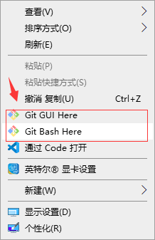 <br/>
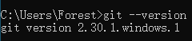

## 配置config的三个作用

```shell
$ git config --local  	# local只对某个仓库有效
$ git config --global 	# global对当前用户的所有仓库有效
$ git config --system 	# system对系统所有登录的用户有效
```

- 查看config的配置

```shell
$ git confi g --list --local
$ git config --list --global
$ git confi g--list --system
```

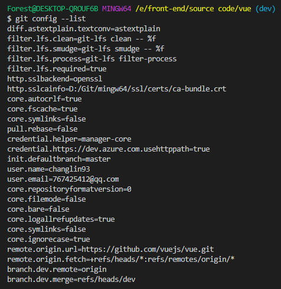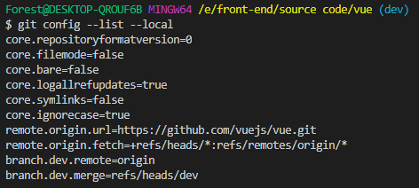

## 搭建本地Git仓库

两种场景

- 把已有的项目代码纳入Git管理

```shell
$ cd 项目代码所在的文件夹
$ git init
```

- 新建的项目直接用Git管理

```shell
$ cd 某个文件夹
$ git init your_porject  #会在当前路径下常见和项目名称同名的文件夹
$ cd your_project
```

## 命令及可视化工具

- `git add .` 和`git add -u`将当前项目中的所有没有被git跟踪的文件添加暂存区
- `git add tools` 将tools文件夹添加到暂存区

- `git rm .` 删除暂存区中所有被跟踪的文件
- `git rm readme.md` 删除暂存区中readme.md文件

- `git status` 查看当前项目中的所有文件状态[暂存区和未添加到暂存区]
- `git commit -am 'type: message'` 将当前项目的所有文件添加并提交到暂存区

- `git commit -m 'type: message'` 将项目文件提交到暂存区

- type：必填项，用于说明本次提交做出哪种类型的修改，必须是以下任意一值：
  - feat: A new feature（新功能）
  - fix: A bug fix（bug的修复）

  - docs: Documentation only changes（修改项目中的文档）
  - style: Changes that do not affect the meaning of the code (white-space, formatting, missing semi-colons, etc)（不影响代码逻辑下的样式修改，通常是风格修改，例如空格、格式、分号方面的修改等）
  - refactor: A code change that neither fixes a bug nor adds a feature（重构，不包括修复bug和添加新功能）
  - perf: A code change that improves performance（性能优化）
  - test: Adding missing or correcting existing tests（添加或者修改测试代码）
  - chore: Changes to the build process or auxiliary tools and libraries such as documentation generation（对构建过程或辅助工具和库(如文档生成)的更改）

- message：对本次提交的描述

- `git reset --hard` 撤销上一次的提交，使其上次提交的所有记录都清除掉 [这个命令谨慎操作]
- `git log` 查看所有的提交记录

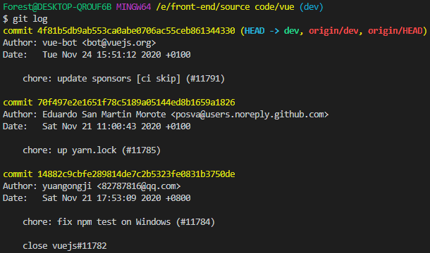

- `git log --oneline` 查看所有的提交记录，与`git log`区别在于不会提交记录的完整信息，只会展示id和描述


- `git mv readme readme.md` 更改文件名
- `git log -n4 --oneline` 查看最近4次提交记录

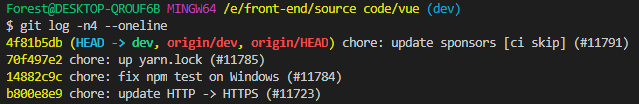

- `git branch -v` 查看当前项目下的所有分支

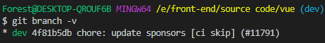

- `git checkout -b development` 新建一个`development`分支
- `git branch -av` 查看当前项目的所有分支

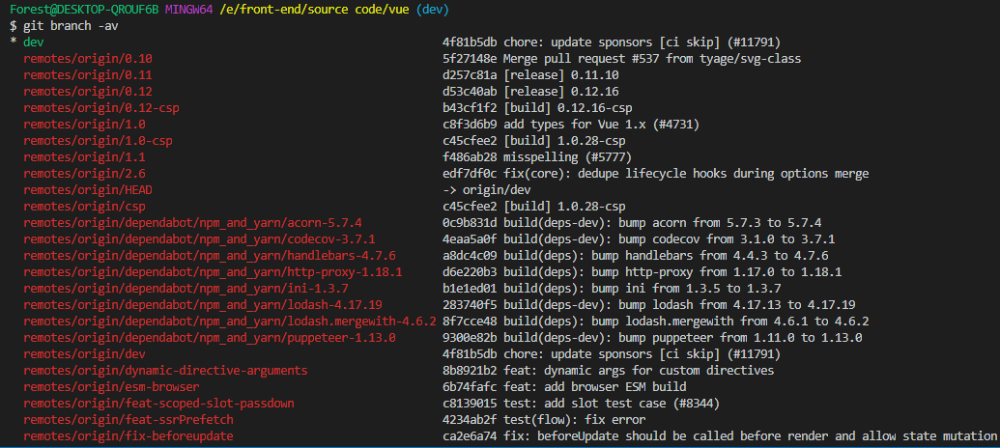

- `git log --all` 查看当前项目的所有分支的提交记录（演进历史）


- `git log --graph` 以树形列表的形式展示提交记录

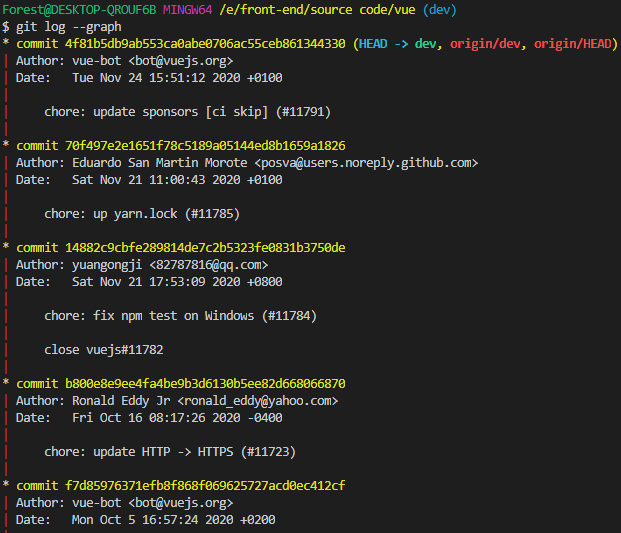

- `git log --oneline -n7 --all --graph` 以树形列表的形式展示最近7次所有分支的历史提交记录

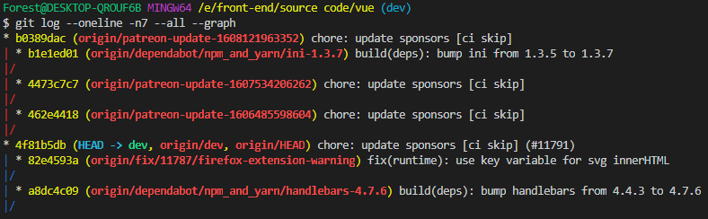

- `gitk` 查看git管理的可视化工具（下图为图形界面）

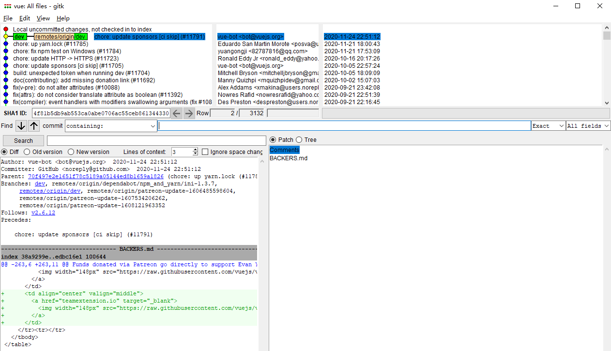

界面板块解析

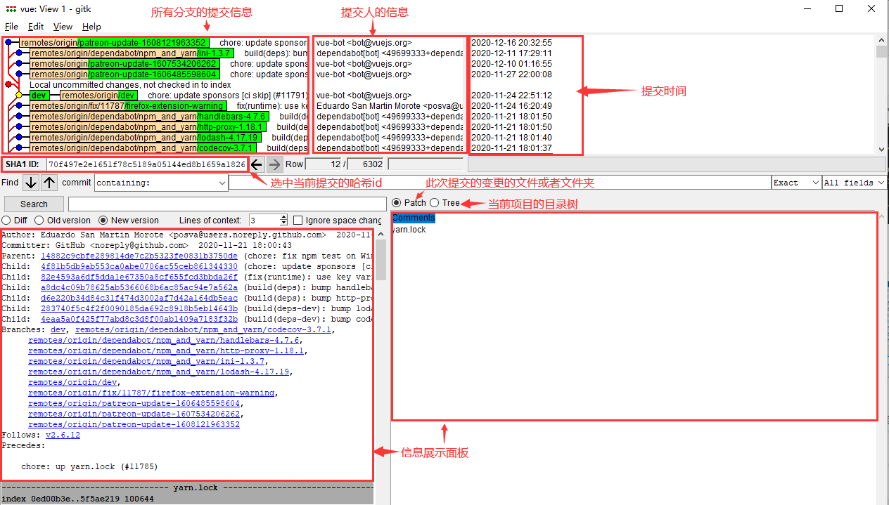

此界面还可以自定义视图

步骤为：左上角的view ---->new view(或者直接shift+F4)

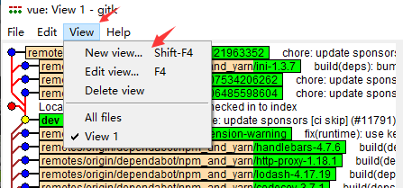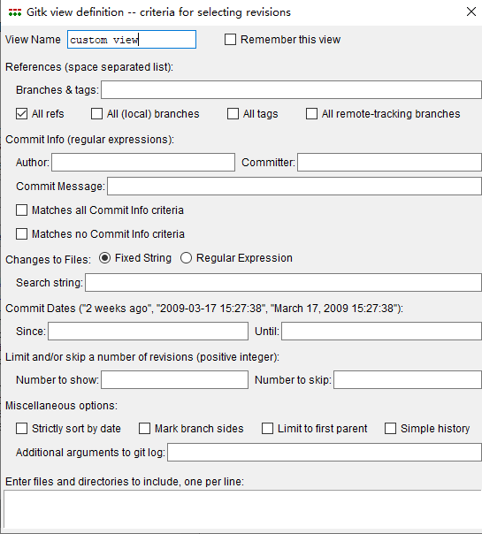

- `git cat-file -t 70f497e2e1651f78c5189a` 查看哈希id为70f497e2e1651f78c5189a的文件类型

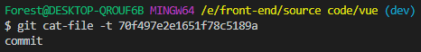

- `git cat-file -p 70f497e2e1651f78c5189a` 查看tree哈希id为76b557b6cb8cf2545cff7b21ad4facee7f620a33内的详细变更内容

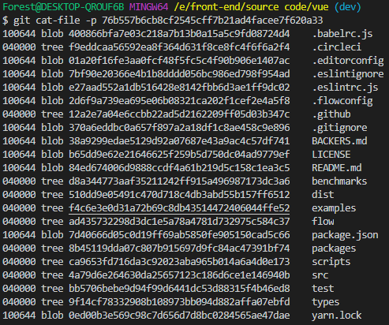

- `git checkout -b fixBug 70f497e2e1651f78c51` 基于哈希id为70f497e2e1651f78c51切换并创建一个fix Bug的分支

## .git目录解密

进入.git查看个文件及文件夹

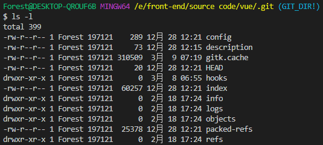

- HEAD 保存当前分支的记录（指向当前引用的分支）
- config 当前项目的本地仓库的配置信息（包含name、email、远程仓库地址）

- refs 记录当前仓库的标签(里程碑)

## commit、tree、blob之间的关系

一个commit只会对应一个tree，这个tree代表当前commit的快照，这个快照的集合里存在的就是本次提交变更的所有文件及文件夹的快照

一个tree可能对应多个tree或者blob

在git中，只要文件的内容完全一致，它就只会存在唯一一个blob
