# git的常见使用场景

## 删除不必要的分支

```shell
$ git branch -d <分支名>    // git branch -d develop
```

分支在没有合并时且要删除可用`git branch -D 分支名`

## 修改commit的描述

- 修改最近一次的提交描述

```shell
$ git commit --amend
```

输入命令后会终端会可交互式界面(vi/vm界面)，但此时还不能输入，必须按键盘`i`才可以输入，修改完成按`ESC`然后按`:wq`保存并退出，此时可以使用`git log`查看刚修改的commit描述信息

实践一下：将`first commit`改为中文“第一次提交”

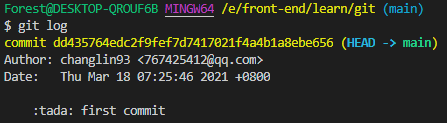

在终端中输入`git commit --amend`回车后，便出现如下图所示

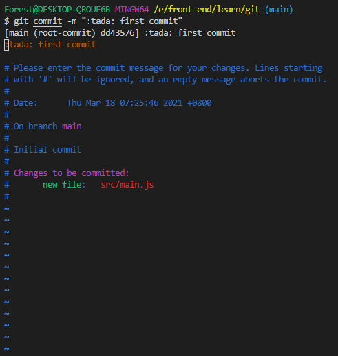

输入键盘上`i`键，输入后便会出现如下图中的标识，左上角的光标由键盘的上下左右键来控制，修改完成后，按键盘上`ESC`，然后再按`:wq`保存并退出

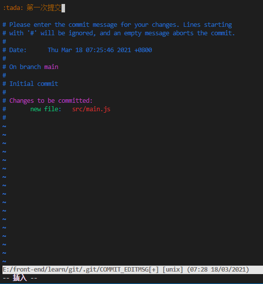

此时再使用命令`git log`或者`git reflog`进行查看，如下图

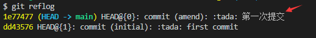

- 修改历史提交的描述

```shell
$ git rebase -i <被修改提交的上一次提交的哈希id>
```

修改下图红色框中的描述信息

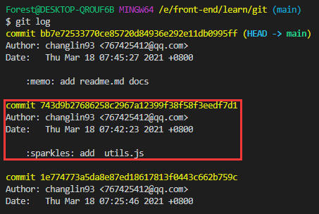

实操一下就是：

```shell
$ git rebase -i 1e774773a5da8e87ed18617813f0443c662b759c
```

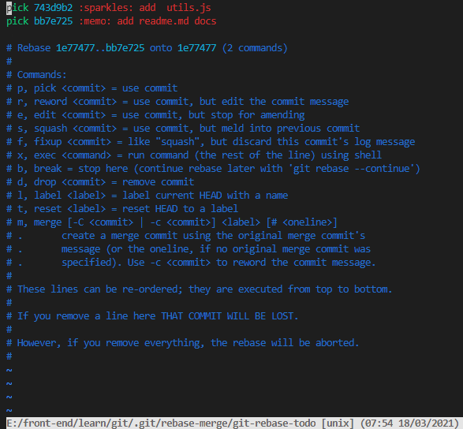

输入命令执行相关操作

将要修改的commit前面的交互命令改为我们要执行的 `r`，

r：就是下面`Commands`中的`r, reword  = use commit, but edit the commit message`

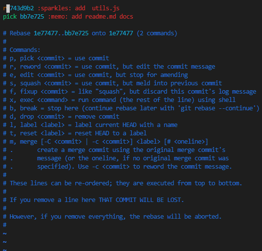

修改后，按`ESC`，然后在按`:wq`保存并退出

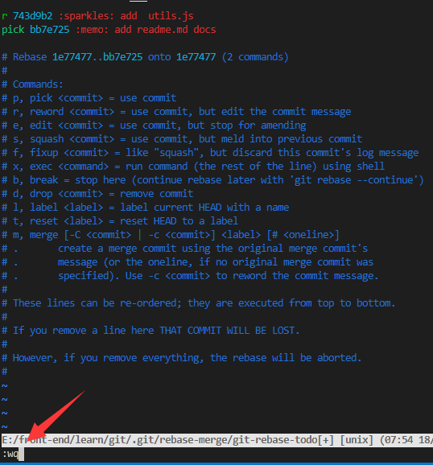

回车后终端就会进入和上面修改最近一次提交描述一样的交互式终端(如下图)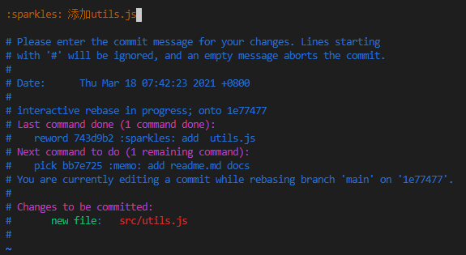

修改完成后`ESC`，`:wq`保存并退出，然后查看就大功告成啦

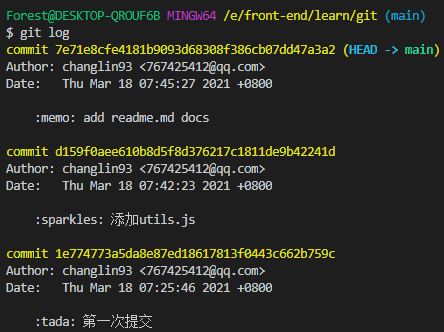

## 怎么把连续的多个commit整理成1个

我要将下图红色框中的4次提交合并为一个commit

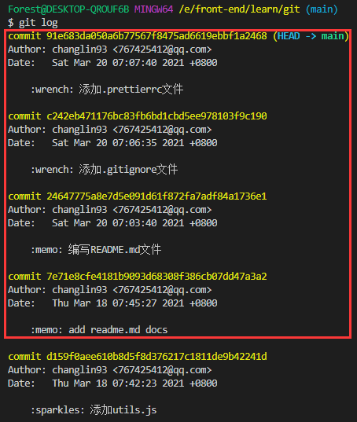

要将红色框中的四次提交合并为一个commit，就得使用到和上一个修改一样的方法`git rebase -i <哈希id>` 这儿的哈希id和上一个问题的一样，都是被修改提交的上一次提交的哈希id，这儿便是`d159f0aee610b8d5f8d376217c1811de9b42241d`(也就是截图中的最后一个commit的哈希id)

在终端中输入如下命令执行

```shell
$ git rebase -i d159f0aee610b8d5f8d376217c1811de9b42241d
```

执行命令后会进入一下界面

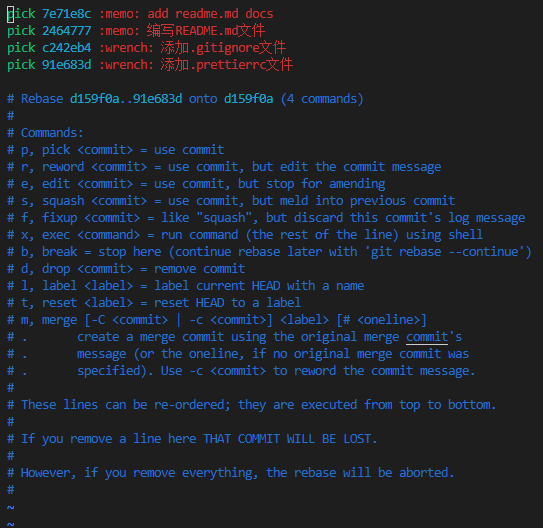

按键盘`i`键，进入可交互式输入模式，将所要修改的提交前的标识改为squash(也就是commands中的s)；如下图输入完成之后，按`ESC`退出，然后按`:wq`保存，回车

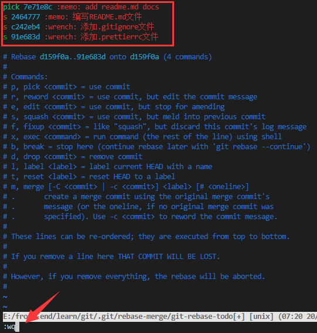

回车后就会出现如下界面

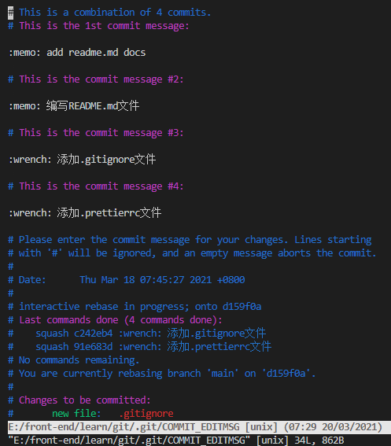

然后在第一行写本次修改的描述，然后`ESC`退出，`:wq`退出交互式终端并保存

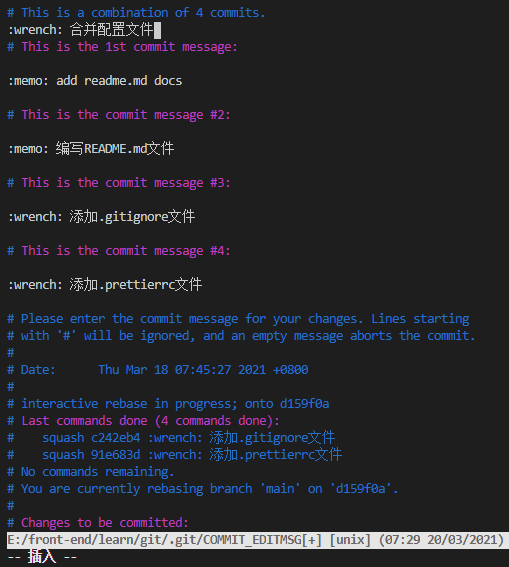

查看刚修改的：`git log`

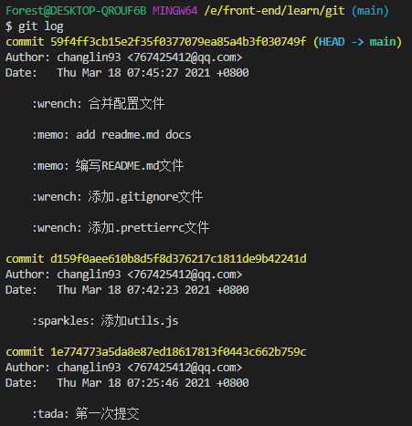

## 怎么把间隔的几个commit整理成一个

将红色框中的两次此提交合并为一次


```shell
$ git rebase -i 1e774773
```

将要合并的分支排在一起，并将其标识改为`s`；如下图：

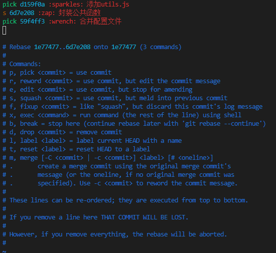

查看修改后的结果：

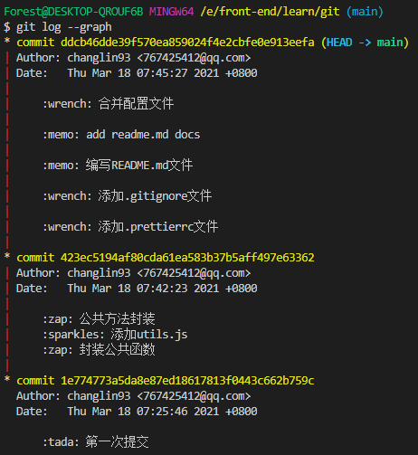

## 比较暂存区和HEAD所含文件的差异

在utils.js文件中添加了一个sum函数，加入（git add .）暂存区后使用命令来比较

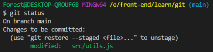

对比当前暂存去与上一次提交的内容变更：命令（git diff --cached）;此时还没有提交，所以修改后在add也不会生成commit记录

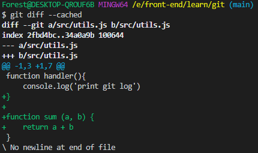

## 比较工作区和暂存区所含文件的差异

在mian.js中添加如下代码后直接`git diff` 进行对比

```js
import Koa from 'koa'

const app = new Koa()

const port = 3000;
app.listen(port, () => console.log(`${port}`))
```

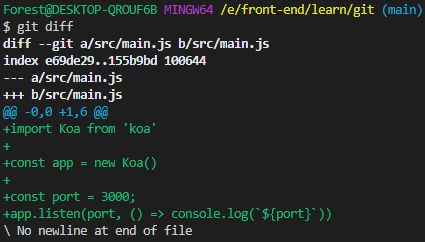

Tips:

- 如果对所有的文件进行对比的话就直接`git diff`
- 如果对单个（或者多个）文件进行对比的话，可以diff后面添加一个（或者多个）文件名，命令：`git diff -- <文件名>`

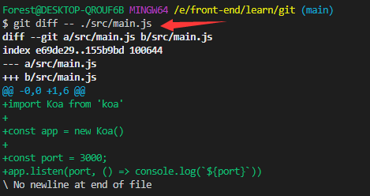

## 如何让暂存区恢复成HEAD的一样？

查看暂存区的变更内容如下

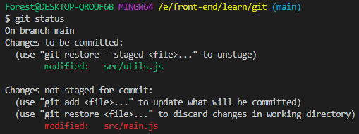

若要变更到与变更之前的那个版本可以使用`git reset HEAD`命令，如果单个文件要变更到变更之前的那个版本则可以在HEAD后面添加文件名`git reset HEAD <文件名>`

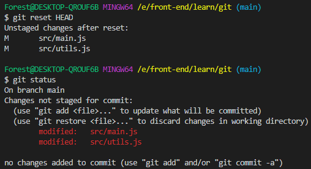

## 如何让工作区的文件恢复和暂存区的一样？

将上一个问题reset的文件重新提交到暂存区并作比较

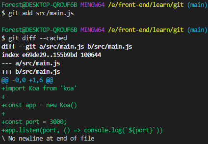

现在我会在`app.listen(port, ()=> console.log(`${port}`))`后面添加中文标识

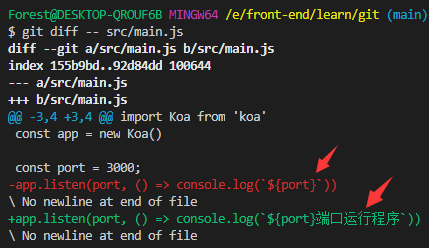

现在不想要中文标识的那次修改了，该怎么恢复呢？

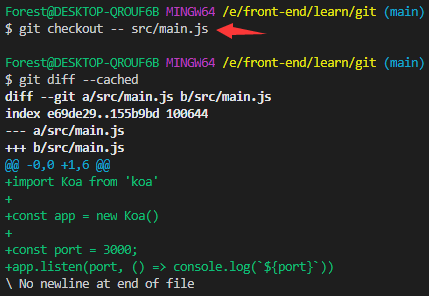

## 怎么取消暂存区的部分文件的更改

现在暂存区中有三个文件已经被修改，若要丢弃utils.js文件的修改，应如何操作？


回复一个或多个文件使用命令：`git reset HEAD -- <文件名> <文件名>`

命令执行之后，查看暂存区的记录如下图：

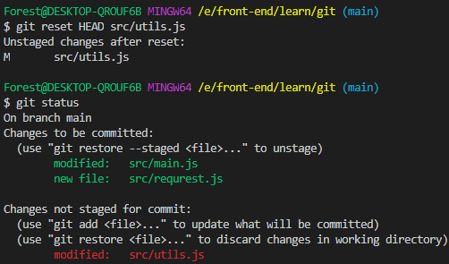

## 消除最近几次提交

如下图，若要回到‘合并配置的那次提交’应如何操作？

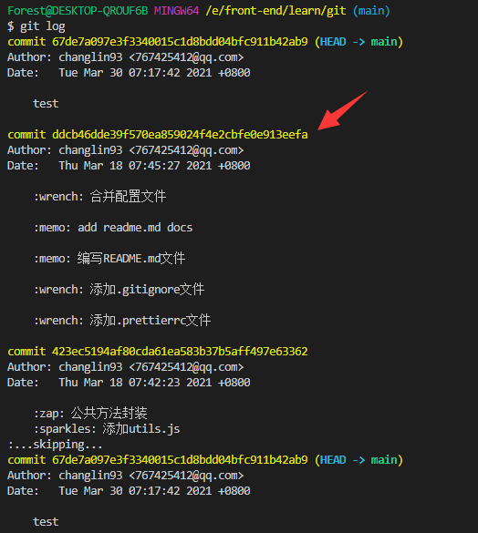

可以使用一非常危险的命令：`git reset --hard <id>`

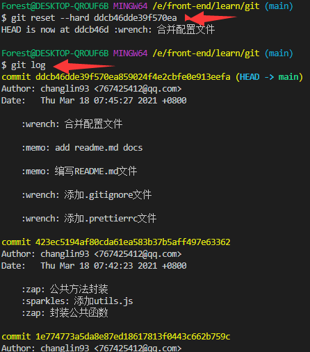

gitk 命令查看提交历史树：

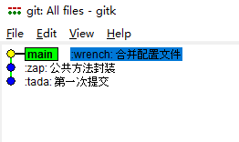

## 查看不同提交的指定文件的差异

命令：`git diff <分支名> <分支名> -- <文件名>`；后面的文件名若不写，则是对比两个分支的所有内容差异

## 删除工作区和暂存区的指定文件

```shell
$ git rm <文件名>
```

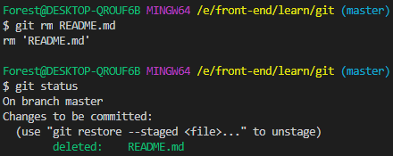

## 开发过程中，若临时加了任务，既要保存当前的开发内容，又要处理临时任务，该如何操作？

```shell
# 1、先将工作区的内容暂存起来
$ git stash

# 2、临时任务处理完成之后，在恢复暂存的内容
$ git stash apply/pop // 作用：a.恢复之前保存的东西到工作区 b.apply不会清除暂存区的记录，pop会清除
```

## 如何处理不需要git管理的文件

添加与.git同级.gitignore文件

- 将不需要git管理的文件或者文件夹名添加进.gitignore文件中

## 如何fork别人的项目，及同步项目

其实fork很简单，进入项目后，菜单栏的右上角有一个有一个fork的按钮，点击之后就会出来一个选择项，会问你保存在哪里，选择自己对应的保存路径就好了，如下图

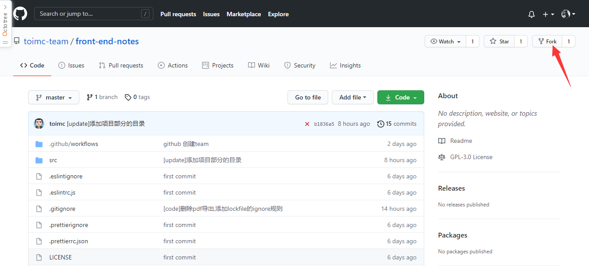

同步项目：就是项目源码更新之后，我们如去更新自己的代码，可以使用网页端手动更新、也可以使用命令更新，我这里就演示使用命令更新

- 建立远程源码仓库连接

```shell
$ git remote update <项目源码的仓库地址>
```

示例：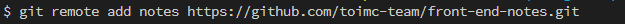

- 查看是否建立连接成功

```shell
$ git remote -v
```

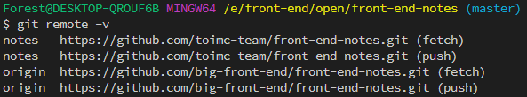

- fetch命令更新源码

```shell
$ git fetch update
```

示例：

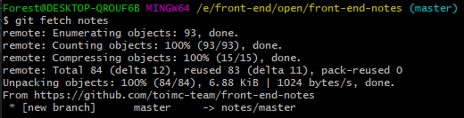

Tips:

这儿更新是更新到notes/master分支上的，不是直接更新到master分支，但是我查看分支时，并没有notes/master这个分支，后续在研究研究；既然没有直接更新到主分支上，那就要手动合并分支

- 合并分支

切换到主分支在合并

```shell
$ git merge <待合并分支>
```

示例：

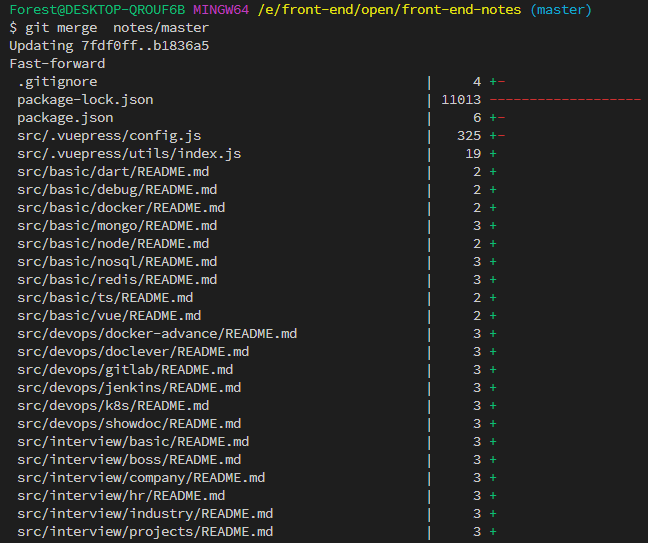

这样代码就更新了
